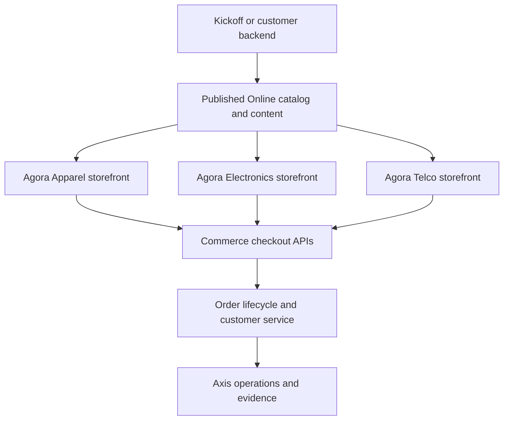
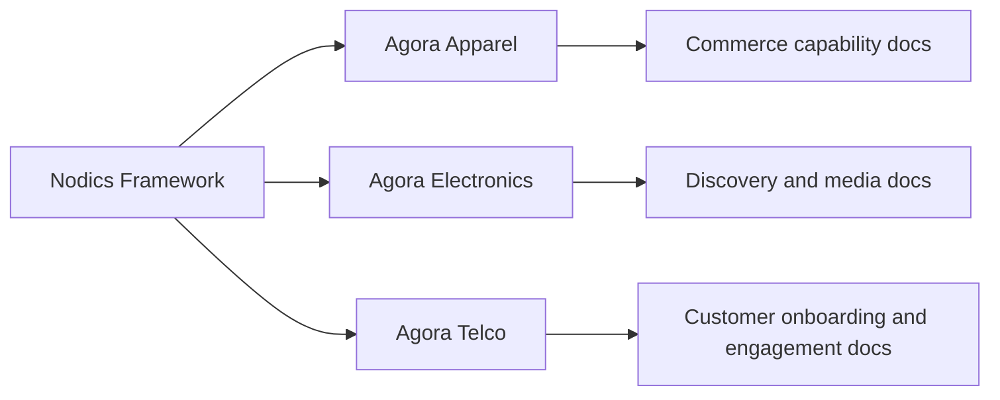

# Accelerators and Industry Solution Templates

Accelerators and Industry Solution Templates are customer-facing starting points built with Nodics capabilities. They help a team move faster without hiding the framework contracts underneath. Beginners should read this page before treating an accelerator as a product, because the accelerator is a packaged reference application pattern, not the owner of catalog, checkout, payment, fulfillment, content, identity, or publication logic.

## Business perspective

Agora is the accelerator application family for commerce experiences. The current split is intentionally domain-specific: Agora Apparel, Agora Electronics, and Agora Telco. Each application gives an implementation partner a focused storefront pattern, test contract, visual journey, and integration shape that can be adapted for a customer. The value is faster time to market: business teams can begin with a working journey, inspect how products and content flow from backend data, and then customize only the areas that differentiate their brand or industry.

| Accelerator | Business fit | Starting journey | Expected customization |
| --- | --- | --- | --- |
| Agora Apparel | Fashion, apparel, accessories, collections, campaign-led commerce | Home, collection, product detail, cart, checkout, order history | Size and fit rules, seasonal campaigns, editorial content, return reasons |
| Agora Electronics | Devices, accessories, specifications, warranty-led commerce | Home, category discovery, product detail, cart, checkout, order status | Specification comparison, warranty content, compatibility rules, pickup or delivery options |
| Agora Telco | Plans, bundles, devices, service activation, account-led commerce | Home, plan/device selection, bundle review, checkout, order lifecycle | Plan eligibility, contract terms, activation flows, customer verification |

The accelerator group gives business users a place to understand what can be reused and what must still be owned by the customer project. It also gives developers a clean source map: frontend presentation belongs to each Agora app, business data belongs to backend content and commerce data packs, and rules stay in the owning framework modules or project-layer extensions.

## Accelerator flow

The same business journey can be inspected from several directions. A merchandiser sees content, products, media, price, and availability. A developer sees API clients, renderer contracts, cart state, checkout validation, payment-result handling, and test coverage. An operator sees backend health, publication state, data-import status, and order lifecycle evidence.

## Technical perspective

The concrete frontend applications are `nodics.agora.apparel`, `nodics.agora.electronics`, and `nodics.agora.telco`. Those identifiers belong in technical source maps and repository references, not in the primary business navigation label. The business-facing documentation should call them Agora Apparel, Agora Electronics, and Agora Telco.

Each accelerator consumes content, catalog, pricing, inventory, media, checkout, payment, fulfillment, engagement, and order lifecycle contracts from the backend. The storefront should not copy backend rules into React components. When a customer needs a different pricing rule, inventory availability rule, content slot, checkout step, payment provider, carrier, or return policy, the implementation should update the owning backend module or project-layer extension and then verify the storefront rendering against that published behavior.

## Customization and extension

Accelerators should be customized through three layers:

| Layer | What changes here | What should not change here |
| --- | --- | --- |
| Backend project data | Products, categories, content, media, prices, inventory, markets, sites, publication state | Frontend-only business truth |
| Project backend extension | Schemas, services, providers, events, pipelines, validations, policies | Vendor framework source |
| Agora frontend app | Presentation, responsive behavior, renderer mapping, browser state, accessibility, tests | Commerce ownership, payment authority, tenant policy |

This separation allows a customer to replace local data with staged/online data, change providers, or add a new domain app without corrupting framework upgrade paths. It also makes the documentation useful for AI tools: each page must state what the accelerator owns, what it consumes, and where a generated or manual change should be made.

## Publication and visibility

Accelerator documentation belongs under this group in the published documentation hierarchy. Public overview pages can be visible in Nexus after Online approval. Implementation details that expose internal environment, operator, or partner-only behavior should use authenticated or permission-based access and appear through Axis. When new accelerator domains are added, they should be added as new child topics in this group with source-backed catalogue metadata, diagrams, customization tables, validation steps, and links to the owning Commerce, WCMS, Search, Payment, Shipping, Order Management, and Engagement topics.

## Common mistakes

- Calling Agora a single generic application after the domain split. The correct documentation shape is an accelerator family with Apparel, Electronics, Telco, and later domain templates.
- Letting the storefront own commerce rules. The frontend presents the journey; backend modules and project extensions own business decisions.
- Copying sample data into a component because it is faster. Data should come from backend APIs or safe development fixtures, with clear test-only boundaries.
- Forgetting business readers. A useful accelerator page explains the revenue path, operating model, and customization impact before it lists files.

## Verification

Verify this topic by checking that the three active storefront repositories exist under `nodics.exp` and that their package names are `nodics.agora.apparel`, `nodics.agora.electronics`, and `nodics.agora.telco`. In each app, run the local verification command when changing presentation contracts. In `nodics.docs`, run `npm run docs:check` and `npm run validate` to prove the accelerator page is in the backend documentation catalogue and produces CMS records, hierarchy nodes, dashboard data, access policy, publication state, and search metadata.

## Active Accelerator Coverage

The accelerator family now has three active application templates. They share
the Nodics Commerce, WCMS, Search, Media, Localization, Payment, Fulfillment,
Order, and Engagement documentation, but each accelerator should add its own
domain page when its data, UI, or operating model becomes distinct enough for
business users.

| Accelerator | Business focus | Documentation references |
| --- | --- | --- |
| Agora Apparel | Apparel storefront, category browsing, product detail, media-rich merchandising, cart, checkout, returns. | Product Catalog, WCMS, Media, Pricing, Inventory, Cart/Checkout, Orders, Returns. |
| Agora Electronics | Electronics catalog, specifications, search facets, recommendations, warranty-style data, checkout and fulfillment. | Product Catalog, Discovery, Media, Pricing, Shipping/Fulfillment, Reviews. |
| Agora Telco | Plans, devices, offers, customer onboarding, service-style fulfillment, support, and engagement. | Catalog, Pricing/Promotion, Identity, Checkout, Process, Communication, Engagement. |

The accelerator documentation must stay honest about ownership: the
accelerator presents and composes journeys; backend modules and project
extensions own business data and decisions. A storefront screenshot or UI
component is useful evidence, but it cannot replace schema, API, data-pack,
publication, and validation evidence.
