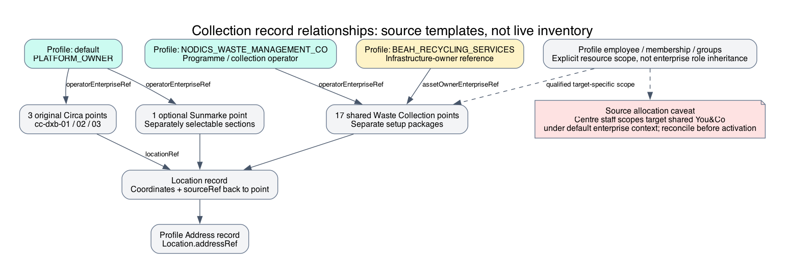

# Circa Collection-Centre Record Reference

This source-backed diagram explains ownership and boundaries; it is not live
deployment or acceptance evidence. Qualification notes remain part of the flow.

This reference answers exactly which collection points the source provides and how
their relationships are configured. Beginners must distinguish authored records,
selected setup packages, installed records and currently visible eligible centres.
The following inventory is source evidence as reviewed on 30 September 2026; it
does not assert a live database count or real partner accreditation. Business and
operator teams can use it to reconcile a deployment before changing allocations.
The business problem is keeping discovery, operational ownership and staff access
aligned: a visible centre alone proves neither authorization nor eligible arrival.

## How many collection points exist in source?

| Source contribution | Number | Selection and ownership |
| --- | ---: | --- |
| Circa original `cc-dxb-*` points | 3 | `circa.ewaste:waste`, optional fresh-environment transaction sample; Location/Profile sections separate |
| Shared Waste Collection network | 17 | Setup selects `wasteCollection:sample-collection-points`, plus shared location/address packages |
| Sunmarke school point | 1 | Separate `sunmarke-waste`, `sunmarke-location`, `sunmarke-profile` manifest sections; not one of the three original points |

There are 21 distinct authored point codes across those reviewed contributions.
The default Circa setup package list selects the shared network and original Circa
location data, but Circa Waste transactions are optional. It does not select the
three Sunmarke sections in that list. Therefore neither 3, 20 nor 21 is a universal
installed/visible count. Installed release receipts, point status/visibility, missing
references and owner API filters determine what a customer actually sees.

## Original three Circa points

| Point code | English name | Location code | Latitude | Longitude |
| --- | --- | --- | ---: | ---: |
| cc-dxb-01 | Circa Green Hub Al Quoz | cc-dxb-01-location | 25.1358 | 55.2274 |
| cc-dxb-02 | Emirates Circular Drop Box | cc-dxb-02-location | 25.0470694 | 55.243265 |
| cc-dxb-03 | TechCycle Collection Desk | cc-dxb-03-location | 25.2515 | 55.3194 |

All three declare `collectionPointType: COLLECTION_CENTRE`, `operatingStatus: ACTIVE`,
`publicVisibility: PUBLIC`, `status: ACTIVE`, `revision: 1` and `active: true`.
Each `operatorEnterpriseRef` points to Profile enterprise `default`. None of these
three authored point records declares a separate bin-owner reference. Do not infer
one from the programme name or assign the shared network's owner automatically.

Each `locationRef` has module `locationCore`, schema `location` and its listed code.
Each Location points back through `sourceRef` to Waste Collection schema
`wasteCollectionPoint` and the original point code. Location declares category
WASTE_COLLECTION, type COLLECTION_CENTRE and public visibility. Its `addressRef`
targets Profile `cc-dxb-01-address`, `cc-dxb-02-address` or `cc-dxb-03-address`.
The authored address lines are Al Quoz Industrial Area 3, First Avenue Mall/Motor
City, and Dubai Internet City Building 10 respectively. They are reference data,
not independently verified real-world operating arrangements.

All three publish a sample opening label Daily 09:00-20:00 and sample telephone
metadata. The common acceptance summary is phones, computers and household
electronics, with specialist items needing prior arrangement. A label is not
time-aware availability or item acceptance enforcement.

## Accepted category metadata and policy

The original points each list 19 acceptedCategoryCodes: MOBILE_DEVICE,
LAPTOP_COMPUTER, TABLET, DESKTOP_COMPUTER, MONITOR_DISPLAY, CABLE_CHARGER,
SMALL_APPLIANCE, LITHIUM_BATTERY, POWER_BANK, MIXED_ELECTRONICS, CIRCA_MIX,
CIRCA_LARGE_HOUSEHOLD_APPLIANCES, CIRCA_SMALL_HOUSEHOLD_APPLIANCES,
CIRCA_IT_EQUIPMENT_INCLUDING_MONITORS, CIRCA_CONSUMER_ELECTRONICS_INCLUDING_TELEVISIONS,
CIRCA_TOYS, CIRCA_TOOLS, CIRCA_MONITORING_AND_CONTROL_INSTRUMENTS and
CIRCA_AUTOMATIC_DISPENSERS. These metadata values must remain distinct from owner
acceptance-rule and preset decisions; do not invent eligibility from displayed text.

The Circa policy overlay contributes EWASTE_DROP_OFF_STANDARD and CIRCA_MALL_DROP_OFF.
The standard overlay chooses CIRCA_VERIFIED_DEVICE_RECOVERY, rule references
EWASTE_DROP_OFF_MOBILE_DEVICE, EWASTE_DROP_OFF_LAPTOP and CIRCA_DROP_OFF_SMART_HOME,
and DROP_OFF/RECEIPT/CIRCA_ONBOARDING capabilities. The mall record selects
EWASTE_STANDARD_RECEIPT, EWASTE_STANDARD_VERIFICATION and EWASTE_STANDARD_PHOTO,
with DROP_OFF/RECEIPT/PUBLIC_COUNTER capabilities. These are policy records, not
proof that a specific point has completed receipt or applied every preset.

## Shared 17-point network

For the following table, each suffix expands to point code
`WCP_SAMPLE_COLLECTION_CENTRE_<suffix>` and location code
`LOC_SAMPLE_COLLECTION_CENTRE_<suffix>`:

| Suffix | Authored English label |
| --- | --- |
| YOU_AND_CO | You&Co Collection Centre |
| AVERDA_NADD_AL_HAMAR | Averda Recycling Center - Nadd Al Hamar |
| AVERDA_METRO_FOOTBRIDGE | Averda Recycling Center - Metro Footbridge |
| AVERDA_AL_SAFA | Averda Recycling Center - Al Safa |
| AVERDA_AL_SATWA | Averda Recycling Center - Al Satwa |
| AVERDA_AL_RASHIDIYA | Averda Recycling Center - Al Rashidiya |
| AVERDA_AL_NAHDA_2 | Averda Recycling Center - Al Nahda 2 |
| AVERDA_MUHAISNAH_1 | Averda Recycling Center - Muhaisnah 1 |
| EFATE_DEIRA | EFATE - Deira |
| EFATE_SUSTAINABLE_CITY | EFATE - The Sustainable City |
| EFATE_RIGGAT_AL_BUTEEN | EFATE - Riggat Al Buteen |
| EFATE_DUBAI_MARINA | EFATE - Dubai Marina |
| EFATE_AL_QUOZ | EFATE - Al Quoz |
| EFATE_AL_QUOZ_1 | EFATE - Al Quoz 1 |
| DU_TELECOM_DIAC | DU Telecom - Dubai International Academic City |
| DU_HQ_DUBAI_HILLS | DU HQ - Dubai Hills |
| AL_HAWAI_RESIDENCE_BARSHA_HEIGHTS | Al-Hawai Residence - Barsha Heights |

These sample points reference operator NODICS_WASTE_MANAGEMENT_CO and the separate
`assetOwnerEnterpriseRef` infrastructure-owner field referencing
BEAH_RECYCLING_SERVICES. Their labels do
not establish commercial affiliation with the named places/companies. The
enterprise and staff reference guide explains why operator, owner and employee
permissions are distinct. Do not rewrite those references based on branding.

## Sunmarke contribution

The optional point is `cc-dxb-sunmarke-jvt`, named Sunmarke School, JVT, referencing
`cc-dxb-sunmarke-jvt-location` and operator `default`. The selected source location
in `sample-v003/sunmarke-location` is latitude 25.0469679, longitude 55.193292,
referencing `cc-dxb-sunmarke-jvt-address`. The point has PUBLIC/ACTIVE/sample
metadata and the same 19-category list. This documents an authored user-requested
local registration, not independently verified school access or installed status.

## Customize and extend safely

A developer adds a point in a custom backend data release, with a reviewed unique
code, Profile operator, optional separately governed owner, Location and address.
For example, a fourth project point must not reuse cc-dxb-03 or overwrite its
location. Install the selected owner releases, grant staff resource scopes and
validate the point through the current collection/arrival APIs. Source extension
alone does not publish it or change current installed records.

Reject missing/inactive references, unauthorized operator changes, stale location
and wrong-centre scope. Failed installation or arrival preserves existing history;
inspect owner receipts before retrying. Test default and custom project layers,
exact radius, public/private filtering, address resolution and independent bin ownership.

## Common mistakes

Reporting three as the entire network; reporting all source points as installed;
using map camera coordinates; treating accepted-category copy as policy; using
operator enterprise as automatic bin owner; and widening employee scope to repair
a missing point are incorrect. Coordinate edits require approved owner mutation.

## Verification

Source files are Circa manifest-selected Waste/Location/Profile records and shared
Waste Collection sample records. DevOps must reconcile installed receipts and fresh
owner projections independently. Live counts and geography were not queried for
this documentation update. See [enterprise/staff references](circa-enterprise-reference.md),
[source inventory](circa-source-inventory.md) and [data overview](circa-data-network.md).
