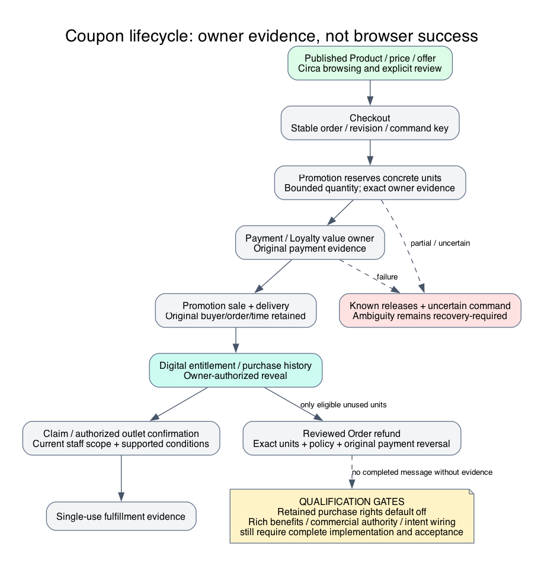
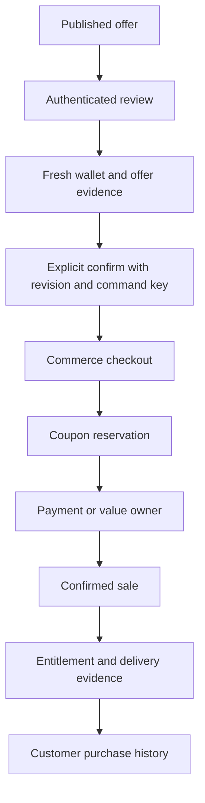
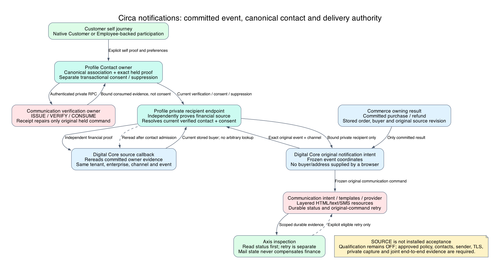

# Circa Shop, Coupon Purchase and Redemption

## October 2026 Owner Integration Update

Promotion now has authored issuer-governed seller authorization. The issuer's
exact scoped administrator grants/revokes bounded seller rights; sale reservation
retains its consent revision. Generic writes cannot manufacture issuer permission.
Issuer/vendor reference equality alone is still not authorization. Independent
source/exposure qualifications remain false until installed acceptance.

Digital Core requests purchase notifications only after confirmed checkout,
capture and unit-delivery evidence. Refund notifications require confirmed owner
refund completion, payment outcome and unit reversal. Delivery failure is separate
from financial compensation: it cannot undo a placed order or repeat a refund.
Communication owns frozen durable intents and same-original-intent retry. Templates
remain layered module resources. Source-bound inspection/retry takes no caller
destination, template, amount or arbitrary intent identifier.

The separately qualified native operator workspace is
GET `/orders/:code/notifications/workspace`. Its exact module
base follows the selected runtime's router contract; consumers use the published
operation route rather than hardcoding a deployment URL. The versioned DTO keeps
order code/revision and financial state separate from event/channel delivery
observations. A persisted intent status is not mailbox delivery or financial proof.
Inspection rereads deterministic original EMAIL/SMS intents through Communication's
source-scoped API; missing, denied or failed reads remain UNCONFIRMED, including
partial observations. Purchase inspection uses original committed evidence even
after a coupon is redeemed or refunded; it does not authorize a new purchase message.
Retry stays limited to the original frozen intent, current source eligibility,
fresh operator permission and a reviewed order revision. Axis handles uncertainty
by inspection, never by automatically replaying purchase, refund or notification.
Navigation, presentation and fixed commands are owned by Digital Core; later-layer
configuration may customize labels without changing eligibility or persistence.

The monetary-benefit source supports fixed discounts, percentages, caps and
minimum spend through exact amount arithmetic and owner-priced transaction evidence.
Browser subtotals and merchant text are not that evidence. SKU/bundle fulfillment
remains refused without approved product mappings and an authoritative priced/POS
integration. Offer display names never become executable SKU rules. Existing approved
sample records are not supplemented with invented identities, mappings or terms.

Verified-recipient and priced/POS adapters are not yet installed owning integrations.
Qualification stays false and delivery remains disabled. Business users, beginners
and operators must distinguish authored mechanics from an enabled Circa journey.
Developers customize existing Promotion, Digital Core and Communication exports and
resources through later layers; do not copy engines into Kickoff or put financial
authority in Circa UI. Joint automated/visual acceptance remains NOT RUN. No runtime
import, approval of sample commercial terms or message send follows from this release.

This source-backed diagram explains ownership and boundaries; it is not live
deployment or acceptance evidence. Qualification notes remain part of the flow.

Circa uses Commerce for browsing and purchases, Waste for asset ownership, Promotion
for coupon units and Digital Commerce for purchased entitlements. Beginners should
distinguish the coupon offer a customer browses from the unique code received for
a purchased unit. The business value is a single account experience with explicit
purchase review, while the owning frameworks protect prices, inventory and value.

## Published browsing and offer content

`/shop` and `/coupons` share search, filters, sorting, grid/list layout, exact counts,
server pagination and read-only quick view. Listing URLs preserve selectors through
details/reload/return. Public Circa APIs are
`GET /nodics/circa.ewaste/v0/catalogue` and `/catalogue/:code`, with kind ASSET or
COUPON. Independent detail reads validate kind and current availability rather
than trusting a card previously loaded in a listing.

Selectors include q, category, condition, issuer, minPoints, maxPoints, validUntil,
sort, page and pageSize. Sorts are FEATURED, POINTS_ASC, POINTS_DESC, NAME and
coupon-only EXPIRY. `validUntil` asks that the listed coupon remains valid through
the selected date; it is not a purchase-relative expiry switch. The reference
composition reads Product pages in batches of 100 and bounds the catalogue at
2,000 published products, with default page size 12 and maximum 48. Repeated owner
pages or bound overflow reject instead of silently presenting truncated totals.

Product localized attributes can carry terms, eligibility, exclusions,
redemptionInstructions and purchaseConditions as strings/arrays. Missing information
is reported as missing. Developers must not convert descriptive copy into implied
enforcement. In particular, the current illustrative sample offer names are not
evidence of real partner commitments or production discount settlement.

## Purchase screen flow and owner sequence

The eWaste marketplace purchase route is
`POST /nodics/eWaste/v0/marketplace/:code/purchase`. The request mapper supplies
trusted context; caller bodies cannot choose service, store or owner. The displayed
revision and stable command identity accompany explicit confirmation. Wallet refresh
failure leaves confirmation unavailable; backend owners still validate/debit value.
No browser wallet calculation acknowledges payment.

For coupon-code-pool products, Digital Core expands purchased quantity into units
and asks Promotion to reserve concrete supply. Quantity must be a bounded positive
integer; `digitalCore.maximumCouponUnitsPerCheckout` defaults to 100 across the
calculation. Confirmed partial acquisitions and the uncertain failing command are
retained for Checkout compensation. An uncertain reservation is not successful
release even if every known unit was released.

Promotion owns reservation/sale/delivery state, original buyer/order/idempotency
bindings and revisioned writes. The staged safety increment requires strict owner
acknowledgement and uncached readback; it no longer accepts a locally constructed
fallback as persisted success. Terminal sale/delivery replay cannot downgrade state
or reset the original sale timestamp. Installed generated-owner CAS/uniqueness and
cross-owner interrupted recovery still require qualification.

## Offer, batch, code and entitlement

| Concept               | Lifecycle significance                                        |
| --------------------- | ------------------------------------------------------------- |
| Product/offer         | Browsable terms, price and listing context                    |
| Promotion             | Eligibility/actions and retained-rights source when qualified |
| Batch/pool            | Supply available for purchase, not customer entitlement       |
| Coupon unit           | Concrete reserved/sold/customer-bound code                    |
| Digital entitlement   | Customer purchase/claim/delivery/reversal evidence            |
| Merchant confirmation | Authorized fulfillment at an eligible physical outlet         |

Supply of 100 units is not 100 codes already issued to customers. A unit intended
for single use cannot be consumed at each eligible outlet separately. Wrong-outlet
or failed confirmation must not consume it. Issuer, online seller and outlet owner
can be different enterprises; a parent company association is not a commercial
authorization or staff scope grant.

## Expiry and retained purchase rights

Existing samples use campaign dates. A staged, independently gated Promotion policy
supports `purchasedCouponPolicy` with validityDays, plain-text terms and optional
refundPolicy. `promotion.purchasedRights.enabled` and `.qualified` default false.
When qualified, sale captures campaign revision/rules and calculates validTo from
the original successful sale, not launch, later delivery or retry. Digital
entitlements retain expiry and safe purchaseTerms for the customer view.

Purchase history now displays owner expiry/terms; an expired or invalid supplied
expiry hides reveal. Backend reveal/use checks remain authoritative. Generic
mutation/provenance protection and installed acceptance are still outstanding,
so this guide is not permission to turn the retained-rights gate on. Legacy fixed
dates must not be rewritten without a governed compatibility plan.

## Claim, outlet fulfillment and customer refresh

Authenticated eWaste routes expose coupon reveal, eligible merchants and claim.
Merchant confirmation belongs to qualified Digital Commerce/Promotion operations
with Profile employee context and canonical Store scope. Supported Promotion
conditions include coupon ownership/product and explicit storeCodes. Richer receipt
subtotal, minimum-spend and cap validation now uses the native priced-cart adapter
described below. Unsupported SKU/bundle mappings and unknown conditions reject
rather than being ignored; no offer prose is interpreted as executable benefit terms.

Purchase history can refresh saved merchant/receipt evidence without executing
purchase/claim/redemption again. Its default visible refresh is 60 seconds and on
focus/return; the presentation option accepts 15-300 seconds. Failed refresh marks
history stale and hides reveal actions. Session change clears displayed history and
invalidates late reveals. Secret codes are not published into WCMS, email templates,
analytics or an all-customer catalogue.

## Cancellation, refunds and failure recovery

Order owns reviewed cancellation/refund orchestration; Payment owns original
captured-value reversal; Digital Core/Promotion own entitlement/code revocation.
Unused does not universally mean automatically refundable. Claimed/redeemed/mixed
orders require review. The staged retained policy checks allowed request type and
purchase-relative window before locking; absent retained refund policy requires
manual review. General provider and seller-settlement qualification remain separate.

Prepared units enter REFUND_PENDING with an original refund binding before value
reversal. Completion requires saved matching revocation/reversal evidence. An
exact bounded unit multiset is rechecked at preview, preparation and completion:
missing/extra units or duplicate entitlement/code identities cannot produce success.
Repeated order entries of one product are aggregated before comparison. An
uncertain payment or partial owner write requires inspection under the same command,
not a fresh refund. Purchase/refund EMAIL/SMS resources exist under Digital Core
`src/templates`, with committed-evidence intent triggers wired to the owning purchase
and refund boundaries. Recipient and privacy qualification remain independently gated.
A resource file is not a sent notification; pending reversal must never send a
completed-refund message.

## Native Priced Basket And Merchant Confirmation

The native provider accepts `CART:<existing-cart-code>` before validation. It is
explicitly PRICED_CART: evidence of an existing basket priced by activated Nodics
Pricing, not external POS settlement or payment capture. ORDER handles reject because
today's prices must not reprice a committed order. A custom external POS connector
requires its own provider contract and approved operational records.

Cart owns buyer intent and quantities; Store owns the canonical outlet; Promotion
owns the delivered/claimed purchased coupon; Pricing owns activated policy and exact
line/subtotal arithmetic; Digital Core owns the current employee authorization and
frozen native receipt. Pricing derives the buyer from the purchased coupon, checks
issuer/outlet/Cart ownership and currency, then reads the complete bounded entry set.
Client amounts, saved Cart totals and entry price fields are not authoritative prices.
Ambiguous price precedence, partial reads, variants/quotes and missing activated roots
reject. The adapter rereads coupon, Cart, entries, Store and published policy to detect
drift before returning source evidence.

Service-only POST `/internal/merchant/priced-transaction` accepts exactly `couponCode`,
`storeCode` and `sourceReference`. It requires the configured runtime permission and
signed tenant/enterprise scope, operational owning modules and private capture.
Promotion calls it through existing authenticated module transport with bounded HTTPS
and no redirects or retry. Later layers may select another qualified provider; they
cannot replace owner evidence with browser totals or permissive fallback pricing.

The merchant workspace exposes `pricedSourceRequired` and configured
`pricedSourceLabel`. Axis collects the reference before POST
`/merchant/redemptions/validate`, retains validationCode/expiry/revision and confirms
with the same original reference. Validation compares current fixed/percentage/cap/
minimum terms and binds the exact benefit snapshot. Confirmation rereads current
membership and pricing; changed basket/outlet/price/scope requires original-command
review. An acknowledged receipt replay retains its original snapshot without repricing.
Displayed monetary evidence never claims seller settlement or refund completion.

## Committed Notifications And Recipient Authority

Solid arrows show owning proof/delivery interactions; dashed arrows show fresh
source reread and separately reviewed retry. Green identifies user/operator entry,
blue Commerce financial authority, teal Profile contact authority and rose
Communication. The yellow note marks unexecuted installation and acceptance gates.
The [editable diagram source](../assets/diagrams/circa-notification-authority.dot)
contains no customer records, sender credentials or fabricated delivery evidence.

Digital Core freezes intent only from committed purchase/refund evidence. It asks
Profile's private `/internal/commerce/notification-recipient` with channel plus exact
event coordinates: kind, orderCode, sourceCode and orderRevision. No recipient address
or arbitrary buyer ID is accepted. Profile asks Digital Core's private
`/internal/notifications/recipient-source` to independently prove the current committed
event and derive its stored buyer. Only then may the selected Profile verified-contact
owner read verification, transactional consent and suppression. The financial source
is reread after contact admission; drift fails without a new intent or financial write.

Communication owns template rendering, provider delivery, retained status and original
retry semantics. Purchase is not marketing consent. Inspection and retry eligibility
are separate operator outcomes; pending finance must never produce a completed-refund
message. Approved recipients, sending grants, private capture, connection/TLS and
contact-proof qualification remain mandatory. No email/SMS has been sent as part of
source implementation or documentation generation.

## Customize and extend safely

In the custom backend, author products/variants/prices/promotion policies and
localized copy in governed data releases, then publish Commerce. Select store,
wallet reward type and approved fulfillment policy in focused configuration.
A safe example adds offer exclusions and an explicit eligible outlet list while
preserving code ownership, single-use CAS, current employee scope and reviewed
purchase. Copy alone cannot implement a capped percentage benefit. New provider
logic belongs with Promotion/Digital Commerce through the Nodics contribution
process, not a Circa button or duplicate Kickoff checkout engine.

## Common mistakes

Equating catalogue validity with purchased expiry; refunding because a code looks
unused; granting all group outlets implicitly; interpreting sample POINTS as AED;
showing cached history as authorization; and treating a released known reservation
as proof about an uncertain unit are incorrect. Preserve the original order/key.

## Verification

Operator/DevOps acceptance must inspect owner order/payment/entitlement/receipt
references, not only the success screen. Cover stock exhaustion, fractional and
aggregate quantity limits, insufficient wallet, changed price/revision, duplicate
confirm, expiry, wrong owner/outlet, double redemption, interrupted persistence,
refund window and retry. Visual acceptance covers details, terms, empty/stale
history and desktop/mobile purchase review. Continue with
[customization](circa-customization.md) and [deployment](circa-deployment-verification.md).
