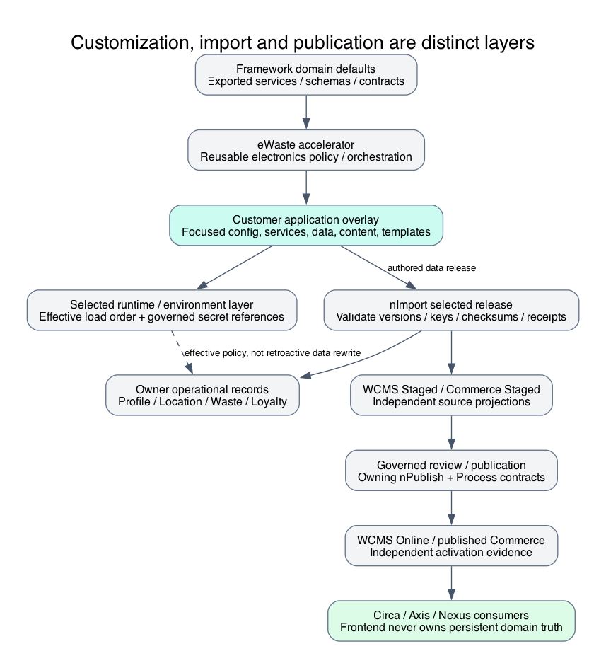

# Customize and Extend Circa Safely



This source-backed diagram explains ownership and boundaries; it is not live
deployment or acceptance evidence. Qualification notes remain part of the flow.

Circa demonstrates framework composition, not a fork that adopters must maintain.
Beginners should first decide whether a change concerns presentation, deployment,
reference policy or reusable lifecycle behavior. Business differentiation normally
belongs in a customer-owned application overlay. Framework invariants remain with
their owners, even when a customer first requests the enhancement.

## Choose the owning layer

| Desired change | Custom project surface | Preserve |
| --- | --- | --- |
| Brand, banners, page copy/detail order | Project WCMS records and frontend presentation | Published renderer contract and safe media delivery |
| App identity/channel selection | Project config/adapters using eWaste/Profile | Authenticated proof, tenant context, secret references |
| Centre or outlet allocation | Profile/Location/Waste/Store owner records and governed data | Explicit scopes and cross-domain references |
| Arrival distance policy | Focused journey config and existing eWaste arrival adapter | Fresh coordinates, current centre, direct distance |
| Acceptance/assessment policy | Project reference overlay/provider selection | Original evidence, limitations, provider history |
| Coupon terms/supply | Commerce/Promotion records and published catalogue | Price/stock ownership and code/entitlement authority |
| New reusable lifecycle mechanics | Nodics-owned framework/domain contribution | Layer ownership, generated persistence, contracts/tests |
| EMAIL/SMS look and feel | Layered module template resources | Parameter validation, escaping, frozen intent and source authority |

Do not edit dependency source as a partner customization. Reuse then extend through
the existing module hierarchy; request reusable changes through Nodics review and
release. A custom module does not rename the functional capability it extends.
Technical-module identity and product branding are not permission authorities.

## Project file layout

Use the standard module shape, keeping only files that actually contribute a delta:

```text
modules/acme.circular/
  package.json
  config/properties.js
  src/service/defaultAcmePresentationService.js
  src/templates/email/<notification>/template.json
  src/templates/email/<notification>/en/subject.txt
  src/templates/email/<notification>/en/email.html
  src/templates/email/<notification>/en/email.txt
  data/<release>/headers/
  data/<release>/records/
  data/manifest.json
  test/
  README.md
  AGENTS.md
  llm/contracts/
  llm/examples/
```

This is an illustrative customer layout, not a new generator or mandatory duplicate
service. Define functional inheritance using the existing module metadata and actual
runtime boot chain. Package dependency makes source available; it does not establish
service precedence. Effective exported members are merged in load order. Verify
the selected module/server index rather than assuming a sibling folder wins.

## Worked presentation and arrival example

When extending the Circa reference, a custom `config/properties.js` can export a
small delta:

```js
'use strict';
/** @module acme.circular/config/properties @description Custom brand and approved arrival policy. @layer config @owner acme.circular */
module.exports = {
    circaEWaste: {
        presentation: { brandName: 'Acme Circular' },
        journey: { arrivalRadiusMetres: 40 }
    }
};
```

The example changes presentation and narrows the reference 50-metre radius. It does
not create a new enterprise, update saved locations, grant permissions or publish
content. A deployment must approve the radius and validate the effective merged
value. Keep sample/estimate labels accurate. For an independent eWaste adoption,
use its domain configuration and your own app presentation namespace rather than
introducing a dependency on Circa-branded services.

Invalid policy, stale coordinates or an outside-radius request must still reject.
Recovery preserves saved work and asks for a fresh reading; it must not retry with
made-up coordinates. Test inherited defaults, the custom layer, exact boundary,
wrong centre, permission loss and restoration. The UI cannot override this gate.

## Focused service overrides and trusted mapping

Services use exported loader-visible members with file/function JSDocs. Customize
the smallest existing member rather than copy the complete framework service or
hide behavior in a closed local helper. Circa's catalogue composition changes the
existing eWaste marketplace list boundary; purchase and other methods remain
inherited. Controller adapters reuse `DefaultEWasteRequestService` with server-owned
selection. User payloads cannot select a service, transport, owner or tenant.

Before an override, read the nearest README/AGENTS/contracts and related fixtures.
Record owner, business outcome, data/security/runtime effects, intended files and
validation route. Retain authorization, DENY precedence, revisions, idempotency,
current resource scope and exact persistence evidence. An override that removes
these checks is not supported customization, even if the happy path still works.

## Data and publication customization

Add intentional data records/deltas to a customer release, preserving installed
codes and history. Existing nImport source-key inheritance supplies reusable
fields when configured; matching filename/key/header semantics matter. Do not
rewrite retained release bytes or manually adjust hashes. A new centre needs
approved Location/operator references; a new coupon needs Product, price, batch,
policy, eligible outlet and published projection, not just an HTML card.

Use Staged validation/review/publication for WCMS and Commerce separately. Source
changes, installed data, Online projection and browser cache are different states.
Rollback must consider owner receipts and dependent transactions; deleting a failed
deployment's records can destroy history. Test missing baseline, wrong version,
ambiguous references and interrupted import through governed owners.

## EMAIL/SMS customization

Default templates come from their framework module under `src/templates/email`
or `src/templates/sms`. Customize locale HTML/text/subject resources through later
module/runtime layers using the same template identity and metadata contract. Keep
static look/content in resource files and dynamic values as declared bounded
parameters. OTP is purpose-specific secure data, not a browser configuration value.

Read the framework [EMAIL/SMS guide](../nodics.communication/email-sms-templates.md)
before adding a notification. Preserve sourceModules, channel/purpose, required
selection and parameter validation. Do not send raw coupon secrets or claim a
refund completed before owner proof. Retry must retain the qualified original
intent/template selection rather than rebuild from mutable current content. Merely
adding an optional Digital Core template does not wire a lifecycle trigger.

## Common mistakes

Copying whole services, storing template bodies in properties, editing generated
documentation records, relaxing permission checks for a demo, introducing a second
wallet or identity store, and putting reusable logic into Kickoff all increase
upgrade risk. One custom app can reuse several functional modules without becoming
their persistence authority.

## Verification

Developers and AI tools must verify default plus later-layer behavior, not only the
overlay. Operators inspect effective configuration and installed/published records.
DevOps checks missing dependency/provider recovery and version compatibility.
Documentation needs concrete rejected, boundary, failure/recovery and customized
examples. Behavioral/visual acceptance remains separate from static docs generation.
See [deployment and verification](circa-deployment-verification.md) for commands,
evidence gates and operational ownership.
