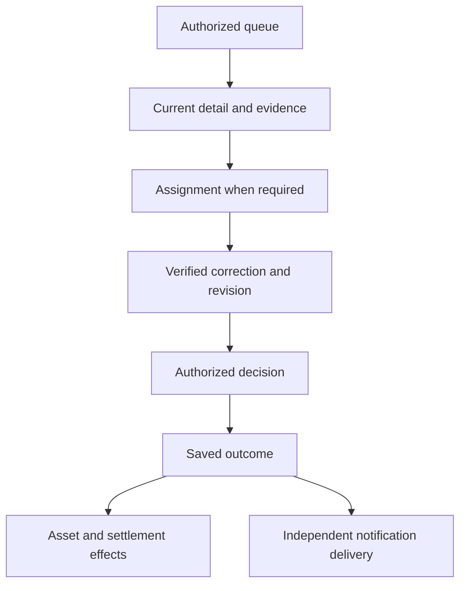

# Circa Review, Assets, Rewards and Environmental Evidence

Circa's operational journey connects customer evidence to accountable staff decisions.
For beginners, verification means reviewing facts; approval means accepting a
submission under policy; receipt means recording physical custody. Reward settlement
is a separate owner operation. The business benefit is traceability: an operator
can explain which actor accepted which facts and why a wallet changed, without
using a website status badge as the source of truth.

## Staff roles and resource boundaries

Axis consumes backend-governed eWaste/Waste workspaces and permissions. Profile
owns the employee identity, selected enterprise membership and operational scopes.
eWaste contributes its concrete electronics navigation to generic Waste operations;
the frontend does not own a parallel review registry or persistence route.

| Responsibility | What it permits conceptually | What it does not imply |
| --- | --- | --- |
| Queue/read staff | View authorized submissions and evidence | Verification, approval or all-centre access |
| Verifier | Record a verified overlay under permission | Approval authority or editing original evidence |
| Approver | Accept/reject authorized reviewed work | Arbitrary wallet adjustment or physical receipt |
| Collection/custody operator | Record authorized receipt/custody evidence | Transport dispatch or enterprise administration |
| Merchant operator | Use qualified store-scoped coupon operations | Waste review or other outlet access |
| Enterprise administrator | Govern bounded enterprise staff/access | Automatic operational scope or platform authority |

The Circa reference sets `waste.operations.requireScopes = true` and
`requireVerification = true`. It sets `requireDifferentApprover = false`: one
employee with both explicit grants may verify and approve the same item. Separate
permission checks, verification prerequisites and actor audit records still apply.
Deployments requiring separation of duties must set and qualify the narrower policy;
two accounts in a sample are not enforcement by themselves.

## Review and decision screen flow

The review detail presents original photo/evidence, suggested data, customer fields,
centre context, assessment and audit. Reviewer corrections are a verified overlay,
not a silent replacement of submitted data or AI output. Customer-facing feedback
must be distinguished from private reviewer notes. Rejection needs an appropriate
reason; the customer account should show the saved public outcome, not private proof.

The eWaste routes expose review-workspace listing/detail, assignment, recovery,
settlement retry and notification resolution/retry. Their presence does not qualify
every interruption path. A stale revision, changed assignment, missing scope or
ambiguous owner response must reject rather than fabricate a completed decision.
Inspect retained state before retrying a committed effect.

## Assets, receipt and ownership

Approval and associated policy can create/update an owned Waste asset. Receipt and
custody remain separately recorded Waste facts; they cannot be inferred from a
customer reaching a map pin or uploading a photo. Preserve linked evidence and
history through any subsequent owner transition.

An approved asset may expose list, gift, purchase or other policy-defined actions.
Available actions come from the backend and are revalidated at execution. The
reference's marketplace is digital ownership, not a promise to deliver a device.
Attached illustrative carbon can move with an asset while historical approval
rewards remain with the original contributor. Donation/recycling handoff and
repair/reuse presentation must not be mistaken for a qualified logistics or repair
orchestration product. Only activate actions whose owner policy and integration
have passed the deployment's acceptance gates.

## Environmental assessments and history

Circa selects `DefaultEWasteOpenAiImpactProviderService` with configured
`DefaultEWasteWarmImpactProviderService` fallback under `wasteImpact.calculation`.
The environmental call is separate from photo metadata. It uses normalized item
information and source references; invalid/timed-out results advance through the
configured chain. Secrets remain governed provider references, not authored records.

Saved results retain provider/model or factor-set version, source references, units,
mass ranges, geography, scenario assumptions and limitations. INPUT_ONLY represents
available input information without defensible calculated savings. WARM proxy and
bundle-reference comparisons need their disclosed assumptions; they are not a
measurement of achieved treatment or a certified item composition.

Axis exposes assessment history, reassessment and explicit acceptance with reasons
and revision checks. Accepted customer/asset details and history use authorized
owner projections. Changing the provider does not overwrite old results. Reassessment
does not silently revalue settled approval rewards. Show true zero/negative values,
unknown metrics and limitation messages rather than substituting appealing defaults.

## Rewards and settlement

Loyalty owns wallet balances, ledger, reservations, debits, transfers and reversals.
Rules/valuation assessment and original approval evidence determine the configured
reward path. Circa renders confirmed assessment and settlement evidence; legacy
valuation is compatibility context, not permission to recalculate balances locally.

The reference's illustrative programme selects `circa`, reward type `points` and
carbon reward type `circaCarbon`. Its weight valuation configuration includes sample
rates and an illustrative marker. Those rates are not production financial policy,
cash conversion, carbon prices or issued credits. Reward points, carbon units,
CO2e estimates and tonnes of carbon equivalent are different concepts.

If approval commits but settlement fails, inspect the original approval and the
owner settlement reference. Use the qualified settlement recovery operation with
the same command identity. Do not approve again, add an opening ledger or manually
increase a balance. Notification failure is independently recoverable and cannot
be used as a reason to repeat a wallet effect.

## Customize and extend safely

A project can select approved acceptance/verification/receipt/impact policy records
through its governed data overlay. For example, require independent approval by
exporting `waste.operations.requireDifferentApprover: true` in the project config,
then assign separate verifier/approver memberships and centre scopes. Do not copy
review services, change private evidence in WCMS or remove freshness/CAS checks.

Developers test same-actor refusal under the changed policy, successful independent
review, wrong-centre rejection, last-minute scope loss, stale revisions, partial
settlement, retained notification retries and original evidence preservation.
DevOps verifies effective configuration and owner receipts, not just source values.
Keep provider choice and reward programme explicit during upgrades; previous results
must continue to be understandable under their saved versions.

## Common mistakes

Showing certified carbon claims from sample factors; rewarding both preparation and
approval; merging private/public comments; treating admin groups as all-centre
scope; inferring custody from arrival; and retrying approval to repair delivery are
incorrect. Review before accepting an environmental reassessment and preserve
the original contributor's reward history after ownership transfer.

## Verification

Read the eWaste review workspace routes and Waste/Loyalty owner contracts alongside
the current project policy. Verify positive, denied, stale, interrupted and
later-layer scenarios through the joint acceptance plan. Static source and docs
checks do not prove external provider accuracy, installed settlement or actual
operator permissions. Continue with [commerce](circa-coupons-commerce.md) and
[deployment verification](circa-deployment-verification.md).
