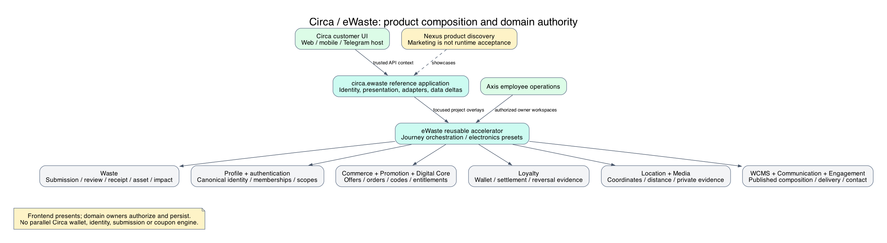
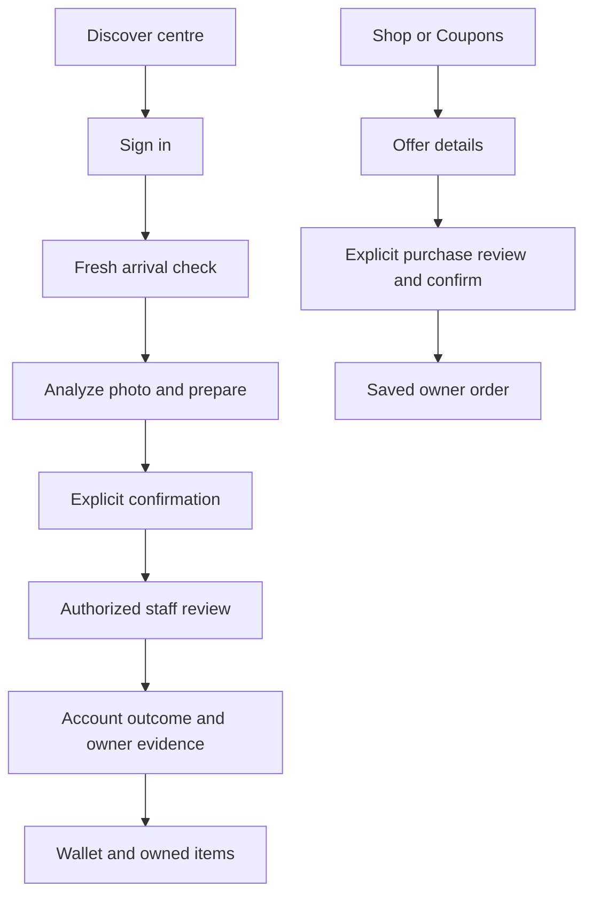

# Circa and the eWaste Product

This source-backed diagram explains ownership and boundaries; it is not live
deployment or acceptance evidence. Qualification notes remain part of the flow.

Circa is Nodics' connected reference experience for electronic-waste participation
and circular ownership. Nexus presents Waste Management as a framework product
showcased through Circa. The reusable electronic-waste domain accelerator is
`eWaste`; Circa is the application that composes it with Profile, Location, Media,
Waste, Loyalty, Commerce, WCMS, Communication and Engagement. There is not a second
Circa domain engine or independent wallet hidden behind the website.

For beginners, start with a simple business scenario: a customer visits a collection
centre, prepares a photographed electronic item, confirms a submission and waits
for authorized review. The accepted outcome can produce an owned asset and governed
rewards. The same account can browse assets or coupons and review purchases.
Approval, physical receipt, environmental assessment, reward settlement, marketplace
sale and coupon redemption are separate facts. One does not prove the others.

## Detailed reference pages

Use the [data network guide](circa-data-network.md) for the relationship overview,
then consult these exact source references:

| Reference | Details |
| --- | --- |
| [Collection centres](circa-collection-reference.md) | Three original points, 17 shared points, optional Sunmarke, coordinates, categories and ownership |
| [Enterprises and employees](circa-enterprise-reference.md) | Three referenced enterprise codes, capabilities, seven sample employees and eight scopes |
| [Source release inventory](circa-source-inventory.md) | Twelve manifest sections, record-file counts, destinations and publication gates |
| [Catalogue records](circa-catalogue-reference.md) | Store, eight products, prices, inventory, three coupon batches and benefit caveats |
| [Configuration reference](circa-configuration-reference.md) | Application settings, domain ownership, providers and extension points |

Counts describe reviewed authored records, not installed or publicly visible totals.
The [submission](circa-submission-journey.md), [operations](circa-operations-rewards.md),
[commerce](circa-coupons-commerce.md), [customization](circa-customization.md) and
[deployment](circa-deployment-verification.md) guides explain the connected journeys.

## Product capability map

| Experience | What the current source supplies | Authoritative owner |
| --- | --- | --- |
| Public website and help | Published page composition, collection discovery, contact intake, application copy and imagery | WCMS, Location, Engagement; Circa presentation |
| Customer identity | Profile registration/sign-in and authenticated account context | Profile and authentication framework |
| Guided eWaste submission | Arrival check, temporary photo analysis, saved preparation, correction and explicit confirmation | eWaste orchestration over Waste/Media |
| Staff review | Scope-aware queues, evidence, verified overlays, decisions and recovery surfaces in Axis | Waste/eWaste with Profile permissions |
| Environmental information | Provider assessments, estimates, input-only limitations, provenance and assessment history | Waste Impact and eWaste providers |
| Account workspace | Drafts, submissions, assets, details, filters, quick view and authorized actions | Owner-scoped eWaste projections |
| Rewards | Wallet balance/history and references to approval settlement | Loyalty; Rules/valuation evidence where configured |
| Asset marketplace | Published catalogue, reviewed digital-ownership purchase, listing, gifts and bid surfaces | Waste and Commerce, not frontend state |
| Coupons | Published offers, purchase review, entitlement history, owner-authorized reveal and merchant-facing framework integration | Promotion, Digital Commerce, Order and Payment |
| Updates | Communication inbox and authorized item-linked outcome presentation | Communication and source-domain resolution |

These are source capabilities, not a promise that every deployment has activated
all providers, permissions or data releases. Production merchant acceptance,
commercial allocations and certain recovery/security improvements still require
qualification. A visible button or enabled setting is not acceptance evidence.

## Repository and authority map

Framework source packages generic Waste behavior under `nodics.waste` and reusable
electronics composition under `nodics.accelerators/modules/waste/modules/eWaste`.
The reference customer backend `circa.ewaste` lives in Kickoff. It supplies
application identity, site adapters, governed content/sample releases, deployment
choices and illustrative policy. `nodics.circa.eWaste` supplies the customer UI;
Axis supplies employee operations. Nexus supplies the framework product discovery
experience. `nodics.docs` owns this framework product guide and generated CMS
documentation release; customer-specific runbooks remain with their backend owner.

Developers must not move Circa-branded data into generic Waste merely because the
reference is marketed as a Nodics product. Equally, reusable lifecycle corrections
must not remain as a copied engine in Kickoff. Module availability, module `extends`,
runtime `extends` and exported-service load order are distinct mechanisms.

## Customer navigation and screen flow

The web experience exposes Submit Waste, Find Collection Center, Shop and Help.
Shop and Coupons have public browsing and independent details. Account views split
dashboard, My items, Wallet, Bids, Purchases and coupons, and Ownership activity.
Drafts are separate from submitted items. Mobile and Telegram use shared domain
components while retaining host launch context through navigation and sign-in.

Quick view is read-only. Browser return/reload must not create another submission,
order, wallet effect or coupon. A customer account can have no items and an empty
wallet; sample opening balances do not define registration behavior.

## Environmental and commercial limitations

Potential CO2e savings are estimates, not certified emission reductions. Carbon
equivalent in tonnes is a unit conversion, not issued credits. Carbon units in the
reference programme are reward units. Available input mass/count does not establish
completed diversion. Unknown outcomes remain unknown; negative or zero calculated
values are not hidden to make a benefit card look attractive.

Reference asset offers describe digital ownership and do not promise physical
delivery. A configured logistics partner does not imply fleet/dispatch orchestration.
Repair/reuse business relationships do not by themselves activate a repair lifecycle.
Telegram source integration and a host shell are not proof of actual-client
acceptance. Nexus channel positioning must not be read as an activated WhatsApp
identity, submission or delivery integration.

## Customize and extend safely

Adopters create their own backend application module and frontend brand, extending
the existing eWaste capability. A minimal presentation change belongs in the custom
module's `config/properties.js`, exporting a focused `circaEWaste.presentation`
delta when extending the Circa reference. A domain change belongs in a focused
`eWaste` policy/provider delta, not a copied submission service. Use new application
identity for a new installation; preserve identity when upgrading an existing one.

For example, change the brand display name and published banner while keeping the
same arrival and authorization operations. Test effective configuration, published
renderer compatibility, missing-content recovery and both mobile and desktop
layout. Do not claim a new channel, certified benefit or payment method from copy
changes alone. See [customization](circa-customization.md) for exact file patterns.

## Common mistakes

Treating all configured journeys as production-qualified; treating parent enterprise
membership as outlet authority; treating approval as physical receipt; copying
sample wallets into a live programme; embedding coupon secrets in public content;
and moving persisted data into a frontend are all incorrect. Operators should use
saved owner evidence and review outstanding gates before activating a programme.

## Verification

This guide is grounded in Nexus backend product records, eWaste routes/contracts,
Circa backend configuration/data and customer frontend source. Static documentation
checks establish catalogue and content consistency, not live acceptance. DevOps
and QA must separately record installed versions, effective policy, API authorization,
failure/recovery and desktop/mobile/native-client evidence. Continue with the
[data guide](circa-data-network.md), [submission journey](circa-submission-journey.md),
[operations](circa-operations-rewards.md), [commerce](circa-coupons-commerce.md) and
[deployment guide](circa-deployment-verification.md).
