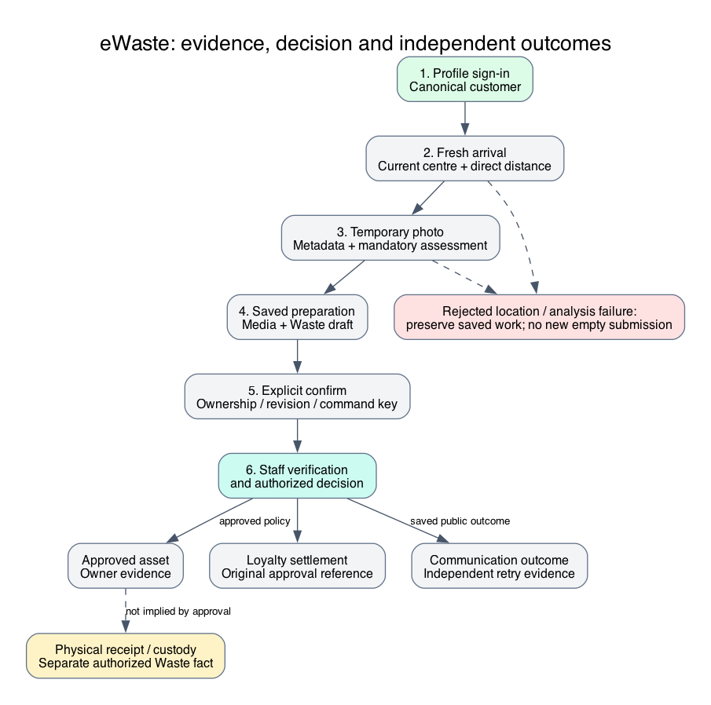
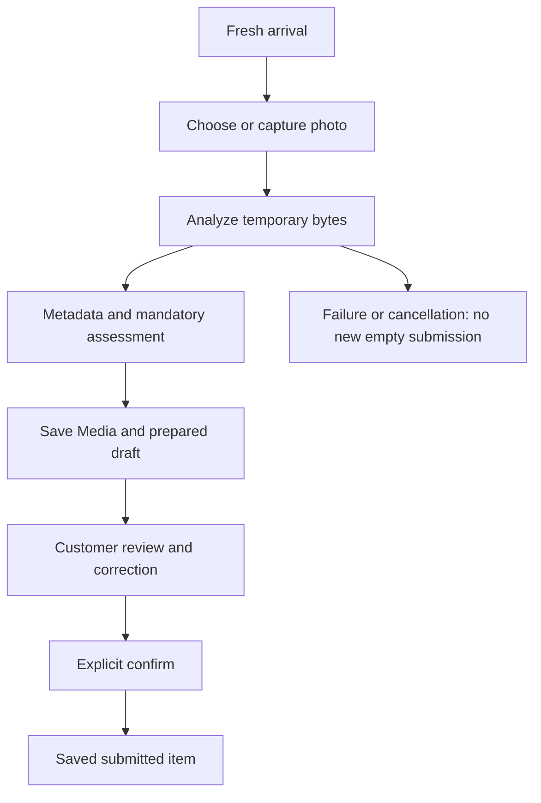

# Circa Customer eWaste Submission

This source-backed diagram explains ownership and boundaries; it is not live
deployment or acceptance evidence. Qualification notes remain part of the flow.

The submission experience guides a customer from intent to evidence and an explicit
review request. Beginners should understand that recognizing a photographed item
does not approve it, deposit it physically or credit a wallet. The business purpose
is consistent evidence collection with fewer technical questions, while retaining
customer ownership checks and staff accountability.

## Sign-in, intent and channels

The public Submit Waste action remains available on web and mobile. Sign-in retains
the intended journey rather than forcing the customer to rediscover it. Registration
uses the Circa adapter to forward business form fields to Profile; it does not
construct credentials locally. A new account is independent and may have an empty
wallet. OTP is not silently imposed on the reference customer registration journey.

The web, mobile and Telegram host share domain components. Telegram launch assertions
are verified by backend/Profile integration and governed credential references.
A `/telegram` shell or valid launch check is not proof of durable account linking,
browser-handoff recovery or actual native-client acceptance. Account linking must
use authenticated proof, never matching an email or trusting a host user identifier.
WhatsApp product positioning is not a qualified Circa WhatsApp implementation.

## Locate a centre and prove arrival

The customer can browse a centre list and map without proving arrival. If location
is unavailable, browsing and help remain useful. A chosen pin, directions link or
route estimate never unlocks photo preparation. Circa requests fresh device/browser
coordinates and submits them to backend arrival validation against a current
eligible collection point.

`circaEWaste.journey.arrivalRadiusMetres` uses an environment-backed reference
fallback of 50 metres. The boundary is inclusive and measured by direct distance.
Accuracy is optional observation metadata, not an arrival gate in this policy.
Invalid/stale coordinates reject; the browser must preserve saved work and offer a
retry. Telegram uses its native location capability when available, with browser
fallback where appropriate. Permission denial and inaccurate/unavailable readings
have distinct recovery controls. Neither control changes backend policy.

## Prepare the photo without an empty submission

Arrival preview creates no submission. Automatic preparation analyzes temporary
bytes before saving Media and a prepared Waste draft. Closing or failing before
successful analysis does not create a new empty submission. A failed replacement
retains the previously saved photo/item. Saved unfinished work appears in Drafts;
the submitted-item collection excludes unfinished states so totals and pagination
do not contradict the filter.

Photo metadata and environmental assessment are separate operations. Suggested
classification, materials and physical details remain advisory until staff review.
Impact assessment is mandatory for the eWaste journey: configured provider/profile
failure propagates for retry rather than producing an apparently ready empty result.
Supported partial assessment is explicit and can have input-only coverage without
numerical carbon savings.

## Review, correction and confirmation

Customers see the photo, item name/description, supported details and environmental
assessment with provenance/limitations. They edit name and description; authorized
Axis reviewers own technical classification and physical/environmental correction.
Inconclusive recognition can use the configured manual-review path rather than
asking a customer to invent technical facts.

Final confirmation is an explicit authenticated domain command. It preserves the
displayed revision and stable idempotency identity, validates current permissions,
ownership, evidence and policy, and transitions the saved preparation to submitted
work. Local optimistic UI is not a successful submission acknowledgement. If a
response is uncertain, inspect the owner record before retrying; do not create a
second draft simply because a spinner timed out.

## Account workspace and customer outcomes

| View | Expected behavior |
| --- | --- |
| Dashboard `/account` | Owner-backed wallet cards, status totals, recent items and draft shortcuts |
| My items `/account/items` | Server filters, stable pagination, exact counts and grid/list controls |
| Drafts | Saved-photo preview and explicit Continue action |
| Submission `/account/submissions/:code` | Independently authorized item detail and public review feedback |
| Asset `/account/assets/:code` | Accepted descriptor, available ownership actions and assessment history |
| Mobile/Telegram item link | Preserves requested selector through sign-in; never substitutes another draft |

Quick view is read-only. Full detail is independently fetched, not trusted from a
previous list. WCMS `/account/waste` supplies presentation through
`circa.wasteWorkspace`, while `/nodics/eWaste/v0/account/items` supplies owner-scoped
records/actions. Missing published composition gives a recoverable content error.
Private photos require authorized Media reads; WCMS never stores customer records.

Updates show Communication inbox entries resolved to authorized source items.
Missing or inaccessible sources use a generic outcome, not leaked item details.
Raw message bodies, arbitrary URLs and internal references are not customer copy.
Notifications can fail independently of a committed review; that requires delivery
recovery, not repeated approval.

## Customize and extend safely

In a custom backend `config/properties.js`, export a focused journey-radius delta
or approved display instruction. Preserve eWaste request mapping, authenticated
identity, fresh coordinates and Location distance ownership. To change account
banner/detail order, author the custom WCMS page/component records and publish them;
do not embed domain eligibility in a React component. A radius change affects new
arrival decisions, not retroactive approval or automatic submission.

Developers must test just-inside/exact/outside radius, stale location, inactive
centre, denied camera/location permissions, cancelled preparation, failed replacement,
unknown assessment, wrong-owner detail, repeated confirmation and later-layer policy.
Check desktop/mobile text, touch/keyboard controls and host Back navigation jointly.

## Common mistakes

Treating directions as proof; storing an empty draft before analysis; overwriting
original AI/evidence with reviewer corrections; showing input mass as achieved
diversion; or using a customer-supplied owner/tenant/service name violates the journey.
An expired token needs authentication recovery, not broader backend service access.

## Verification

Source entry points include eWaste `src/router/routers.js`, Circa journey adapters
and customer frontend `CustomerWasteWorkspace`/item-detail components. Operator and
DevOps acceptance must verify owner records before and after cancellation/retries,
not merely UI messages. Behavioral and visual tests are separate from documentation
validation. Continue to [staff review and rewards](circa-operations-rewards.md) and
[deployment/verification](circa-deployment-verification.md).
