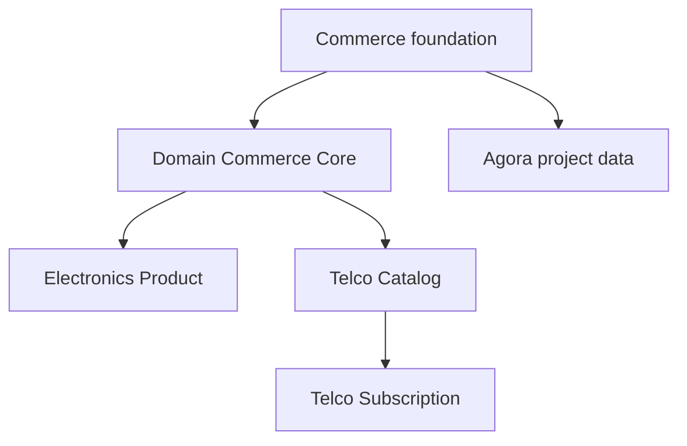

# Domain Commerce Accelerator Source Map

Domain commerce accelerator modules add industry-specific commerce behavior on
top of the shared Commerce foundation. They do not replace product, pricing,
inventory, search, checkout, or fulfillment authority. Instead, they add
domain rules, projections, validation, enrichment, and setup contracts for
Apparel, Electronics, Telco, and customer accelerators. For beginners, the
accelerator layer answers "what is special about this industry?" while Commerce
answers "how does commerce work?"

## Business problem

The business problem is faster industry adoption without copying frameworks.
An electronics catalogue needs technical attributes and search enrichment. A
telco catalogue needs plans, subscriptions, and product constraints. A domain
core needs shared industry policies. Business users get an accelerator that
feels ready for their market; developers get a clean extension layer; operators
still get one production evidence model.

## Source map

| Area | Source location |
| --- | --- |
| Accelerator group | `../nodics.accelerators/package.json` |
| Domain commerce core | `../nodics.accelerators/modules/domainCommerceCore/` |
| Electronics product | `../nodics.accelerators/modules/electronics/modules/electronicsProduct/` |
| Telco catalog | `../nodics.accelerators/modules/telco/modules/telcoCatalog/` |
| Telco subscription | `../nodics.accelerators/modules/telco/modules/telcoSubscription/` |
| Agora Apparel authoring | `docs/pages/accelerators/agora-apparel-product-data-authoring.md` |
| Commerce data authoring | `docs/pages/nodics.commerce/commerce-data-authoring-and-fulfillment.md` |

## Layering model



## Contract

Domain modules can add schemas, validation services, search enrichment,
indexes, and industry policies. They should reference shared Commerce objects
using stable codes and documented relation fields. They should not copy shared
Commerce services or redefine generic product lifecycle rules unless they
declare a versioned extension contract.

```js
const enrichment = {
  productCode: 'smartphone001',
  domainType: 'electronics',
  searchableAttributes: ['storage', 'screenSize', 'warranty']
};
```

## Customization and extension guidance

Developers can add an industry module by starting with domain policy,
specialized schemas, import records, search enrichment, validation tests, and
browser evidence. Business users should see industry-specific workbenches in
Axis only after the backend module exposes capability metadata. Operators
should see whether a domain accelerator is installed, active, indexed, and
compatible with the selected Commerce release.

## Operating rules

Each accelerator release should identify which shared Commerce release it
extends, which sample data it contributes, and which search projections or
storefront journeys prove the industry behavior. Import data can seed Apparel,
Electronics, or Telco examples, but runtime services must still resolve
authority from Commerce schemas and domain extension schemas. Axis should show
accelerator readiness only after module activation, data import, and indexing
evidence agree.

Decision makers should treat accelerators as governed shortcuts, not forks of
the platform. The value is reduced project setup time with retained upgrade
discipline, source traceability, and consistent production operations.

## Common mistakes

- Copying Commerce product or checkout logic into an accelerator.
- Treating a search enrichment module as catalogue authority.
- Adding industry data without import and projection tests.
- Hiding accelerator readiness behind generic setup messages.
- Forgetting browser proof for Agora or the relevant storefront.

## Verification

Run domain commerce, electronics product, telco catalogue, and telco
subscription tests. Import sample data into a fresh schema, rebuild search
projections, open the relevant storefront journey, and confirm industry fields
render without breaking shared commerce behavior. Production readiness requires
business fit, developer extension clarity, operator readiness evidence, and QA
proof across install and upgrade paths.
