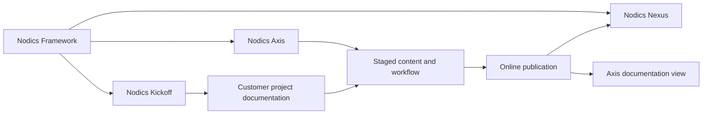

# Nodics Application Suite

Nodics Application Suite describes the application experiences that sit on top of the Nodics Framework. The framework remains the foundation, while Axis, Nexus, and Kickoff are usable application surfaces that help a business team run, publish, inspect, or demonstrate a Nodics installation. Beginners should treat this page as the orientation map before opening individual application documentation, because it explains which application owns which user journey and where implementation detail should live.

## Business perspective

The suite exists to reduce the gap between a powerful backend framework and the day-to-day operations that business users, implementation partners, developers, QA owners, and operators need to perform. Axis is the authenticated operations and BackOffice surface. Nexus is the public corporate and documentation consumption surface. Kickoff is the reference customer workspace that shows how a customer project composes modules, data, content, topology, and acceptance checks without changing vendor-owned framework code.

| Application | Primary business purpose | Typical user | Publication visibility |
| --- | --- | --- | --- |
| Nodics Axis | Configure, inspect, approve, publish, and operate business capabilities | Administrator, business user, operator, developer | Authenticated by default, role or permission filtered where needed |
| Nodics Nexus | Render corporate pages and selected documentation to non-logged-in readers | Visitor, buyer, partner, evaluator | Public for approved Online content |
| Nodics Kickoff | Demonstrate a customer project, local setup, customization, and acceptance | Implementation partner, developer, QA owner | Public documentation, local project runtime, and customer-owned customization |

The most important business rule is ownership clarity. Axis may let a user change a page, navigation item, content area, schema extension, or operation setting, but the owning backend capability remains responsible for validating and publishing that change. Nexus may render public documentation, but it must read approved Online content instead of loading source Markdown or repository files. Kickoff may demonstrate how a customer works, but it must not become the owner of Commerce, WCMS, Profile, Process, or other framework capabilities.

## Application journey

An enterprise team normally starts with the framework value pages, then opens Kickoff to understand a runnable customer composition, then uses Axis to inspect active modules and content, and finally confirms how Nexus renders public Online content. The same documentation content catalog can expose pages differently based on access mode: public pages can appear in Nexus, authenticated pages can appear only after login, and role or permission guarded pages can be limited to selected Axis users.

## Technical perspective

Axis is a frontend and BackOffice application experience, but its documentation content pack is backend-owned under the Platform Axis module. Nexus is a frontend consumer for corporate and public documentation routes; its content data belongs to the backend content catalog and customer/project modules. Kickoff is a customer project and reference application; its documentation source lives under `nodics.kickoff/docs`, and its generated data is importable through `data/core`.

The suite depends on WCMS for sites, pages, routes, templates, slots, components, documentation product metadata, navigation nodes, dashboards, access policies, publication states, and search metadata. BackOffice contributes the discoverable application and documentation sources. Profile owns user identity, groups, and permissions. nPublish owns the staged-to-online lifecycle, review, approval, activation, rollback, and publication evidence.

## Customization model

Customers customize the suite at the project layer. They can add a new Axis navigation item, extend a BackOffice capability provider, add a Nexus content route, add a Kickoff module, or introduce a new documentation product. The customization must be source-backed and publication-governed. For example, a business user may reorder documentation groups in Axis after those groups are represented as content-catalog records. A developer may add a new renderer, but the renderer key must be registered and validated rather than injected through content.

Use this division when writing or reviewing implementation work:

| Change | Correct owner | Validation expectation |
| --- | --- | --- |
| New application suite page | Owning application or project documentation source | Catalogue metadata, generated CMS records, access policy, search metadata |
| New Axis workspace | Backend BackOffice capability plus Axis renderer | Permission, route contract, renderer registry, visual verification |
| New public Nexus page | WCMS content/catalog source | Staged review, Online publication, public access policy |
| New Kickoff example | Customer project module | Project-layer source, data manifest, local acceptance check |

## Access and publication

Every suite topic must declare whether it is public, authenticated, or role/permission based. Public pages can be consumed by Nexus only after they are approved and Online. Authenticated and restricted pages should remain visible in Axis based on Profile-owned groups and permissions. Generated documentation records must include stable route, page, component, navigation, dashboard, access, publication, and search metadata so Axis can render and manage them without hardcoded menus.

## Common mistakes

- Treating Nodics Framework as a product inside the application suite. The framework is the base capability platform; the suite contains application experiences built on it.
- Putting Nexus documentation source in the frontend app. Nexus renders public Online content, but backend content catalog and publication records remain the authority.
- Allowing Axis to become a parallel data owner. Axis should render, validate, and submit operations through backend contracts.
- Writing suite documentation only for developers. Business users need to understand what each application lets them decide, approve, publish, or inspect.

## Verification

Verify this topic by checking that `nodics.docs/docs/catalogue.json` contains a `Nodics Application Suite` section and that generated documentation records include product, navigation, node, dashboard, page metadata, access policy, publication state, and search metadata files. Run `npm run docs:check` and `npm run validate` in `nodics.docs`, then install the content pack through the normal import and publication workflow before relying on Axis or Nexus rendering evidence.
