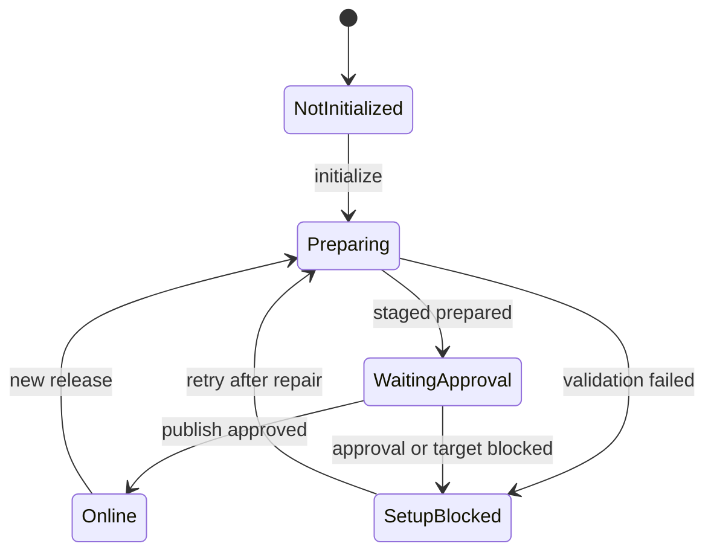

# Axis Setup and User-Safe Error Contracts

Axis is the business-facing backoffice journey for setup, governance, and
operation. It should help a business user initialize accelerators, inspect
status, retry failed work, and navigate to the right owner without exposing
raw framework exceptions. Axis is not the authority for catalogs, pages,
media, products, prices, inventory, or documentation data. It consumes
BackOffice capability metadata and runtime evidence, then presents a safe
operator experience.

## Source map

| Area | Current source |
| --- | --- |
| BackOffice initialization services | `../nodics.platform/modules/backoffice/src/service/defaultBackofficeApplicationInitializationService.js` |
| BackOffice availability and registry | `../nodics.platform/modules/backoffice/src/service/availability/`, `../nodics.platform/modules/backoffice/src/service/registry/` |
| BackOffice setup controllers | `../nodics.platform/modules/backoffice/src/controller/application/`, `../nodics.platform/modules/backoffice/src/controller/registry/` |
| Axis module docs | `../nodics.platform/modules/axis/docs/pages/module-health.md`, `../nodics.platform/modules/axis/docs/pages/implementation-and-documentation-contract.md` |
| Axis frontend | `../../nodics.exp/nodics.axis/package.json` |
| Contract tests | `../nodics.platform/modules/backoffice/test/backofficeApplicationInitializationContract.test.js`, `../nodics.platform/modules/backoffice/test/availability.test.js` |

## State model



Every status shown in Axis should be business-safe and evidence-backed. A
beginner should see "Content catalog pending setup" rather than a stack trace.
A developer should still be able to open the details panel or backend logs and
find the exact missing module, release, schema, and operation. An operator
needs retry guidance and a way to prove whether the failure is configuration,
data quality, permission, missing dependency, or target runtime availability.

## Error contract

| Backend condition | Axis headline | Axis detail | Technical detail |
| --- | --- | --- | --- |
| Required module inactive | Setup blocked | Required capability is not active. | Module code, expected runtime role, dependency check. |
| Missing content catalog | Staged preparation blocked | Storefront content is not available for this application. | Data release item, catalog code, schema name. |
| Missing application release | Setup blocked | Application release is not configured. | Profile code, baseline, release version field. |
| Publication target unavailable | Publication blocked | Online target is not reachable. | Target URL, correlation id, health result. |
| Unexpected exception | Setup needs attention | Setup could not be completed. | Error code, stack in logs, request id. |

The user-facing message should explain the business impact and next action.
The technical evidence should be available to administrators and support, but
it should not replace the safe message. Axis should avoid labels such as
`ERR_SYS_00000` in the primary row, because that message tells neither the
business user nor the operator what to do.

## Setup flow

```text
1. Axis asks BackOffice for the accelerator setup profile.
2. BackOffice resolves module registry and capability readiness.
3. BackOffice validates the requested application release and target runtime.
4. Initialization imports or prepares Staged data owned by backend modules.
5. The setup response returns normalized state, user-safe message, and evidence.
6. Axis renders action buttons based on capability state and allowed operation.
```

Configuration matters, but it should be expressed as capability metadata and
runtime health, not frontend assumptions. When a release version is required,
BackOffice must validate it before dispatching work. When a content catalog is
missing, the response should identify the missing catalog in technical
evidence and phrase the UI message as a setup problem that needs data repair.

## Customization and extension guidance

Developers can extend setup by adding new BackOffice capability providers,
initialization targets, evidence fields, and status mappers. Keep the mapper
near the owning backend service so Axis does not duplicate business rules.
Business users can customize through Axis only when a capability exposes a
governed operation. Operators can add observability by carrying request ids,
profile code, baseline code, target runtime, release folder, import run id,
and publication code through the response.

New frontend panels should consume a normalized setup DTO. They should not
parse exception text. If a new backend error code is introduced, the owning
service should also define the safe headline, business detail, severity,
recoverability, retry action, and evidence payload.

## Common mistakes

- Rendering raw error codes as the main business message.
- Letting Axis infer data ownership from component names.
- Making retry buttons available when the backend says the capability is
  blocked by configuration or missing data.
- Hiding technical evidence from administrators and operators.
- Returning a generic internal error when the backend can identify a missing
  release, catalog, module, or target runtime.

## Verification

Test setup with a fresh schema and intentionally broken data. Confirm that
Axis shows friendly setup states, BackOffice logs keep technical evidence,
retry behavior is gated by capability state, and production-facing users never
see stack traces or unknown framework codes. Run the BackOffice application
initialization tests and the Axis live smoke checks after each setup contract
change.
