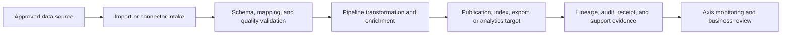

# Data Engineering and Analytics Platform

Data Engineering and Analytics Platform, or DEAP, is a Nodics solution use case for building governed data flows: consume data from approved sources, validate and transform it, publish it to approved destinations, and expose operational or analytical evidence. It is not a standalone product label in the application suite. It is a solution pattern that uses Nodics data import, export, discovery, publishing, provider, event, cron, pipeline, and Axis capabilities.

For a beginner, DEAP can be understood as a trusted data factory. A business user wants reliable data movement, reporting, enrichment, or search readiness. A developer defines schemas, mappings, processors, adapters, and pipeline steps. An operator watches batches, failures, quarantine, retries, lineage, and publication evidence so data quality issues do not silently reach Online experiences.

## Business context

Customers need DEAP when data quality and data movement become business risks. Product feeds, content indexes, customer engagement data, partner files, search documents, analytics exports, and migration packs all need source ownership, validation, transformation, retention, and support evidence. DEAP gives teams one governed pattern for these flows instead of one-off scripts and disconnected dashboards.

| Business question | DEAP answer |
| --- | --- |
| What problem does it solve? | It makes data ingestion, transformation, publishing, search readiness, and analytics evidence governed and repeatable. |
| Who uses it? | Business data owners, administrators, developers, operators, QA owners, and implementation partners. |
| What decisions are supported? | Whether a source is trusted, a batch is valid, a transform is accepted, a destination can be published, or a data issue needs quarantine. |
| What business value does it create? | Faster onboarding of data sources, safer migrations, better search/content quality, and clearer operational accountability. |

## Data journey

DEAP starts from an approved source and ends with a governed destination or analytical output. The journey should preserve source identity, tenant and enterprise context, schema version, checksum, mapping, transformation decision, lineage, validation result, and publication receipt. If data feeds search, WCMS, commerce, or analytics, the owning domain remains responsible for business meaning while DEAP carries the movement and processing pattern.



| Journey step | Business view | Technical owner |
| --- | --- | --- |
| Source approval | Business owner confirms source, purpose, and data classification. | Provider configuration, import definition, access policy. |
| Intake | File, API, event, or content pack is received with checksum and context. | Import/export services, provider adapters, event handlers. |
| Process | Data is validated, transformed, enriched, or quarantined. | Schema, mapping, validator, pipeline, processor service. |
| Deliver | Data reaches search, publication, export, dashboard, or analytical target. | Discovery, publishing, export, reporting, or domain projection. |

## Capability composition

DEAP documentation should link to the framework capabilities that implement the flow. Data import/export owns file and record movement. Discovery owns index configuration and query-ready documents. Provider and data access layers control storage and external connections. Cron and Process can schedule or govern recurring flows. Event and messaging capabilities distribute changes and processing results. Axis renders the management journey declared by the backend.

| Capability | Role in DEAP | Documentation link to maintain |
| --- | --- | --- |
| Data Import, Export, and Migration | Defines packs, manifests, import runs, mappings, checksums, and migration evidence. | Data Import, Export, and Migration |
| Schema and Data Modeling | Defines source records, target records, validation, and extension fields. | Data Modeling and Schema Management |
| Provider and Data Access Layer | Keeps MongoDB, search, file, and other providers replaceable through governed adapters. | Provider and Data Access Layer |
| Search and Discovery | Builds searchable documents and index operations from approved sources. | Search and Discovery |
| Pipeline and Events | Executes transformations and propagates changes with traceable payloads. | Pipeline and Event documentation |

## Configuration and extension

Developers customize DEAP by adding data-pack headers, import definitions, mapping records, validators, processors, provider adapters, discovery source providers, and export destinations. Business users manage only records exposed through Axis workspaces and governed by role, workflow, and publication rules. A project must document whether a change is a business configuration, a schema extension, a provider replacement, or a domain-service customization.

| Extension need | Recommended approach | Avoid |
| --- | --- | --- |
| Add a feed or file format | Add an import definition, header, parser, mapping, and validation evidence. | Accepting arbitrary files without schema and checksum. |
| Add a transformation | Add a pipeline processor with deterministic input and output contracts. | Hiding transformation rules in ad hoc scripts. |
| Replace storage or search provider | Implement a provider adapter and document migration and rollback. | Binding DEAP logic directly to one database client. |
| Publish to search or analytics | Use discovery or export publication with receipts and lineage. | Writing target data without acknowledgement or audit. |

```js
deapFlow: {
  source: "approved-feed",
  controls: ["schema-version", "checksum", "mapping", "quarantine"],
  delivery: ["discovery-index", "export-target", "analytics-dashboard"]
}
```

## Operations and troubleshooting

Operators need DEAP pages to explain how data issues are found and contained. A data flow should show source, batch id, record counts, accepted count, rejected count, quarantine reason, retry state, destination acknowledgement, and rollback or compensation path. Production support must be able to distinguish a provider outage from malformed source data, a mapping error, a processor failure, or an unpublished destination.

| Symptom | Likely cause | Check |
| --- | --- | --- |
| Batch imports but records are missing | Mapping, validation, or quarantine rejected records. | Import run, rejection report, schema version, and mapping revision. |
| Search results are stale | Index publication did not run or alias was not switched. | Discovery publication policy, index batch, and Online pointer. |
| Analytics numbers changed unexpectedly | Source scope, transform rule, or deduplication changed. | Lineage, checksum, processor version, and audit. |
| Provider replacement breaks delivery | Adapter contract or migration path is incomplete. | Provider configuration, data-access test, and rollback evidence. |

## Common mistakes

- Presenting DEAP as a finished product instead of a solution use case built from source-backed framework capabilities.
- Importing data without source ownership, classification, checksum, and quarantine behavior.
- Combining business data meaning with low-level provider code.
- Skipping mapping and transformation documentation because a processor test passed.
- Allowing search, analytics, and publication targets to drift without lineage and receipts.
- Forgetting beginner and business guidance when describing schemas, providers, and pipelines.

## Verification

Verification must prove that DEAP is understandable and operable. The page should let a business user identify the data problem, the source, the destination, and the risk controls. Developers should verify schema, parser, mapping, processor, provider, discovery, publication, and export contracts for the specific flow being documented. Operators should verify batch status, quarantine, retry, audit, and support evidence in Axis.

Documentation verification requires `npm run docs:check`, `npm run validate`, and `npm run audit:hardening` from `nodics.docs`. Runtime verification should include a valid import, an invalid record, a mapping failure, an idempotent retry, a provider failure or fallback path where applicable, a publication or export receipt, and browser evidence from the Axis view used by the business user.
