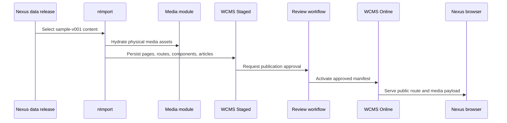

# Nexus Data and Content Guide

Nexus is the corporate website accelerator in the Kickoff project. It is a
business application that renders published content, but it is not the data
authority for sites, pages, media, articles, forms, or navigation. Those
objects are authored as governed data releases, imported into the owning
backend modules, reviewed in Staged, and made visible through Online delivery.
For beginners, the easiest model is this: Nexus is the window, WCMS and Media
own the content contract, Engagement owns contact and testimonial records, and
the project data folder provides the release package.

## Source map

| Area | Current source |
| --- | --- |
| Module package and lifecycle | `../../nodics.kickoff/modules/nexus.web/package.json`, `../../nodics.kickoff/modules/nexus.web/LIFECYCLE.md` |
| Release manifest | `../../nodics.kickoff/modules/nexus.web/data/manifest.json` |
| WCMS headers | `../../nodics.kickoff/modules/nexus.web/data/sample-v001/content/headers/wcms/` |
| WCMS update headers | `../../nodics.kickoff/modules/nexus.web/data/sample-v001/content/headers/wcmsUpdate/` |
| Media headers and records | `../../nodics.kickoff/modules/nexus.web/data/sample-v001/content/headers/media/`, `../../nodics.kickoff/modules/nexus.web/data/sample-v001/content/records/media/` |
| Physical media assets | `../../nodics.kickoff/modules/nexus.web/data/sample-v001/content/assets/nexus-cms-media/` |
| Editorial records | `../../nodics.kickoff/modules/nexus.web/data/sample-v001/content/records/editorial/` |
| Engagement records | `../../nodics.kickoff/modules/nexus.web/data/sample-v001/content/records/engagement/` |
| Browser application | `../../nodics.exp/nodics.nexus/package.json` |
| Acceptance tests | `../../nodics.kickoff/modules/nexus.web/test/nexusCorporateContentContract.test.mjs` |

## Release layout

Nexus uses the same customer-project data structure as Agora content packs:

```text
modules/nexus.web/data/
  sample-v001/
    content/
      headers/
      records/
      assets/
  manifest.json
```

The release folder tells the importer which lifecycle lane is being installed.
`sample-v001` is sample content owned by the project until the first production
baseline is frozen. Inside it, `content` separates CMS, Media, Editorial, and
Engagement records from commerce data. The `manifest.json` is generated by the
system from the folder structure and file checksums; developers should not hand
maintain it except during a deliberate tooling repair.

## Header contract

Headers route each record file to its owning module and schema. The top-level
key is the target module, the child key is a logical import item, `schemaName`
is the backend schema, `operation` is the persistence behavior, and `query`
defines idempotency.

```js
module.exports = {
  cms: {
    nexusCorporatePages: {
      options: {
        enabled: true,
        schemaName: 'cmsPage',
        operation: 'saveAll',
        dataFilePrefix: 'nexusCorporatePageData'
      },
      query: { code: '$code', tenant: '$tenant' }
    }
  }
};
```

Business users do not need to understand this file. Developers and AI tools do,
because it is the safe routing contract between release data and backend
authority. Record files must remain declarative. They can contain business
keys, labels, relation codes, locale values, publication state, and asset
references, but they must not call services, read environment variables, or
generate runtime paths.

## Import and publication flow



Nexus content should never be hardcoded into the frontend as the long-term
truth. A component can show a clear unavailable state, but the published site
must ultimately render from Online WCMS and Online Media. Operators should be
able to trace an image or page from browser route to Online delivery pointer,
publication manifest, Staged source record, and project release file.

## Customization and extension guidance

A project can customize Nexus by creating a new content release folder after a
baseline is frozen, adding new headers for additional schemas, adding new
record maps, and placing physical assets under the release-owned assets folder.
Developers should extend the owning backend module when a new schema or
operation is required. Business users should use Axis for normal page, media,
article, and form journeys once the backoffice capability is available.

When a customer needs a new corporate page, the developer should add a page
record, page route, layout or component relation, localized copy, media object,
and media asset manifest entry. A QA owner should then import into a fresh
schema, publish through Staged approval, open Nexus in the browser, and verify
the route, title, navigation, media URL, and friendly empty states.

## Troubleshooting

| Symptom | Likely owner | User-safe message | Technical evidence |
| --- | --- | --- | --- |
| Page route is missing | WCMS data release | Content is not ready for this site. | Missing `cmsPageRoute` record or failed import run. |
| Image is broken | Media import | Media is still being prepared. | Missing asset manifest entry, checksum failure, or Staged storage failure. |
| Form is hidden | Engagement data | Contact form is not available. | Missing form definition or inactive version record. |
| Nexus shows fallback copy | Publication | Latest approved content is not online yet. | No active Online manifest for the route. |

## Common mistakes

- Treating Nexus as the owner of corporate content instead of a consumer.
- Adding a page record without its route, slot, component, or media relation.
- Copying physical media into a frontend public folder instead of the release
  assets folder.
- Hand editing generated manifest checksums after a file changes.
- Showing technical import errors directly to a business user.

## Verification

Run the Nexus contract tests, regenerate data manifests, import into a fresh
schema, publish to Online, and open Nexus from the browser. A successful check
proves that developers can trace the release files, business users can see a
clear setup journey, operators can inspect import and publication evidence, and
production delivery reads Online records rather than frontend defaults.
