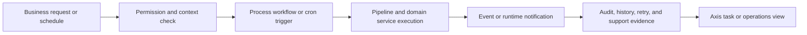

# Task Execution Engine

Task Execution Engine, or TEE, is a Nodics solution use case for running governed business tasks across manual actions, scheduled jobs, process workflows, event messages, and runtime-safe configuration changes. It is not a separate application-suite product. It is a customer solution pattern built from Nodics Framework capabilities when a business needs repeatable execution, operational evidence, and recovery behavior without creating a custom platform fork.

For a beginner, the mental model is simple: TEE is the operating layer that turns business work into controlled tasks. A business user sees a job, approval, retry, or operational queue in Axis. A developer connects that work to process definitions, cron schedules, pipeline stages, services, events, and data records. An operator verifies that work is traceable, restart-safe, and recoverable across running nodes.

## Business context

Businesses usually start asking for TEE when manual operations become too risky or too slow: product data needs nightly validation, publication needs approval, pricing needs scheduled activation, fulfillment needs retry, or a partner integration needs controlled execution. TEE provides a pattern for making these operations visible, permissioned, monitored, and auditable.

| Business question | TEE answer |
| --- | --- |
| What problem does it solve? | It converts repetitive or sensitive business operations into governed tasks with ownership, execution evidence, and recovery. |
| Who uses it? | Business users request or monitor tasks, administrators manage approvals, developers implement task behavior, and operators support runtime execution. |
| What decisions are supported? | Whether a task should run, pause, retry, fail over, require approval, or trigger another business process. |
| What business value does it create? | Faster operations, fewer hidden scripts, clearer accountability, and safer go-live for automated business changes. |

## Execution journey

TEE begins with a business trigger and ends with observable evidence. The trigger may be a cron schedule, an Axis action, a process task, an event, or an API request. The execution should move through validated inputs, a pipeline or service boundary, state updates, audit events, and a visible result. When the task changes Online content or runtime behavior, approval and publication controls must remain in the owning capability.



| Journey step | Business view | Technical owner |
| --- | --- | --- |
| Request | User asks for work or reviews a scheduled operation. | Axis action, API route, cron job, or process trigger. |
| Validate | System confirms tenant, enterprise, permission, payload, and state. | Profile, routing, validator, schema, and process services. |
| Execute | Task runs once with clear status and failure handling. | Pipeline, domain service, event, and runtime service contracts. |
| Recover | Failed or interrupted work can be retried or transferred safely. | Cron, process incidents, idempotency, node membership, and audit. |

## Capability composition

TEE should be documented as a composition of existing Nodics capabilities, not as a shortcut around them. Cron owns scheduled execution. Process owns workflow definitions, tasks, approvals, and runtime lifecycle. Pipeline owns ordered business logic execution. Event and messaging capabilities notify other nodes or services. Runtime governance controls safe changes while the application is running.

| Capability | Role in TEE | Documentation link to maintain |
| --- | --- | --- |
| Cron and Scheduled Automation | Runs scheduled and background work with node responsibility and recovery. | Cron and Scheduled Automation |
| Process and Workflow Automation | Models approval, task state, incidents, retries, and human decisions. | Process Workflows |
| Pipeline and Business Logic Orchestration | Provides ordered, testable execution steps. | Pipeline and Business Logic Orchestration |
| Event and Messaging Management | Propagates changes and operational messages across nodes. | Event and Messaging Management |
| Governed Runtime Change | Applies controlled runtime changes without unmanaged node-by-node edits. | Governed Runtime Change Capability |

## Configuration and extension

Developers customize TEE from the project layer by adding task definitions, cron schedules, workflow definitions, pipeline stages, validators, and domain services. Business users should configure only the records that are designed for Axis administration. If a task affects runtime behavior or Online content, it must use the relevant publication, approval, permission, and audit flow.

| Extension need | Recommended approach | Avoid |
| --- | --- | --- |
| Add a scheduled business task | Define a cron job, link it to a process or service, and document retry/idempotency. | Running unmanaged scripts outside Nodics lifecycle. |
| Add human approval | Use Process task and approval contracts. | Embedding approval state only in a custom UI. |
| Add execution logic | Add a pipeline step or project-layer service override with tests. | Forking framework services for customer-only behavior. |
| Notify other nodes | Use events or messaging with bounded payloads and audit. | Asking operators to update each node manually. |

```js
teeTask: {
  trigger: "cron-or-process",
  execution: ["validate-context", "run-pipeline", "record-audit"],
  recovery: ["idempotency-key", "retry-policy", "node-responsibility"]
}
```

## Operations and troubleshooting

Operators need evidence that a TEE task is safe to support in production. Every task should expose status, owner, trigger, last run, next run, correlation id, error summary, retry policy, and audit trail. Cluster-sensitive tasks must explain which node currently owns execution and how responsibility transfers when a node goes down and later returns.

| Symptom | Likely cause | Check |
| --- | --- | --- |
| Task did not run | Schedule disabled, permission missing, or owning node unavailable. | Cron status, process trigger, node registry, and logs. |
| Task ran twice | Missing idempotency, duplicate trigger, or unsafe retry. | Execution id, correlation id, and retry policy. |
| Runtime change not visible | Event propagation failed or stale cache remained active. | Event logs, cache invalidation, and runtime configuration audit. |
| Approval task is stuck | Process task state or permission mapping is incomplete. | Process task queue, role permission, and incident records. |

## Common mistakes

- Presenting TEE as a separate product instead of a solution use case built from framework capabilities.
- Creating a cron job without explaining business owner, retry policy, idempotency, and audit.
- Putting approval behavior into frontend code instead of Process and permission contracts.
- Running scheduled work without documenting node responsibility and failover behavior.
- Skipping beginner and business guidance because the execution looks technical.
- Changing runtime behavior without events, audit, cache invalidation, and rollback evidence.

## Verification

Verification must prove both the business journey and the technical contract. Review the page in Axis to confirm the user can understand when to use TEE, who owns each step, and where operational evidence appears. Then run the owning Process, Cron, Pipeline, Event, and runtime-governance tests for the implementation being documented.

Documentation verification requires `npm run docs:check`, `npm run validate`, and `npm run audit:hardening` from `nodics.docs`. Runtime verification should include a scheduled execution, a manual trigger if exposed, a permission denial, an idempotent retry, a node responsibility transfer where applicable, and browser evidence from the relevant Axis operation screen.
