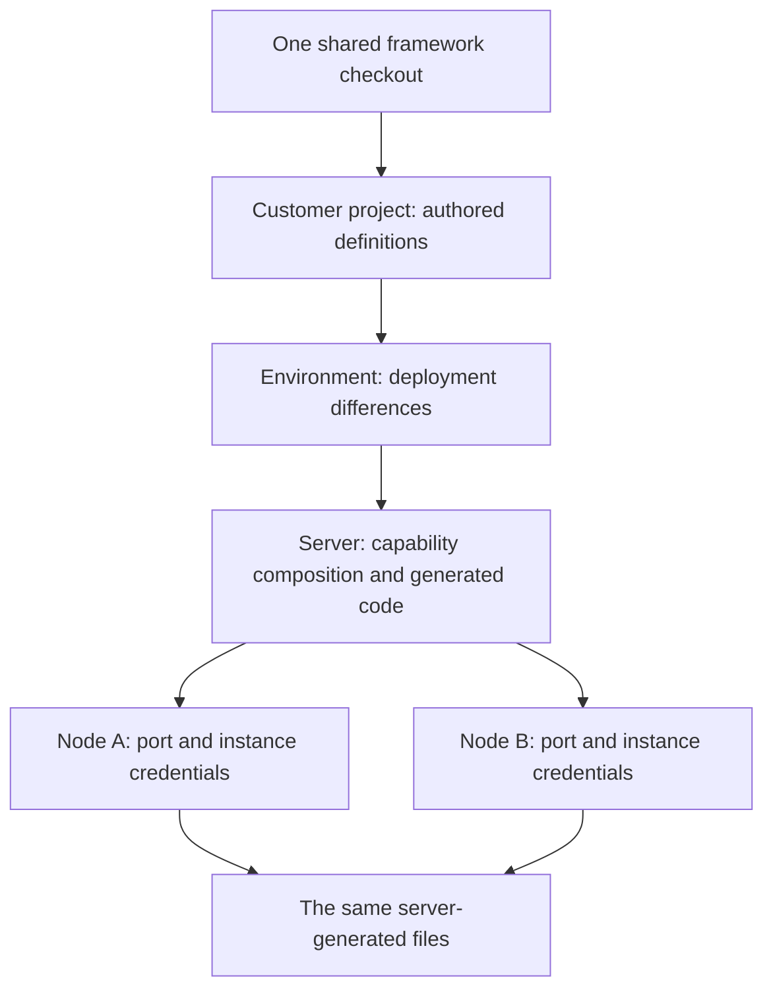
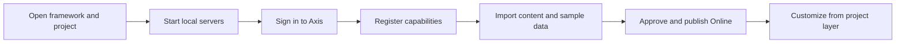

# Adoption and First Journey

The first Nodics journey should help a reader move from concept to a running
workspace without getting lost in module internals. A beginner should
understand what Nodics is, start the local reference project, sign in to Axis,
see which capabilities are available, initialize the required data, and open
the public applications only after Online content exists. A business reader
should see how fast the product can be prepared. A developer should see where
customization belongs. An operator should see which services, data packs, and
publication states prove the environment.

This page describes the adoption path, not every implementation detail. The
deep module pages explain specific schemas, APIs, providers, pipelines,
workflows, and project-layer override paths.

## First visible framework success

Prerequisites: use the repository's supported Node/npm toolchain, install its
locked dependencies, and make `mongod` and `redis-server` available on `PATH`.
From the framework repository, run:

```bash
node nodics.foundation/modules/nTooling/test/projectRuntimeBootstrapLive.test.js --require-live --composition=foundation
```

This is a disposable learning and acceptance environment. It creates its own
loopback databases, project, generated schema service, Profile principals and
explicit deployment grants. It starts an authority and a separate Foundation
runtime, creates/updates/reads/removes a project record, renews credentials,
rejects revoked credentials, restarts, and checks failure cleanup. It removes
its own temporary project and providers when finished.

Success ends with `PROFILE_START_PASS foundation`,
`PROFILE_RESTART_PASS foundation` and `PROFILE_FAILURE_PASS foundation`.
The failure marker means an injected failure was correctly rejected and cleaned
up. A missing provider binary or missing success marker is a failed exercise;
inspect its bounded evidence log and correct the prerequisite before continuing.
Use `NODICS_MONGOD_BINARY` or `NODICS_REDIS_BINARY` for explicit binary paths.

The trusted initializer belongs only to this test fixture. Real projects must
provision distinct runtime principals, retained proof and approved Profile scope
through their operator/secret/data process before startup. Do not copy fixture
credentials or bypass that step with a default account. See
[Service Runtime Overrides](../nodics.foundation/service-runtime-overrides.md)
for the implemented configuration and grant contract.

## Understand and customize the example

The generated service belongs to the temporary project schema, while Foundation
owns generation, request pipelines, persistence and authentication mechanics.
The service sends its operation through the existing database pipelines; the
project does not create another model loader or identity store.

For the complete layering exercise, run:

```bash
node --test nodics.foundation/modules/nConfig/test/serverGeneratedArtifactContract.test.js
```

The fixture creates framework, partner, project, environment and server modules.
Its generated `DefaultItemService.value()` returns `generated`; the partner
contributes `partner`; the project's matching method returns `authored`.
Environment/server methods add separate behavior. Build and reload preserve the
project value and all unrelated inherited methods. Changing one method does not
require copying the generated service. The fixture verifies the same behavior
for facades/controllers, records actual member origins, and removes its own files.

Use this pattern in an existing project only after reading the real capability's
contract. Add the matching exported method in the owning project layer, build
the selected server with the installed shared command, restart it with its
approved runtime identity, and run the capability's positive and rejection tests.
Rollback removes or reverts that project contribution and repeats build/restart;
it does not reverse any business data already changed by the customized method.

## Add one new composition at a time

Use the same live command with `--composition=inventory`, `commerce`, `cms`,
`process` or `cluster`. Inventory runs separately; Commerce omits local Inventory;
CMS is Online. Process exercises registration, required import, activation,
deactivation and admitted-work completion. Cluster starts two node configurations
and identities with one server-generated directory. These are framework
acceptance examples; they do not demonstrate a production payment, storefront
publication or provider failover.



The server decides functionality. Nodes can supply configuration differences and
separate identities; they do not own duplicate generated implementations.
Continue with the reference application journey below when a team needs visible
administration/content/storefront workflows and their publication prerequisites.

## Learning path and prerequisites

Use this path for the framework exercises above. Each row names the concept to
learn first, the result to check and the next source of detail. A reader entering
through search can start at the prerequisite column instead of guessing missing
setup. Business readers can follow stages 1, 2 and 7; developers follow 1–6;
operators continue through 8; experienced maintainers can enter stage 9 directly.

| Stage and topic | Prerequisite | Result to check | Continue with |
| --- | --- | --- | --- |
| 1. Purpose and value | A business capability the team needs to deliver | Explain framework versus customer responsibility and the value of reusable capabilities | [Modular architecture](modular-architecture.md) |
| 2. Runtime mental model | Framework/project ownership | Identify module, environment, server and node in the diagram above | [Runtime configuration](../nodics.foundation/runtime-configuration.md) |
| 3. First visible success | Supported Node/npm, installed dependencies, MongoDB and Redis binaries | Run the Foundation exercise and recognize all three success markers | The working-example explanation above |
| 4. Understand the request | Successful generated-record exercise | Trace the project schema through generated service and existing database pipelines | [Schema and data modeling](../nodics.foundation/schema-data-modeling.md) |
| 5. One customization | Indexed module contributions | Run the five-layer example, identify the winning method and preserve unrelated inherited methods | [Service runtime overrides](../nodics.foundation/service-runtime-overrides.md) |
| 6. Predict effective behavior | The customization example | Explain target-owned build/clean, inherited differences and required rebuild/restart | [Runtime configuration](../nodics.foundation/runtime-configuration.md) |
| 7. Add business capabilities | A working baseline and approved runtime grants | Start separate Inventory, Commerce, CMS, Process and cluster examples with their stated limits | [Module communication](../nodics.foundation/module-to-module-communication.md) and [data import](../nodics.foundation/data-import-export-migration.md) |
| 8. Operate and recover | Registration, activation, identity and provider ownership | Refuse unauthorized new work, distinguish admitted work, and verify startup-failure cleanup | [Startup lifecycle](../nodics.foundation/framework-startup-lifecycle.md) |
| 9. Compatibility and reference | The effective contract being changed | Locate member origins, plan persisted migration and test the effective override's guarantees | [Release and upgrade compatibility](release-upgrade-compatibility.md) |

The examples establish executable technical outcomes. Reader comprehension and
the published browser experience require separate observation; passing an
exercise does not prove that a first-time reader understood the explanation.

## First reader sequence

The documentation should not force a new reader to open every framework module
before seeing the product. The sequence should be practical:

| Step | Reader action | Why it matters |
| --- | --- | --- |
| 1 | Read What is Nodics and Why Nodics Exists. | Understand the business reason before touching code. |
| 2 | Open the Kickoff setup and local runtime pages. | Learn the reference project and server topology. |
| 3 | Start Platform, WCMS, Process, Axis, Nexus, and Agora as required. | See the runtime boundary instead of guessing from folders. |
| 4 | Initialize Axis baseline data. | Axis needs governed content and administration data before full workspace use. |
| 5 | Register required modules and capabilities. | Storefront packs should not pretend to work without their domain owners. |
| 6 | Import Nexus, Agora, documentation, and sample data packs. | Content, media, pages, and routes become Staged records. |
| 7 | Publish approved Online content and verify browsers. | Public apps render Online data only. |

## Business adoption journey

For business users, adoption starts with confidence that the platform can
support fast revenue without becoming fragile. The reference workspace should
show how an administrator can prepare Axis, initialize a corporate site,
prepare storefront accelerators, approve publication, and confirm the public
experience. The journey should make the next action obvious from the screen.

If a pack needs approval, the user should see the pending item and approve or
reject it in the same operational place when their role permits it. If a site
is not Online yet, the public app should show a professional maintenance page,
not hidden framework data. If data is missing, the UI should explain what must
be initialized first.

## Developer adoption journey

Developers should start by running the product and then tracing ownership.
After the fresh environment is visible, they can study how the project points
to `nodics.ai`, how Kickoff declares local topology, how modules register
capabilities, how data packs import Staged records, and how Axis reads
backend-owned metadata.



The first customization should happen in the project layer or through Axis
managed content, not by editing framework source. That habit keeps the
framework upgradeable.

## Operator adoption journey

Operators adopt Nodics by learning the runtime evidence. They should know how
to check server status, port ownership, logs, data import state, publication
state, task queues, content routes, and public delivery. When a local schema is
fresh, operators should be able to explain why Axis may start in a recovery
workspace, why Nexus or Agora may show a maintenance page, and which import or
publication action unlocks the normal experience.

Operational adoption also includes knowing what can run in parallel.
Documentation imports can happen alongside other setup work because they
publish documentation content. Commerce-dependent Agora data must wait until
commerce capabilities are registered because the storefront data relies on
domain models.

## Documentation entry points

The first navigation level must stay friendly. Business users should see
capabilities and journeys, not raw module package names. Developers and AI
tools still need exact source ownership, so each detailed page should include
source maps, module names, configuration keys, APIs, events, and validation
commands in the page body.

| Entry point | Best for | Continue to |
| --- | --- | --- |
| What is Nodics? | First-time business, developer, and operator readers. | Why Nodics Exists and How Nodics Works. |
| Documentation Roadmap | Readers choosing their route through the docs. | Reader Journey and Coverage. |
| Kickoff setup | Teams starting a local reference environment. | Local runtime, acceptance checklist, and publishing operations. |
| Axis guide | Administrators using the BackOffice workspace. | Module registry, imports, documentation publication, and workflows. |

## Common mistakes

- Trying to understand every package before running the reference environment.
- Importing Agora data before the commerce capability is registered.
- Expecting Nexus or Agora to show full public content before Online
  publication exists.
- Treating documentation import as a one-time exercise instead of a recurring
  content-pack release process.
- Putting customer-specific setup rules only in environment files instead of
  project-owned configuration and installer-generated workspace data.

## Verification

The adoption journey is correct when a new user can start from a clean schema,
follow the setup sequence, and understand each next action from Axis without
asking which page owns it. Verification should include browser checks for Axis,
Nexus, and Agora, plus data evidence that required modules are registered,
content packs are imported, publication tasks can be approved or rejected by
authorized users, and public apps show Online content or a customer-friendly
maintenance page.
