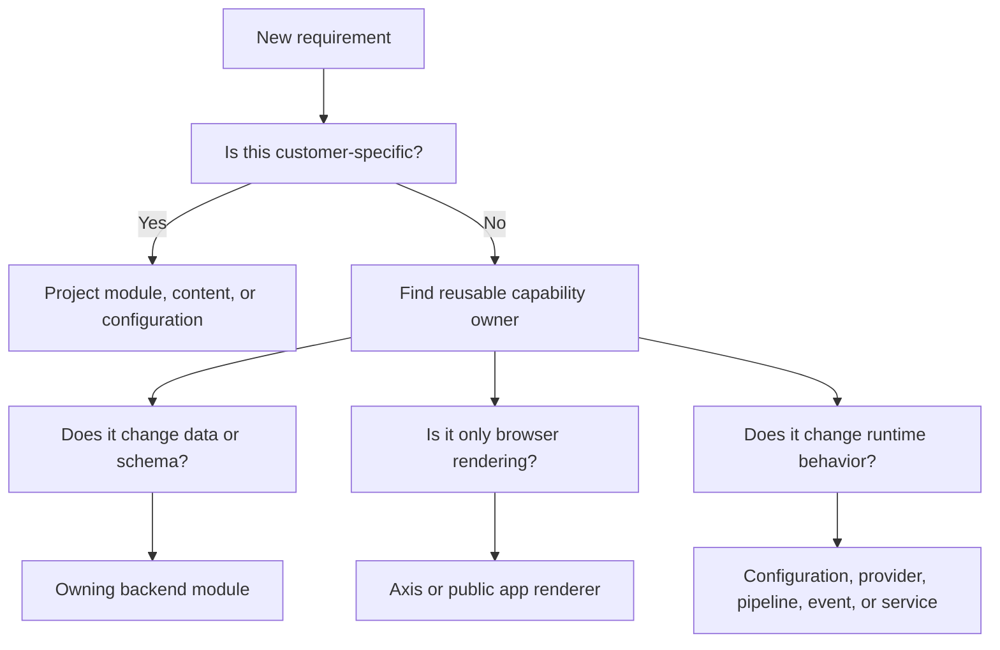

# Architecture Decision Guide

The architecture decision guide helps teams decide where a new behavior,
configuration, API, schema, data pack, renderer, or workflow belongs. It exists
because enterprise projects fail when every team solves the same ownership
question differently. A business user sees the resulting confusion as slow
delivery. A developer sees it as duplicated code. An operator sees it as a
runtime that cannot explain itself.

Use this page before implementation. It does not replace module-specific
documentation; it gives the first decision path so the right module-specific
page is opened.

## Decision path

## Ownership table

| Change type | Preferred owner | Avoid |
| --- | --- | --- |
| Employee identity or permission | Platform/Profile capability. | Public app or Axis-only logic. |
| CMS page, component, route, media, or documentation | WCMS or backend content pack owner. | Frontend hardcoded pages. |
| Storefront accelerator data | Accelerator project/module pack plus required domain capabilities. | Importing data before modules are registered. |
| Scheduled work | Process/Cron or project cron extension. | Node-local timers hidden from governance. |
| Business rule | Service, validator, pipeline, or project extension. | Editing unrelated framework files. |
| Provider switch | Provider adapter and configuration. | One-off conditionals in business code. |

## Business perspective

The business benefit is predictable change. If a customer asks for a new
approval rule, product field, page layout, search provider, or payment adapter,
the team can identify the owner and impact before changing code. That shortens
delivery because the discussion moves from "where can we hack this?" to "which
capability owns the business decision?"

## Customization and extension

Start with configuration and content when the behavior is designed for
business administration. Move to project modules when code is needed. Change
framework source only when the reusable capability itself needs to improve for
all projects. Every extension must document its owner, runtime impact, tests,
and rollback path.

## Reader and implementation contract

A beginner should use this page as the first checkpoint before opening source
files. A business sponsor should be able to see whether a request changes
customer experience, administration, runtime behavior, public content,
security, or operations. A developer should convert that business request into
one owner and one extension path before editing. An operator should receive
enough detail to know which server, import, publication, or configuration
change will be affected.

When a decision is made, record the rejected options as well as the selected
owner. For example, if a new storefront header is implemented through WCMS
content, state why it is not a hardcoded Agora component. If a workflow is
implemented in Process, state why it is not an unmanaged cron timer. These
small decision notes prevent future teams and AI tools from reversing the
architecture during urgent delivery work.

## Common mistakes

- Starting from the nearest matching filename instead of the owning capability.
- Putting backend authority inside Axis because the action starts from a
  screen.
- Treating generated OpenAPI, documentation, or content data as hand-edited
  output.
- Forgetting that data import, publication, and runtime activation may require
  separate steps.
- Skipping business impact when the change appears technical.

## Verification

A decision is ready when the owning capability is named, the project versus
framework boundary is clear, configuration and content options were checked,
the runtime server is known, and the validation path covers API, browser,
data, permissions, publication, and operations where applicable.
