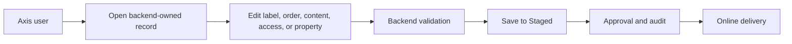

# Axis Content Customization

Axis Content Customization explains how business users and administrators can
change labels, navigation, page content, content areas, visibility, setup
records, and publishing decisions without turning Axis into the backend owner.
This page belongs with project customization because many customer changes are
business-managed rather than code-managed.

The key rule is that Axis is the workspace. Backend modules and content
catalog records remain the authority.

## Customization journey

## What business users can change

| Change | Owner | Notes |
| --- | --- | --- |
| Documentation navigation | Documentation content catalog. | Section, group, subgroup, sequence, and summaries should be editable with workflow. |
| CMS pages and content areas | WCMS content catalog. | Headers, footers, pages, and components should be backend-driven. |
| Public visibility | Access policy records. | Public and authenticated views must be explicit. |
| Setup and application packs | Backend initialization metadata. | Axis should show dependencies and next actions. |
| Workflow decisions | Process tasks and permissions. | Authorized users can approve or reject according to permissions. |

## Business value

This model gives business teams more control without bypassing governance.
They can prepare content, request publication, approve tasks when authorized,
and verify public delivery in a guided journey. Developers still own renderer
contracts and backend validation, so the UI does not become a private data
model.

## Customization and extension

Projects can add Axis screens, renderers, and workspaces when new business
capabilities require them. The extension must consume backend contracts, not
invent frontend-only authority. If a new left-nav item or content section is
needed, the backend should expose navigation metadata and permissions so Axis
can render it consistently.

## Reader and implementation contract

A beginner should know that Axis is where work happens, not where backend
truth is invented. A business user should have a clear path to update content,
submit approval, review pending work, approve or reject when permitted, and
verify public delivery. A developer should know which backend API and renderer
contract power the screen. An operator should know which state refreshes after
each mutation.

Every Axis customization should be designed as a single business journey where
possible. If a user starts from documentation publishing, they should not be
sent to unrelated task lists without context. The screen should show available
updates, dependency blockers, approval actions, Online state, and links that
become visible after successful publication.

## Common mistakes

- Hardcoding Axis navigation for data that should be backend-managed.
- Requiring users to jump between multiple pages to approve one publication.
- Hiding setup dependencies until an import fails.
- Letting the requester identity block approval instead of checking actual
  permissions, unless separation of duties is explicitly required.
- Forgetting to refresh navigation after a successful mutation.

## Verification

Verify Axis customization by changing a backend-owned record from Axis,
confirming validation and permissions, completing approval where required, and
checking that Axis and public apps refresh from the updated backend state. The
browser journey should be easy enough for a business administrator to complete
without reading source code.
