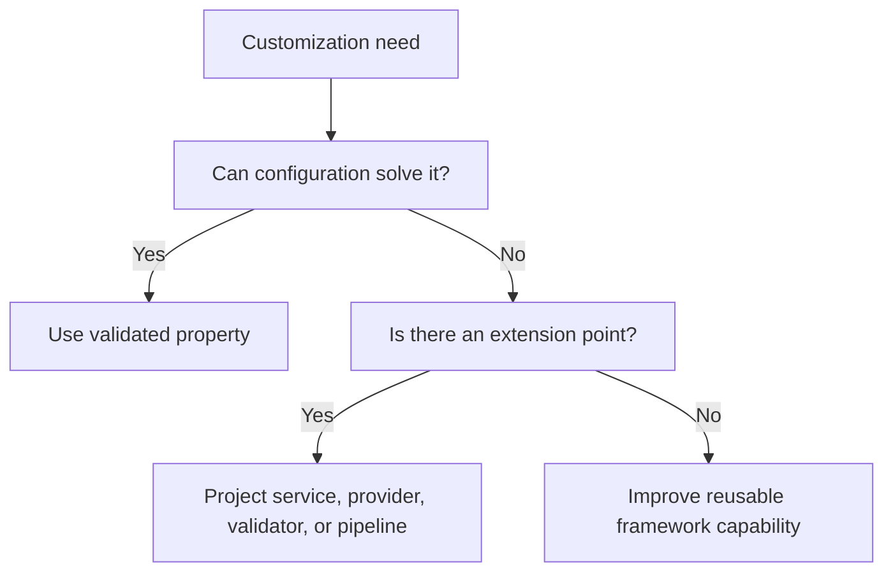

# Backend Extension Patterns

Backend Extension Patterns explain how developers add or change behavior
without damaging the reusable framework. This page splits the deeper developer
guidance out of the general customization overview so a reader can choose the
right path: configuration, provider, service, validator, pipeline, schema,
route, event, or project module.

The business reason is straightforward. Customer-specific behavior should be
fast to deliver, but it should not make framework upgrades expensive. Nodics
keeps that balance by making extension points explicit.

## Extension options

| Pattern | Use when | Verification |
| --- | --- | --- |
| Configuration | Behavior already has a supported switch. | Config validation and runtime evidence. |
| Provider adapter | Storage, cache, search, messaging, or integration backend changes. | Provider tests and fallback behavior. |
| Service override | Business decision changes for a project. | Default and override tests. |
| Module communication | One module must call another local or remote module. | Local, remote, target-authority, internal-auth, timeout, and failure tests. |
| Validator | Data rules or approval rules change. | Valid and invalid payload tests. |
| Pipeline step | Business logic is staged or composable. | Step order and failure tests. |
| Schema extension | Project needs additional data fields. | Generated schema and API tests. |

## Decision flow

## Business and developer impact

Business users get faster customization because the project does not need to
fork the framework for every customer request. Developers get clearer code
ownership because the extension lives beside the customer project. Operators
get better support because logs and generated context can identify the active
implementation.

## Customization and extension

The extension itself must be documented. The page should say which module owns
the base behavior, where the project override lives, which server loads it,
which configuration enables it, which API or event changes, and how rollback
works. If the customization is business-configurable from Axis, the Axis
journey and approval rules must be documented as well.

For HTTP request customization, start from `API Request Lifecycle and Handler
Pipeline` before changing controllers or route middleware. For cross-module
calls, start from `Module-to-Module Communication` before adding direct
service access, endpoint URLs, or provider-specific transport code.

## Reader and implementation contract

A beginner should learn that customization has a ladder and the lowest safe
step should be tried first. A business user should understand whether the
request can be handled by Axis configuration or requires developer delivery. A
developer should identify the extension mechanism before writing code. An
operator should receive enough detail to support the customized runtime during
restart, scaling, failure, and rollback.

Every extension page should include a small evidence map: owning capability,
project module, configuration key, affected server, API or event boundary,
data impact, tests, and browser proof where a user-facing journey changes.
That evidence keeps customization fast without making the system mysterious.

## Common mistakes

- Editing framework source for a customer-only rule.
- Adding a provider without documenting configuration and failure behavior.
- Creating a service override but testing only the default service.
- Extending schemas without explaining API, import, and migration impact.
- Using Axis to hide backend complexity instead of exposing governed actions.

## Verification

Verify backend extension by proving default framework behavior still works,
the project override activates only in the intended runtime, generated schemas
or APIs are updated, tests cover failure paths, and browser or API evidence
shows the customized behavior. The documentation must include the owner,
extension path, and rollback signal.
