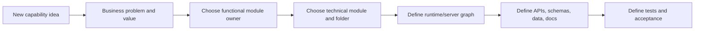

# Capability documentation maturity pattern

Nodics includes stable runtime capabilities, capabilities under active design,
partially implemented slices, and separately governed capabilities that are not
currently available for runtime use. Documentation must explain each of these
states clearly without creating false authority.

The rule is direct: documentation may describe a conceptual capability, a design
contract, or a partially implemented slice, but it must say which state it is in.
A reader should never confuse a concept page with production-ready runtime
behavior.

## Why this matters

For business users, capability-maturity documentation explains business value
and readiness. It should answer: what problem does this capability solve, why
would an enterprise adopt it, how does it reduce operating cost or delivery
risk, and how does it fit with multi-enterprise, multi-tenant, modular Nodics?

For developers, capability-maturity documentation prevents rushed placement. It
should answer: which functional module owns the capability, which technical
modules may be needed, which APIs and schemas are authoritative, what can be
customized through configuration, and what must remain backend-owned.

For operators, capability-maturity documentation explains runtime impact. It should
answer: which server will run it, what dependencies are mandatory or optional,
what properties are public or private, what health evidence exists, how data is
initialized, and how rollback works.

## Documentation maturity levels

Use a clear maturity label whenever a module area is not fully complete:

| Level | Meaning | Allowed content |
| --- | --- | --- |
| Concept | Business problem and direction are known, but implementation has not started. | Business value, personas, examples, target boundaries, open questions. |
| Design contract | Ownership, APIs, schemas, or runtime behavior are being defined. | Architecture diagrams, data ownership, security model, proposed endpoints, acceptance criteria. |
| Partial implementation | Some slices exist, but the module is not production-complete. | Implemented scope, missing scope, feature flags, known gaps, safe rollback. |
| Operational | Runtime behavior, data release, tests, docs, and acceptance are current. | Full user guide, developer guide, DevOps guide, customization guide, verification evidence. |

The maturity label belongs near the top of the page. If a page mixes conceptual
direction and implemented behavior, split the sections clearly.

## Required page structure

Every capability page should include:

1. **Business problem** — who needs the module and what pain it removes.
2. **Business value** — faster delivery, lower customization cost, reduced
   risk, better governance, scalability, or customer experience.
3. **Beginner mental model** — a simple analogy or walkthrough.
4. **Functional module ownership** — standard module identity and whether a
   customer extension may customize it.
5. **Technical module ownership** — where services, routes, schemas,
   migrations, data, docs, and tests belong.
6. **Runtime topology** — which server starts it and how it extends Core or
   another standard module.
7. **Security and governance** — authentication, authorization, tenant,
   audit, data exposure, and secret boundaries.
8. **Customization model** — configuration first, extension modules second,
   framework-source change only when the capability itself changes.
9. **Examples** — at least one business example and one developer or operator
   example.
10. **Common mistakes** — things developers and AI tools must avoid.
11. **Verification** — tests, generated data checks, local acceptance, and
   runtime proof.

## Source-backed coverage rule

Every operational or partial-implementation topic must be source-backed. A page
is not complete only because it explains the idea. It must connect the idea to
the current repository files that implement, configure, import, publish, render,
or test the capability.

Use this checklist for every topic, whether the topic is products, content,
media, pricing, inventory, workflows, APIs, imports, search, security,
localization, documentation, or accelerators:

| Coverage area | Required detail |
| --- | --- |
| Business journey | What a business user, administrator, operator, or customer is trying to accomplish. |
| Runtime owner | Functional module, technical module, server role, and whether the capability is local, remote, Staged, Online, or operational. |
| Source map | Exact package, module, schema, service, controller, router, config, data, asset, frontend, and test locations. |
| How to do it | Step-by-step instructions for creating, updating, importing, publishing, operating, or troubleshooting the capability. |
| How it works | Ordered flow from authored input through backend validation, persistence, events, publication, projection, frontend rendering, and evidence. |
| Customization | Safe project-layer extension points, override rules, provider adapters, validators, renderer mappings, properties, and areas that must remain framework-owned. |
| Examples | Real code or data snippets from current files, with enough context for a developer or AI tool to repeat the pattern safely. |
| Visual explanation | Mermaid diagram, screenshot, source map, flow image, or table that clarifies ownership and sequence. |
| Validation | Focused tests, generator checks, import checks, fresh-schema checks, publication checks, and browser evidence when the capability is visible in Axis, Nexus, or Agora. |
| External references | Official or vendor documentation used for comparison, clearly marked as reference material and not as Nodics authority. |

Source-backed does not mean every technical module needs a public business page.
Some modules are framework utilities and should be covered inside a broader
capability topic. It does mean that a reader should be able to trace the topic
from documentation to source and from source back to documentation.

When the source inventory shows an implemented schema, service, controller,
router, data pack, asset pack, frontend journey, or test with no matching
documentation, create a documentation gap. When a page exists but does not show
files, services, data, customization, and verification, mark it shallow and
improve it before calling the topic operational.

## Example: documenting a Workflow capability

A Workflow page should not begin with API endpoints. It should begin with the
business problem: enterprises need governed approval, task routing, escalation,
return-to-sender, audit, and cross-module process visibility. Then it should
explain why a Workflow module is better than every module inventing its own
approval table.

The developer section would say that `nodics.process` owns workflow
definitions, states, transitions, assignments, SLA metadata, process history,
and Workflow APIs. A Commerce return flow may start a workflow, but Commerce
does not own the generic workflow engine. Axis may render assigned work,
approvals, returned work, and process detail only when BackOffice reports the
Workflow capability as active and authorized.

The operator section would explain whether Workflow runs inside a Platform
server, a dedicated workflow server, or both. It would define scheduler
dependency if escalations use Cron, event dependency if transitions publish
events, and data-import dependency if starter definitions are loaded from a
release.

## Example: documenting a Commerce capability

A Commerce page should explain business outcomes: product catalog, pricing,
cart, checkout, order lifecycle, returns, refunds, promotions, inventory, and
customer experience. It should also explain boundaries. Product media belongs
to Media/nMedia for storage and lifecycle, while Commerce owns the business
relationship between a product and selected media. Refund decisions belong to
Commerce or order lifecycle ownership, not Catalog alone.

For developers, this prevents a classic mistake: adding refund actions to a
Catalog page because the word “product” appears there. The page must show the
actual domain owner and the runtime module that provides the operation.

## Diagrams and visual guidance

Use diagrams whenever a concept has multiple owners or ordered steps. Prefer
small diagrams that show real authority:

Images may be reused from the approved framework documentation assets when
they explain the exact concept. Do not add decorative images that make the page
look richer without teaching the reader something.

## Customize and extend safely

Capability documentation must describe customization before implementation
details. Partners should understand how to change behavior without forking the
standard framework source:

- use module properties for defaults and policies;
- use customer project environment/server configuration for deployment
  topology and local overrides;
- use customer extension modules to override or add services, routes,
  renderers, and data when the customer needs a project-specific behavior;
- keep standard functional module identity stable when a customer extension
  customizes the standard capability;
- avoid exposing every technical module as a business registry item.

For example, a customer may later create a project-specific Platform extension
that changes user onboarding behavior. Axis should still show Platform unless
the customer intentionally creates a new business capability. This keeps the
business model understandable while preserving runtime customization.

## Common mistakes

- Writing a concept page as if all APIs already exist.
- Hiding missing implementation behind marketing language.
- Putting customer-specific behavior into a standard framework module.
- Creating a frontend page before the backend capability contract exists.
- Documenting code placement with a project-specific name where the contract
  should work for any customer project.
- Forgetting operator concerns such as deployment topology, properties,
  secrets, data import, health, rollback, and observability.
- Skipping examples because the module is still conceptual. Concept pages need
  examples even more, because they guide implementation.

## Verification

A capability documentation page is accepted when it clearly states maturity,
business problem, owner, runtime graph, security boundary, customization model,
examples, common mistakes, and verification expectations. If implementation
does not exist yet, the page must say so. If a partial implementation exists,
the page must list the implemented slice, missing slice, tests that currently
pass, and acceptance evidence still required before calling it operational.

Before importing documentation, run the docs generator and validator. Before
claiming runtime readiness, run the module tests and the local fresh-bootstrap
acceptance checklist for the executing server graph.
