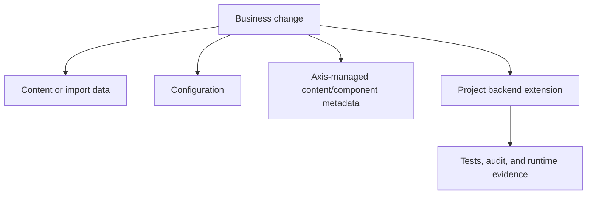

# Customization and Extension Guide

Customization and Extension Guide is the decision page for changing Nodics
without breaking reusable framework ownership. It explains which customization
mechanism to choose first, then links to deeper backend and Axis customization
topics.

## Customization ladder

| Change type | First place to check | Why |
| --- | --- | --- |
| Business content | Axis content catalog or import data. | Keeps business updates governed and publishable. |
| Runtime behavior | Configuration or Dynamo-style governed runtime change. | Avoids redeploy when runtime policy is intentionally dynamic. |
| UI arrangement | Axis-managed component and navigation metadata. | Lets business users adjust labels, sequence, visibility, and page structure. |
| Backend logic | Project-layer module extension. | Keeps framework source reusable and customer-specific behavior isolated. |

## Business perspective

Business users should not need to know package names to request a change. They
need to know whether a change affects content, catalog data, pricing, checkout,
approval, publication, security, or runtime operations. Documentation must
explain the decision, expected impact, risk, approval path, and rollback model.

## Developer perspective

Developers should start from the owning capability and pick the least invasive
extension point. If configuration is enough, use configuration. If a model,
service, pipeline, event, controller, or schema must change, use a project
module and document the override path. If Axis needs new editing controls,
publish the backend metadata and render it through Axis rather than hardcoding
business structure in the frontend.

## Continue with

- **Backend Extension Patterns** for services, schemas, APIs, events,
  pipelines, interceptors, and project module ownership.
- **Axis Content Customization** for navigation, components, page content,
  publication visibility, role access, and user-facing labels.
- **Governed Runtime Change Capability** when administrators need approved
  runtime changes distributed across running nodes.

## Reader and implementation contract

A beginner should leave this page knowing that customization is a managed choice, not a random code edit. A business user should understand whether the requested change belongs to content, configuration, Axis-managed structure, runtime governance, or backend extension. A developer should know that the implementation must start from the owning capability and must document the selected extension mechanism. An operator should know which evidence proves the customization is active and how it can be reversed.

Every future customization topic should include the same minimum information: business problem, decision supported, owner, configuration keys, data model or schema impact, APIs or events, project-layer override path, permissions, audit behavior, visual flow, and test evidence. If a customization changes customer-visible behavior, the documentation must include browser verification and rollback notes.

## Common mistakes

- Editing framework source for a customer-only behavior.
- Hardcoding content, navigation, or visibility in Axis.
- Adding a backend override without tests and operational evidence.
- Describing the technical change but not the business decision it supports.

## Verification

Verify customization by checking the affected module contract, project-layer
override, configuration source, Axis visibility, audit trail, and tests. A
beginner should understand what changed, a business user should understand the
impact, a developer should know where to implement, and an operator should know
how to observe and rollback the change.
