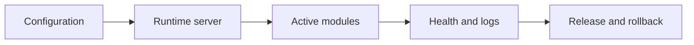

# Runtime and DevOps Operations

Runtime and DevOps Operations is the overview for running Nodics safely across
local, staged, online, and future production environments. It points operators
and developers to focused pages for topology, configuration, release,
rollback, monitoring, and browser acceptance.

## Runtime map

| Area | Owner question |
| --- | --- |
| Topology | Which servers run locally and which capabilities do they host? |
| Configuration | Which values come from project env, module defaults, or governed runtime changes? |
| Dependencies | Which external stores or services must be reachable? |
| Recovery | Which logs, health checks, and operations prove the system recovered? |

## Business perspective

Business stakeholders care about availability, controlled change, and safe
recovery. If documentation, Nexus, Agora, checkout, or publishing is not
available, the operator should have a clear path to identify whether the issue
is startup, configuration, missing data, publication state, media delivery, or
external dependency health.

## Developer perspective

Developers use this page to understand where runtime behavior is configured
and where deeper runbooks live. A code change that affects topology,
configuration, generated schema, import, publication, cache, events, or
provider selection must update the related documentation and tests.

## Continue with

- **Process Runtime Topology** for process and service layout.
- **Local Runtime Troubleshooting** for busy ports, stale state, timeouts, and
  circuit errors.
- **Runtime Release and Rollback** for changing environments safely.
- **Local Browser Acceptance Journey** for proving a fresh setup from the UI.

## Operational evidence

Runtime documentation should connect commands to visible system state. Include topology status, active modules, generated schema status, environment source, dependency health, circuit state, logs, import history, publication state, and browser route evidence. If a local setup differs from staged or online environments, state the difference directly. This helps beginners avoid guessing and gives experienced operators a reliable path from symptom to owner without reading unrelated source files.

## Reader and implementation contract

A beginner should understand that runtime readiness is more than a process listening on a port. A business user should understand which application journey is affected when a service, dependency, import, or publication state fails. A developer should document configuration layers, active modules, generated contracts, provider choices, and tests. An operator should know where to inspect health, logs, circuits, import history, publication state, and rollback evidence.

Every DevOps topic must connect local proof to enterprise readiness. That means clean build, fresh schema, startup, setup journey, browser acceptance, monitoring, recovery, and a clear statement of what is implemented now versus what belongs to future production rollout.

## Documentation maintenance rule

Keep this topic current whenever implementation, configuration, Axis workflow, publication behavior, or customer-facing rendering changes. The page should remain small enough to scan, but it must still carry enough business context, technical ownership, customization guidance, visual structure, operational evidence, and verification detail for a reader to act without guessing. When the detail becomes too large, create a sibling topic and link it from this page instead of turning the overview back into a long mixed article.

This extension guidance must stay linked to the owning project or capability page whenever a customer customizes the behavior.

## Common mistakes

- Treating local success as production readiness.
- Hiding required environment values outside project configuration.
- Changing provider behavior without rollback and monitoring notes.
- Running browser acceptance without a fresh schema or clean content state.

## Verification

Verify runtime work with startup logs, health endpoints, generated schema,
Axis status, import/publish evidence, browser checks, and rollback evidence.
Operators should be able to diagnose the system without reading source code.
