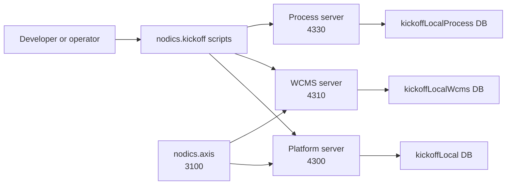
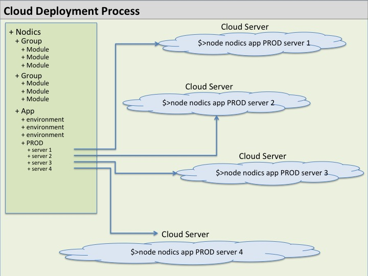
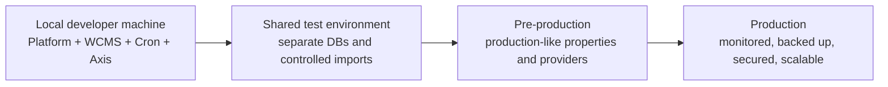
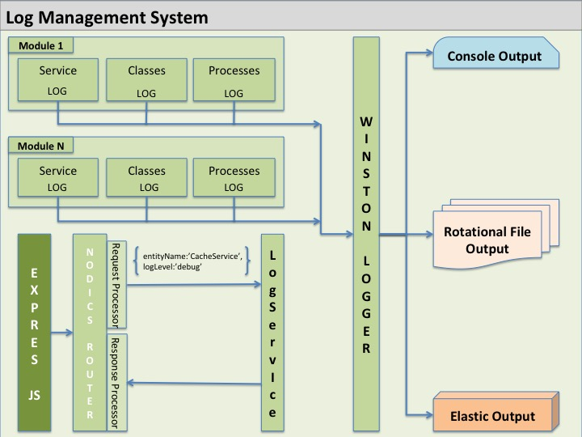

# Runtime and DevOps operations

Nodics runtime operations are based on explicit server composition and layered
configuration. A runtime server is a process that hosts an effective set of
active modules. The module remains the capability owner; the server is the
runtime grouping.

For a beginner, DevOps in Nodics means “how does this code become a safe,
observable process?” The answer starts with a clear server graph, narrow
properties, predictable dependencies, releaseable content packs, and recovery
behavior that operators can explain during an incident.

## Local topology

The reference local setup uses separate servers:

- Platform on `http://localhost:4300`;
- WCMS on `http://localhost:4310`;
- Cron when scheduled behavior is needed;
- Axis on `http://localhost:3100`.

This split keeps module boundaries visible. It also prepares the team for a
future topology where different capabilities may run in different processes,
hosts, containers, or deployment units.

This diagram is intentionally local and beginner-friendly. Production may use
containers, private networks, managed databases, and separate deployment
pipelines, but the same ownership idea remains: servers host capabilities;
modules own behavior.

## Configuration layers

Nodics configuration is layered. Framework defaults come first. Project,
environment, server, node, tenant, and governed runtime configuration can refine
behavior later. A developer should place a property in the narrowest owner that
needs it.

The practical rule is: defaults travel with the owning module; overrides travel
with the runtime. If WCMS generally owns data import, data export, media
management, or CMS delivery, those defaults belong in the WCMS module. If
Platform generally owns profile, BackOffice, or runtime registry exposure,
those defaults belong in Platform. A project, environment, server, or node file
should add only the part it intentionally changes for that boundary.

Server configuration should therefore stay light. It may define ports, active
modules, local database names, runtime identity, remote service coordinates, or
an explicit decision to disable an inherited capability. It should not copy
whole inherited property blocks such as `apiExposure`, provider defaults,
import/export policy, media settings, permissions, limits, or discovery flags
just to make the server file look complete. Copied defaults become a second
authority and make upgrades harder.

Use public browser configuration only for values safe to expose, such as Axis
base URLs and client contract versions. Credentials, private keys, service
tokens, database passwords, and provider secrets belong in protected backend
configuration or deployment secret management.

## Public versus private properties

Nodics configuration must be explicit about visibility. A property being
needed by a screen does not automatically make it safe for the browser.

| Property type | Example | Owner | Browser visible? |
| --- | --- | --- | --- |
| Framework default | default API category enablement | owning framework module | only if intentionally exposed |
| Project default | reference enterprise display name | customer project | sometimes |
| Environment override | local database name, local host/port | environment/server module | usually no |
| Private secret | database password, token signing secret, storage credential | secret store or private runtime property | never |
| Public frontend config | Platform base URL, WCMS base URL | Axis deployment config | yes, but not secret |
| Generated state | import manifest checksum, generated docs data | owning module/project generator | imported through backend |

The safe rule is simple: if exposure would help an attacker, it is private. If
Axis needs to display a value, expose a sanitized backend contract instead of
passing the private property through the frontend.

## Dependencies

MongoDB is the primary local runtime dependency for persisted records.
Elasticsearch is used when search-backed capabilities are enabled. Redis is
used when Redis-backed cache or session behavior is enabled. Enterprise
messaging, external storage, AI providers, or other integrations may be
optional depending on active modules and configuration.

Disabled providers should fail closed or log that they are disabled. A disabled
optional provider is not the same as a broken mandatory provider.

## Deployment mindset

Start simple locally. Keep capability ownership correct. Then distribute only
when scale, resilience, security, or team ownership requires it. The runtime
topology can change without moving business ownership out of the owning module.

For production, define:

- which servers run which functional modules;
- where public and private properties are sourced;
- how credentials are injected and rotated;
- how logs, health, audit events, and runtime diagnostics are collected;
- how content packs, generated artifacts, and database migrations are released;
- how rollback works for code, configuration, and imported content.

## Local-to-production evolution

The first Nodics deployment should be understandable before it is distributed.
Local development proves ownership and behavior. Production topology then
separates runtime processes only for a reason: scale, resilience, security,
team ownership, data locality, or operational control.

The important rule is that deployment shape changes should not move business
ownership. Platform remains Platform whether it runs locally or across several
nodes. WCMS remains WCMS whether media storage is local or cloud-backed. Cron
remains Cron whether one scheduler node or multiple controlled nodes execute
jobs.

## Release and rollback model

A Nodics release is not only source code. A real release may include:

- framework package versions;
- customer project code;
- environment/server property changes;
- generated import manifests;
- initialization, core, sample, and documentation data releases;
- Axis frontend build;
- database migration or data repair scripts;
- provider configuration changes;
- operational runbook updates.

Rollback must name which layer is rolling back. Rolling back Axis does not
roll back imported WCMS content. Rolling back a content pack does not roll back
framework source. Rolling back a server property may require process restart.
This separation is a strength only when operators can see and control each
layer.

## Monitoring and recovery

Platform exposes registry and BackOffice projections for active modules. WCMS
owns content-pack delivery and CMS route resolution. Cron owns scheduled work.
Axis should show recovery states when these backends are unavailable instead of
inventing another control plane.

When something fails, identify the owner first:

- login or BackOffice bootstrap: Platform/Profile/BackOffice;
- CMS page delivery or documentation content: WCMS/CMS/content-pack owner;
- scheduled job execution: Cron;
- frontend rendering or shell interaction: Axis;
- customer-specific behavior: customer project module.

Logs are operational evidence, not only developer debugging text. A production
topology should make it possible to connect a user request, module action,
scheduled job, import, export, and storage/provider call with a shared
correlation story. Console output may be enough during local development, but
shared environments need retained logs, safe rotation, searchability, and
security-aware redaction.

## Operational acceptance checklist

Before calling an environment healthy, verify:

| Area | Acceptance evidence |
| --- | --- |
| Process health | Platform, WCMS, Cron where required, and Axis are reachable on expected ports. |
| Runtime graph | Each server logs or exposes the effective module graph it loaded. |
| Module registry | Mandatory modules are active; optional modules match project intent. |
| Data imports | Required releases validate, install, and record import history. |
| Documentation | Framework, Axis, API, and customer documentation routes render through WCMS. |
| Authentication | Reference or environment-specific employee login works through Platform. |
| Authorization | Unauthorized calls fail closed and do not leak private data. |
| Configuration | Public and private properties are sourced from the correct layer. |
| Observability | Logs include correlation, enterprise, tenant where applicable, module, and safe status evidence. |
| Recovery | Restarting servers preserves durable registry and imported content state. |

This checklist is intentionally practical. It lets a support engineer prove
the system from the outside before diving into source code.

## Common incident examples

| Symptom | First owner to inspect | Likely next check |
| --- | --- | --- |
| Axis shows BackOffice registry unavailable | Platform/BackOffice | Is port `4300` reachable and did Platform finish startup? |
| Documentation route shows recovery | WCMS/content pack owner | Is port `4310` reachable and was the docs pack imported? |
| Module disappeared after register | Platform registry API and Axis refresh state | Did the operation response update persisted state and frontend cache? |
| Process automation is registered but unavailable | Process runtime observation | Is processServer running and reporting `nodics.process` with `cronjob`? |
| Import release is invalid | Content-pack manifest owner | Were source files changed without regenerating manifests? |
| Media upload exposes path-like data | WCMS Media | Is the API returning storage internals instead of safe contracts? |

## Common mistakes

- Treating environment or server modules as business capability owners.
- Putting secrets into frontend `.env` files.
- Deploying generated content without a version change.
- Relying on process memory instead of durable registration or import history.
- Ignoring negative tests, recovery states, and rollback behavior.

## Verification

For a local developer or beginner operator, verify the operations model with
the reference acceptance script before trusting manual UI observations. Start
from a known local database state, run the framework servers through the
customer project, then confirm Platform, WCMS, Cron where required, and Axis
are all reachable. The acceptance evidence should show module registry state,
documentation import status, route health, and Cron lifecycle behavior.

For a shared environment, add environment-specific checks: dependency versions,
database backup and restore evidence, secret-source validation, log retention,
health probes, restart behavior, and rollback steps for each imported data
release. A production change is not verified merely because the application
started. It is verified when the owning module, runtime process, imported
release, security boundary, and rollback evidence can all be explained by an
operator who did not write the code.

## Next actions

Before production, write an environment-specific operations runbook that lists
server topology, dependency versions, secrets strategy, health checks,
monitoring, backup, restore, content-pack import process, and rollback steps.
