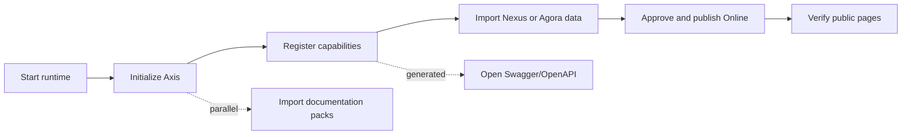

# Nodics Documentation

Nodics documentation is the governed reader entry point for understanding,
setting up, operating, and extending a Nodics project. It should help a
beginner decide where to go first, help a business user see the journey in
plain language, help a developer find the owning module, and help an operator
verify that the published experience matches the approved release.

This page is intentionally delivered as CMS documentation content. Nexus can
render it publicly after publication, while Axis can render the same content
for authenticated administrators. The browser application owns the renderer;
the backend documentation pack owns the page, navigation, publication state,
and search metadata.

## Choose the right entry point

| Entry point | Best reader | Use it when |
| --- | --- | --- |
| Framework | Business, architect, developer, operator | You need the core architecture, module ownership, extension model, runtime behavior, publishing rules, or governance contract. |
| Nodics Axis | Administrator, author, operator | You need the authenticated BackOffice journey for setup, content operations, documentation management, process tasks, and publication. |
| Nodics Kickoff | Beginner, implementation partner, QA | You need the reference customer-project path from fresh schema to working Nexus and Agora applications. |
| Swagger and OpenAPI | Developer, tester, integrator | You need generated runtime API contracts. Swagger is generated from active backend routes and does not require documentation publication approval. |

The first useful decision is not which page looks interesting. The first useful
decision is what job the reader is trying to complete. A business reader should
start with the framework value and adoption pages. A developer should start
with architecture and module ownership. An operator or QA owner should start
with local runtime, publication, and verification pages.

## First setup sequence

Fresh setup should feel like one guided operational journey instead of a hunt
through unrelated tools. The recommended sequence is:

1. Start the local topology and open Axis.
2. Initialize the Axis baseline so the managed BackOffice control plane exists.
3. Register required capabilities for the application you want to run.
4. Import the Nexus or Agora accelerator data pack.
5. Review, approve, publish, and verify Online content in the browser.

Documentation packs can be imported and approved in parallel with application
setup because they do not block module registration or application data
preparation. Public Nexus readers see only documentation pages that are Online
and public. Axis readers may use authenticated delivery where the route is
intended for administrators.

## What appears before publication

When no Online CMS content is available, public applications should show a
customer-friendly maintenance state, not half-rendered placeholder content.
That protects the customer experience and makes the setup status honest. Nexus
and Agora should not show real headers, footers, promotional cards, catalog
tiles, blogs, news, or documentation links until their Online content is
approved and available.

Axis is different because it is the authenticated control plane. It can show
setup, import, approval, and publishing tasks before public content is ready.
The Axis screen should make the next action clear: initialize data, register a
missing module, approve a pending request, publish Online, or verify the public
route.

## How documentation publication works

Documentation content is prepared in a content pack, imported into Staged,
reviewed in Axis, approved through the governed process task, and activated for
Online delivery. Approval is permission-based. A user who has review, approve,
and publish rights can complete the decision even if that same user requested
the publication. A user without those permissions cannot approve simply because
they can see the task.

The documentation navigation has only two levels: section and page link.
Sections organize the reader journey, and page links open real pages directly.
Avoid adding a third level just to preserve an internal hierarchy from source
files. If a page covers several independent use cases, split those use cases
into separate pages and place each one directly under the correct section.

## Common mistakes

- Do not put public documentation landing cards in Nexus React code when the
  CMS documentation pack can own them.
- Do not hide Swagger behind CMS documentation approval. Swagger is generated
  from the active runtime contract and should remain independently available.
- Do not import Agora data before the required Commerce and related
  capabilities are registered and active.
- Do not treat an import success as a full site success unless media binaries,
  media objects, pages, routes, navigation, catalog data, blogs, news, and
  references are all present where the application expects them.
- Do not make users jump between unrelated pages to review and approve one
  publication decision.

## Verification

Verify documentation as a customer journey, not only as generated records. From
a fresh schema, start the topology, initialize Axis, import the documentation
pack, submit approval, approve or reject through the queue, publish Online, and
open the public Nexus documentation route in the browser. Confirm the left
navigation refreshes, the page content resolves from CMS, the navigation is
only section plus page link, and the public route shows an unpublished message
instead of hardcoded content when Online data is absent.

For developers, run the generator validation and focused renderer tests after
changing content, navigation records, or frontend documentation renderers. For
operators, keep the publication status, audit trail, import run, and browser
evidence together so a later reviewer can understand what changed and why it
is safe for readers.

## Continue

- [Start with the framework](framework-what-is-nodics.md)
- [Understand the documentation roadmap](documentation-roadmap.md)
- [Review the publishing model](documentation-publishing-model.md)
