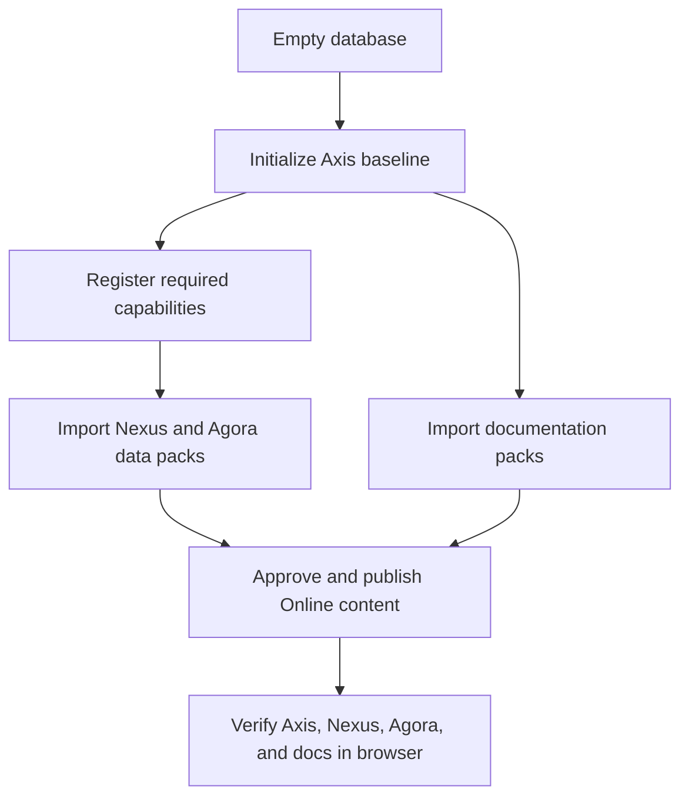

# Fresh Schema Setup Journey

The fresh schema setup journey explains the order required to bring a new
local database from empty state to a usable Axis, Nexus, Agora, and
documentation experience. It exists because a fresh schema is where hidden
dependencies become visible. If the setup order is unclear, users see buttons
that do nothing, public pages that render partial data, or imported packs that
look successful while required capabilities are still missing.

For a beginner, this page is the safe path. For an operator, it is the
acceptance sequence. For developers, it is the minimum journey that proves
setup documentation matches the implementation.

## Required order

## Setup table

| Step | Action | Why it comes here |
| --- | --- | --- |
| 1 | Start local backend and Axis. | The user needs the recovery shell and APIs. |
| 2 | Initialize Axis baseline. | Axis needs managed CMS and administration data. |
| 3 | Register required modules. | Commerce and other domain data must not import as if owners are absent. |
| 4 | Import application data packs. | Nexus and Agora need content, media, routes, catalogs, and records. |
| 5 | Import documentation packs. | Documentation can happen in parallel with app preparation. |
| 6 | Approve and publish. | Public apps consume Online content, not Staged content. |
| 7 | Verify in browser. | The user journey proves the setup is complete. |

## Business and user experience

The setup screens should make the next action obvious. If an application pack
needs commerce capabilities, Axis should show that dependency before import.
If content is not Online, Nexus or Agora should show a customer-friendly
maintenance page. If approval is required, the user should see the approval
task and perform approve or reject from the same business journey when
permissions allow it.

## Customization and extension

Projects can add their own setup packs, required capabilities, and publication
steps. The installer should copy project-owned setup metadata where needed,
but it should not force every customer into Nodics sample server names. A
generated customer corporate site or storefront should declare its own content
pack, media assets, channel, catalog, and dependency requirements.

## Reader and implementation contract

A beginner should be able to follow this page without knowing internal module
names first. The screen should say what is missing, what is ready, and what
action comes next. A business user should understand when the site is safe to
show publicly. A developer should understand which backend pack or capability
provides each record. An operator should understand which logs, publication
states, and browser checks prove the environment.

Each setup step should have a visible state: not imported, Staged ready,
approval needed, approval in progress, Online ready, failed, or blocked by a
missing capability. If an implementation cannot express one of those states,
the UI journey will become confusing again because users will have to infer
what the framework already knows.

## Common mistakes

- Importing Agora data before commerce capabilities are registered.
- Assuming documentation publishing should block Swagger/OpenAPI visibility.
- Forgetting media files and media records during a site data import.
- Showing public application content from fallback frontend constants.
- Asking users to find approval tasks on a separate confusing page.

## Verification

Verification must use a fresh schema. Run the setup sequence, confirm Axis
baseline state, confirm required modules are registered, import application
and documentation packs, approve publication, refresh navigation, and open
Nexus and Agora. Public apps must either show Online content or the approved
maintenance state.
