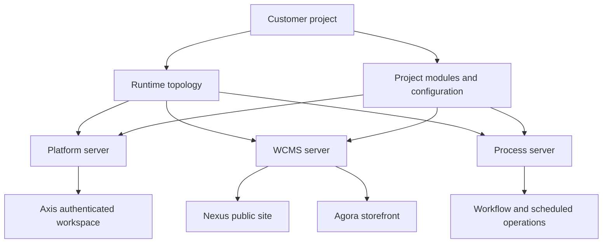

# How Nodics Works

Nodics works by separating business capability ownership from the physical
files, servers, and screens that implement it. A beginner can think of Nodics
as a framework that lets a project assemble enterprise capabilities without
copying them into one large application. A business user can think of it as a
governed way to change content, configuration, workflows, and operational data
from Axis. A developer can think of it as a layered runtime where framework
modules load first and customer project modules extend behavior safely.

The important rule is simple: the screen is not always the owner. Axis may
render an operation, Nexus may render a public page, Agora may render a
storefront, but backend modules own the data contracts, APIs, publication
rules, permissions, and runtime services.

## Mental model

Nodics has four major parts in the current reference experience:

| Layer | What it does | Reader impact |
| --- | --- | --- |
| Framework modules | Provide reusable capabilities such as Platform, WCMS, Process, Foundation, Commerce, Discovery, Engagement, and Localization. | Developers learn where behavior is owned before changing code. |
| Customer project | Declares runtime topology, project modules, data packs, configuration, and customization. | Business teams can launch a tailored solution without editing reusable framework source. |
| Axis | Renders authenticated business and administrator workspaces from backend-owned metadata. | Business users manage capabilities through a guided interface. |
| Public apps | Nexus, Agora, and other applications consume Online content and APIs. | Public users see only approved, published, and permitted experiences. |

## Runtime flow

The runtime flow begins with a project environment. The project points to the
framework checkout, declares which servers exist, and loads the modules needed
by each server. Platform handles employee identity, profile, BackOffice
metadata, module registration, and API discovery. WCMS handles sites, catalogs,
pages, components, routes, documentation, and media. Process handles workflow
and scheduled automation. Commerce and other domain modules add business
capabilities when registered and active.



## Backend-driven experience

Axis should not hardcode which business applications, imports, documentation
pages, modules, or approvals exist. Those should come from backend component
metadata, content catalog records, module registry records, process tasks, and
publication state. This keeps the user journey customizable from Axis while
the backend remains the authority.

For example, when documentation is published, the left navigation must refresh
from the Online documentation content model. Swagger/OpenAPI can be available
independently because it is generated API reference, not a CMS documentation
pack. When an Agora or Nexus content pack is imported, the import must prepare
the full site: media files, media records, pages, components, routes, catalog
data, and publication workflow evidence.

## Customization model

Developers customize Nodics in the layer that owns the reason for change.
Business labels, page hierarchy, visibility, and content areas belong in the
content catalog. Provider changes, such as moving from local cache to Redis or
from one search engine to another, belong in provider configuration and
adapter contracts. Business logic belongs in services, validators, pipelines,
or extension modules owned by the capability.

```js
// Example mental model, not a hardcoded navigation contract.
const customizationDecision = {
  content: 'Axis-managed content catalog and publication workflow',
  provider: 'configuration plus provider adapter',
  businessLogic: 'service, validator, pipeline, or project extension',
  publicPage: 'Online CMS route with access policy'
};
```

## Operator view

Operators care about whether the runtime can be explained. Nodics keeps
configuration, module loading, imports, events, publication, and approvals as
visible records. If a configuration change is pushed at runtime, the cluster
must receive it through governed events. If a node is responsible for cron
work and goes down, another node may take responsibility and transfer it back
when the original node returns, depending on the capability design. Those are
business continuity concerns, not only technical details.

## Common mistakes

- Assuming the application that displays data owns the data.
- Importing a storefront content pack before the required domain capabilities
  are registered and active.
- Hardcoding navigation, headers, footers, or public pages in Nexus or Agora
  instead of using backend content.
- Treating Swagger as blocked by CMS publication when it is generated API
  reference.
- Adding project behavior into the framework layer because that is the nearest
  file.

## Verification

A correct implementation can be verified from a fresh schema. Initialize Axis
baseline data, register the required modules, import application content packs,
submit and approve publication where required, then refresh the browser. Axis
should show available backend-driven actions, Nexus and Agora should render
only Online content, Swagger should remain independently accessible, and logs
should show which server and module handled each step.
