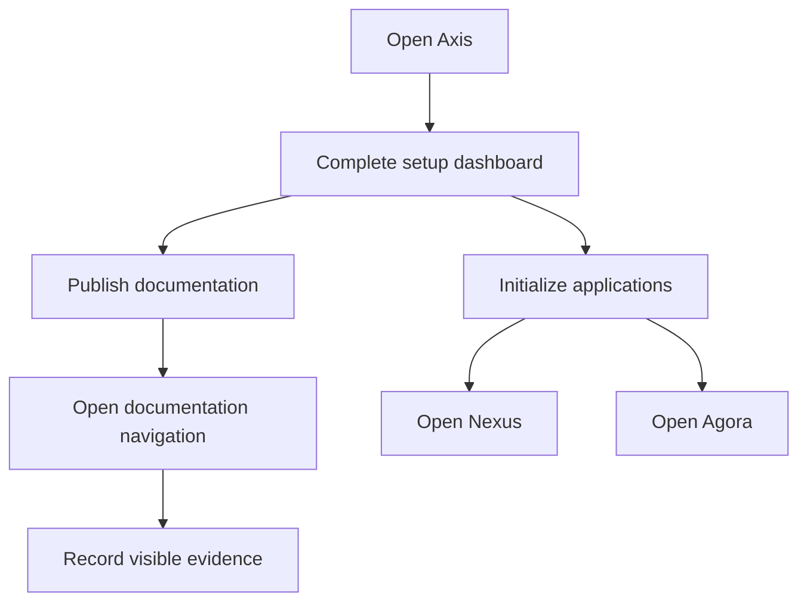

# Local Browser Acceptance Journey

Local Browser Acceptance Journey explains the required manual browser pass
after a fresh schema setup. It exists because many defects only appear when a
real user moves through Axis, Nexus, Agora, documentation, and approval flows.

## Browser path

| Route | What to verify |
| --- | --- |
| `localhost:3100` | Axis login, setup status, left navigation, and workspace clarity. |
| `/docs` | Documentation publication center, available links, and compact lists. |
| `/docs/framework` | Documentation navigation, page content, diagrams, tags, and search. |
| `localhost:3200` | Nexus Online content or customer-friendly unpublished message. |
| Agora ports | Storefront Online content or customer-friendly unpublished message. |

## Business perspective

The browser journey should feel like a guided onboarding process. A user
should know what is ready, what needs approval, what can be opened, and why a
link is locked. Empty pages should explain the business state instead of
showing broken layouts or hardcoded sample content.

## Developer perspective

Developers should verify the same route after every UI, content, publication,
or import change. The browser pass should catch stale navigation, missing media,
unpublished content, alignment issues, broken labels, hidden approval tasks,
and actions that do nothing.

## Operator perspective

Operators need evidence that setup actions triggered the expected backend
state. Browser checks should be paired with import history, publication state,
approval tasks, logs, and API status when a failure appears.

## Operational evidence

Browser acceptance should produce evidence a teammate can repeat. Record the schema state, build result, server status, logged-in role, route opened, expected state, actual state, screenshots or notes, and any backend log or API used to explain a failure. The route list should include setup pages, documentation pages, application pages, approval queues, and customer-facing unpublished states. This prevents false confidence from testing only one happy path.

## Reader and implementation contract

A beginner should understand the visible journey before learning internal APIs. A business user should see whether the system is usable, waiting for data, waiting for approval, or intentionally unpublished. A developer should know which route, component, content pack, media relation, and action caused the visible state. An operator should know what backend evidence to inspect when the browser result is wrong.

Every browser acceptance page must include routes, expected states, setup actions, approval or publication gates, frontend fallback behavior, and evidence. It should be updated whenever Axis, Nexus, Agora, documentation navigation, setup accelerators, media import, or publication UI changes.

## Documentation maintenance rule

Keep this topic current whenever implementation, configuration, Axis workflow, publication behavior, or customer-facing rendering changes. The page should remain small enough to scan, but it must still carry enough business context, technical ownership, customization guidance, visual structure, operational evidence, and verification detail for a reader to act without guessing. When the detail becomes too large, create a sibling topic and link it from this page instead of turning the overview back into a long mixed article.

This extension guidance must stay linked to the owning project or capability page whenever a customer customizes the behavior.

## Common mistakes

- Checking only the route that was changed.
- Not using a fresh schema before claiming setup works.
- Publishing docs but forgetting Nexus or Agora content.
- Allowing a button to trigger work without visible progress or error detail.

## Verification

Verification is complete when every route either renders approved Online
content or an intentional unpublished/maintenance state, all setup actions show
clear progress or failure, and the user can find the next action without
leaving the current workflow.
