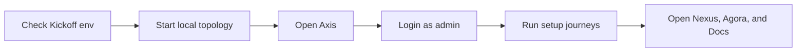

# Local Quick Start with Kickoff and Axis

Local Quick Start explains the shortest reliable path for running Nodics on a
developer machine. It is not the full enterprise setup manual. Use it to start
Kickoff, open Axis, confirm the managed workspace is available, and know where
to continue when the schema is fresh or a server fails.

## Quick path

| Step | Command or action | Expected result |
| --- | --- | --- |
| Configure | Review the Kickoff `.env` and topology settings. | Ports and framework root are correct. |
| Start | Run the project topology command from Kickoff. | Backend services and frontend apps start. |
| Axis | Open `http://localhost:3100`. | Axis login or first-run setup is visible. |
| Setup | Use Axis setup screens. | Baseline data, accelerators, and documentation move through governed import and approval. |
| Verify | Open Axis, Nexus, Agora, and docs links. | Each page either renders Online content or a customer-friendly unpublished message. |

## Business perspective

The quick start is for proving that a project workspace can become useful
quickly. Business users should see how Axis guides setup instead of requiring
hidden scripts. A customer team should understand which data is not imported,
which packs need approval, and which storefronts are waiting for Online
publication.

This page intentionally links to the deeper fresh-schema journey and runtime
troubleshooting page instead of carrying every recovery detail here.

For beginners, this page should be treated as the map, not the full manual.
Follow the visible Axis setup journey first, then open the linked pages only
when a specific setup, publishing, or runtime problem needs deeper explanation.

## Developer perspective

Developers use this page to confirm the local topology, then move to focused
pages for schema cleanup, build, server startup, publication, and browser
acceptance. If a project adds new modules, content packs, media assets,
accelerators, or documentation packs, the local quick start should point to the
right setup page rather than expanding into a giant checklist.

Project code should continue to use the framework root from the local machine
or configured environment. The project should not depend on copied framework
modules under `.nodics/framework`.

## Operator view

An operator should know that quick start success is not only a server process
being alive. The useful result is a live Axis workspace with visible setup
status, import history, approval tasks, Online readiness, and application links
that do not leave the user guessing.

## Continue with

- **Fresh Schema Setup Journey** for deleting schema data, importing baseline
  content, publishing Online, and verifying from the browser.
- **Local Runtime Troubleshooting** for busy ports, stale supervisor state,
  remote-service circuit errors, and timeout diagnostics.
- **Application Setup and Accelerators** for Nexus, Agora Apparel, Agora
  Electronics, Agora Telco, and future accelerator setup.

## Customization and extension guidance

When a project changes the local setup, document the project-specific module list, ports, environment files, content packs, accelerator packs, and any extra startup or approval step. Keep customer setup data in project-owned configuration or generated content packs, not in reusable framework source. If the project adds a new application, the quick start should link to that setup journey and explain the fresh-schema verification path.

## Common mistakes

- Treating a successful start command as complete setup.
- Importing accelerator data before the required backend capability is
  registered.
- Expecting documentation, Nexus, or Agora to render Online content before the
  relevant content pack has been approved and published.
- Hiding setup instructions in logs instead of exposing them in Axis.

## Verification

Verify the quick start with a fresh schema, a clean build, local server start,
Axis setup screens, documentation publication, accelerator publication, and
browser checks for `localhost:3100`, `localhost:3200`, and the Agora storefront
ports used by the topology.
