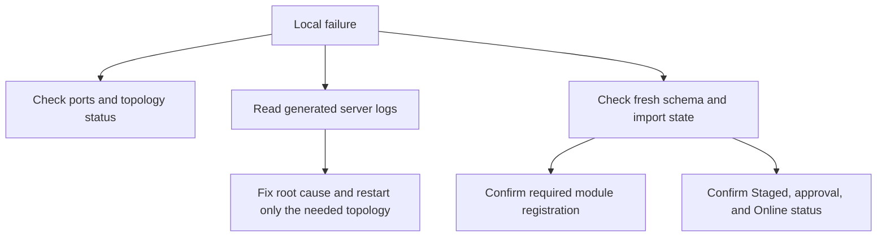

# Local Runtime Troubleshooting

Local runtime troubleshooting gives developers and operators a practical path
when the reference workspace does not start cleanly. It belongs beside the
quick start because setup problems are part of the first user journey. If a
port is busy, a supervisor state file is stale, a schema import fails, or a
content pack times out, the user should not have to guess whether the failure
is a server issue, data issue, publication issue, or browser issue.

The goal is not to hide failures. The goal is to make them actionable.

## Troubleshooting flow

## Common local signals

| Symptom | Likely cause | Action |
| --- | --- | --- |
| Required ports are busy | A previous Axis, Nexus, Agora, or backend process is still running. | Run topology status, identify the owner, and stop it explicitly. |
| Stop refuses to signal PID | Generated state is stale or belongs to another checkout. | Resolve listening ports manually before restarting. |
| Import validation fails | Fresh schema contract or content-pack field mismatch. | Fix source pack/schema, regenerate, and retry import. |
| Public app shows maintenance | Online CMS content is not published for that site. | Import, approve, publish, then refresh. |
| Axis navigation is missing docs | Documentation source is not Online or navigation did not refresh. | Publish the docs pack and refresh backend-driven navigation. |

## Business impact

Local troubleshooting is a business concern because adoption depends on the
first hour. A user who cannot understand what failed will not trust the
framework. Error messages should name the missing dependency, owner, and next
action wherever possible. Maintenance pages should be professional and
customer-friendly, not accidental blank screens.

## Customization and extension

Customer projects may use different ports, servers, application packs, or
content catalogs. Troubleshooting documentation must refer to project-owned
configuration and generated workspace metadata rather than assuming only the
reference Kickoff topology. Installer-created projects should include enough
metadata for Axis to show setup dependencies and recovery steps.

## Reader and implementation contract

A beginner should never have to decide between random terminal commands and
guesswork. The troubleshooting path should name the owner of the failure and
the safest next action. A business administrator should see whether the issue
blocks authoring, approval, Online publication, or public delivery. A
developer should know whether the fix belongs in schema, import data,
configuration, service code, or frontend rendering. An operator should know
which process can be restarted and which process must be left alone.

Troubleshooting guidance should be updated whenever startup, import,
publication, or browser setup behavior changes. If the UI introduces a new
button such as initialize, update Staged, approve, reject, or refresh, the
failure states for that action must be documented with the same care as the
happy path.

## Common mistakes

- Treating every startup failure as a build failure.
- Deleting schema before reading the failing import or server log.
- Killing processes without confirming which checkout owns the port.
- Fixing a UI symptom while the missing record is in Staged/Online
  publication state.
- Keeping troubleshooting knowledge outside the docs.

## Verification

Troubleshooting is verified by reproducing a fresh schema setup, checking the
failure messages, confirming logs point to the correct owner, and proving that
the documented recovery restores Axis, Nexus, Agora, documentation, and API
reference behavior without manual hidden steps.
