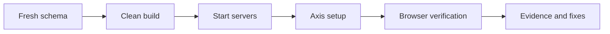

# Local Verification and Acceptance Checklist

Local Verification and Acceptance Checklist is the overview for proving a
local Nodics environment after code, content, or setup changes. It keeps the
high-level acceptance rules here and links the detailed browser journey to a
focused page.

## Acceptance flow

| Check | Why it matters |
| --- | --- |
| Fresh schema | Proves the system does not depend on old local data. |
| Clean build | Proves generated contracts and compiled frontend agree. |
| Startup | Proves topology, ports, and runtime dependencies work. |
| Browser journey | Proves a real user can complete setup and open applications. |

## Business perspective

Acceptance should answer one simple question: can a new customer or developer
start from nothing and reach a working governed workspace without being lost?
That means Axis must explain setup status, required imports, approval tasks,
publication, Online readiness, and application links clearly.

## Developer perspective

Developers should run focused tests for changed modules and complete browser
verification when the change affects navigation, setup, publication, content,
media, roles, or storefront rendering. A passing API test is not enough when
the user journey is the thing being changed.

## Continue with

- **Fresh Schema Setup Journey** for schema cleanup and first-run setup.
- **Local Browser Acceptance Journey** for end-to-end browser verification.
- **Local Runtime Troubleshooting** for common local failures.

## Operational evidence

The checklist should produce a small acceptance record for every run. Include command output summary, failed and passed test suites, started ports, setup actions completed, content packs imported, approval tasks completed, applications opened, media rendered, and unresolved blockers. If the run uses a fresh schema, say so explicitly. If it reuses existing data, mark the result as limited because stale data can hide import, publication, role, and navigation defects.

## Reader and implementation contract

A beginner should understand the difference between command success and journey success. A business user should know whether the setup can be completed without reading logs. A developer should know which automated checks cover the code path and which browser checks cover user experience. An operator should know how to repeat the run from a fresh schema and compare evidence between attempts.

This checklist must be updated after any change to setup, import, publishing, content, media, approval tasks, left navigation, runtime configuration, or storefront rendering. The acceptance result should state what passed, what was not run, and what remains blocked by missing data or environment state.

## Documentation maintenance rule

Keep this topic current whenever implementation, configuration, Axis workflow, publication behavior, or customer-facing rendering changes. The page should remain small enough to scan, but it must still carry enough business context, technical ownership, customization guidance, visual structure, operational evidence, and verification detail for a reader to act without guessing. When the detail becomes too large, create a sibling topic and link it from this page instead of turning the overview back into a long mixed article.

This extension guidance must stay linked to the owning project or capability page whenever a customer customizes the behavior.

## Common mistakes

- Testing on a reused schema and missing initialization defects.
- Verifying backend endpoints but not the Axis or storefront UI.
- Ignoring customer-friendly empty or unpublished states.
- Leaving setup commands undocumented after implementation changes.

## Verification

Verify local acceptance by recording commands, test results, server status,
browser routes, screenshots or observations, and any remaining gaps. A
business user should see a guided path; a developer should see reproducible
steps; an operator should see evidence.
