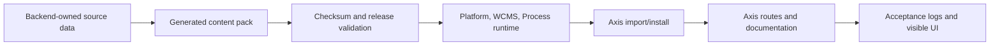

# Local verification and acceptance checklist

This page explains how to prove that a local Nodics workspace is healthy after
setup, documentation import, module registration, or a framework change. It is
written for a beginner who has started the servers and now needs to answer a
more important question: “How do I know this is really working?”

For a business evaluator, this checklist shows whether the framework is
demonstrable and repeatable. For a developer, it shows which commands and UI
screens prove the expected behavior. For a DevOps or TechOps engineer, it
shows which runtime processes, data packs, logs, and recovery states must be
observable before the stack is trusted.

## What this is

Local verification is the controlled proof that the framework, reference
project, backend servers, documentation packs, and Axis frontend agree with
each other. A server can start and still be incomplete if data was not
imported. A documentation release can exist on disk and still be unavailable
if WCMS has not imported it. Axis can render a route and still be unsafe if it
is guessing capabilities instead of reading Platform and WCMS contracts.

The checklist therefore verifies the full path:



## Why it exists

Without a verification contract, every developer invents a different meaning
for “working.” One person may mean that Node started. Another may mean the
login page opened. A tester may mean routes returned HTTP 200. An operator may
mean the database can be rebuilt from empty local state. Nodics needs a common
definition because the framework is modular: Platform, WCMS, Cron, Axis, and
customer projects can each be healthy or unhealthy independently.

This page gives the shared definition for local development. It does not
replace production monitoring, security review, performance testing, or
customer-specific acceptance, but it gives everyone the same first baseline.

## Who uses it

| Reader | What they verify |
| --- | --- |
| Business evaluator | The local demo can be started, logged into, imported, and explored without custom manual database edits. |
| Developer | Source changes regenerated the right artifacts and did not break Platform, WCMS, Cron, Axis, or documentation routes. |
| Architect | Module ownership, runtime loading, import ownership, and Axis rendering are still separated. |
| Administrator | Module Registry, Imports and Exports, Documentation, Content, Media, and Cron screens show the expected state. |
| DevOps or TechOps | Processes, ports, databases, logs, generated packs, and recovery behavior are visible and repeatable. |
| Tester or QA engineer | Happy path, failure path, persistence, refresh, and route checks are covered. |
| AI tool | The right generated artifacts and validation commands were run before claiming completion. |

## Preconditions

Before running local acceptance, confirm these basics:

1. MongoDB is running and reachable from the local server configuration.
2. The framework repository, customer/reference project, and Axis frontend are
   checked out.
3. The customer project `.env` points `NODICS_FRAMEWORK_ROOT` to the framework
   checkout.
4. Dependencies are installed after any package or local-framework-link change.
5. No unrelated process is using the local ports expected by the reference
   stack.

The reference ports are:

| Process | Default local URL | Owner |
| --- | --- | --- |
| Platform | `http://localhost:4300` | `nodics.platform` through the customer project server |
| WCMS | `http://localhost:4310` | `nodics.wcms` through the customer project server |
| Process and Automation | `http://localhost:4330` | `nodics.process` through the customer project server |
| Axis | `http://localhost:3100` | `nodics.axis` frontend |

## Fast automated acceptance

From the customer project, run:

```bash
npm run acceptance:local
```

This command is the normal local confidence check. It starts or verifies
Platform, WCMS, Cron, and Axis; authenticates the reference admin; checks
documentation release state; opens important Axis routes; verifies WCMS
record counts; and runs live smoke coverage for module registry and Cron
lifecycle.

Use the fresh database version when you intentionally want to rebuild the
local reference databases from zero:

```bash
npm run acceptance:local:fresh
```

The fresh command is destructive only for the named local reference databases.
It must not be generalized to arbitrary database names. A safe fresh run proves
that the local environment does not depend on hidden manual records.

## Manual UI acceptance journey

Automated acceptance is fast, but a human should also walk the product once
after major documentation, Axis, WCMS, registry, or import changes.

1. Open `http://localhost:3100`.
2. Log in with enterprise `default`, username `admin`, and the configured
   reference password.
3. Open **Documentation → Framework** and verify the first article renders,
   navigation stays usable, and diagrams/images appear as images rather than
   Markdown text.
4. Open **Documentation → Nodics Axis** and **Documentation → Nodics Kickoff**
   to confirm product and project documentation are imported from their owning
   backend packages.
5. Open **System and Integrations → Module Registry** and confirm Core,
   Platform, and WCMS are mandatory active modules.
6. If Cron is running, confirm Cron appears as an optional observed module.
   Register, activate, deactivate, and deregister it without a browser
   refresh.
7. Open **Imports and Exports** and confirm release cards are valid. If a card
   says `INVALID RELEASE`, regenerate the owning content/data manifests
   instead of bypassing validation.
8. Open **Content** and confirm sites, catalogs, pages, components, and routes
   have non-zero counts after import.
9. Open **Media** and confirm media screens use backend-owned source contexts
   and do not expose private storage paths.
10. Refresh the browser and confirm the session and selected route recover as
    expected.

## Documentation-specific checks

Framework documentation is source-owned by `nodics.docs`. The frontend should
not own these records. When framework docs change, run:

```bash
npm --prefix nodics.ai/nodics.docs run docs:generate
npm --prefix nodics.ai/nodics.docs test
```

Then run framework-level governance checks:

```bash
npm --prefix nodics.ai run quality:copyright
npm --prefix nodics.ai run quality:docs
npm --prefix nodics.ai run ai:validate
npm --prefix nodics.ai run llm:generate
npm --prefix nodics.ai run llm:validate
git -C nodics.ai diff --check
```

If the generated documentation content pack changes, import or update the
release through Axis and verify the visible routes. The expected result is not
only “the file exists”; the expected result is that WCMS reports the release as
current and Axis renders the page from backend-delivered content.

## What success looks like

The local stack is acceptable when these statements are true:

| Evidence | Expected result |
| --- | --- |
| Server startup | Platform, WCMS, Cron if selected, and Axis are reachable on expected local ports. |
| Authentication | The reference admin can log in and unauthorized access fails closed. |
| Registry | Mandatory modules are active; optional modules follow register, activate, deactivate, deregister lifecycle. |
| Documentation packs | Framework, Axis, and customer project documentation packs are current after import. |
| CMS records | Sites, catalogs, pages, components, and routes exist; no visible site is orphaned from its catalog. |
| Visual docs | Diagrams and screenshots render as governed images, not broken links or raw Markdown. |
| Route health | `/`, `/docs`, `/docs/framework`, `/content`, `/media`, `/cron`, and system routes return HTTP 200. |
| Fresh rebuild | The local database can be recreated from backend-owned data packs. |

## Troubleshooting

| Symptom | Likely owner | Safe first check |
| --- | --- | --- |
| Login page opens but login fails | Platform/Profile | Confirm Platform is reachable and the reference identity data was imported. |
| Documentation page shows recovery mode | WCMS/content-pack owner | Confirm WCMS is running and documentation releases are installed/current. |
| A release says `INVALID RELEASE` | Owning data pack | Regenerate manifests from source and restart the affected runtime. |
| Module action needs browser refresh | Axis plus BackOffice API | Check operation response and local state update after register/activate/deactivate/deregister. |
| Cron disappears after deregister | BackOffice registry projection | Confirm live runtime observation returns the module to available optional state. |
| Media page reports schema discovery issue | WCMS/Media API category | Confirm the media and data API categories are enabled by module defaults or narrow server override. |
| Docs image is broken | `nodics.docs` source/generator | Confirm image exists under `docs/pages/assets/images` and the Markdown path is relative. |

## Common mistakes

- Calling the stack healthy before importing initialization and documentation
  data.
- Editing generated documentation data instead of fixing Markdown source and
  regenerating.
- Treating `nodics.axis` as the owner of Framework, Axis product, or customer
  project documentation records.
- Dropping broad databases or using unsafe environment variables during a
  fresh test.
- Ignoring `INVALID RELEASE` because the UI still shows a checkbox.
- Accepting a visual documentation change without opening the rendered Axis
  page.
- Claiming module registry lifecycle works after only a page refresh.

## Related pages

Read **Local quick start with Kickoff and Axis** before this page if the
servers have not been started yet. Read **Modular architecture and ownership**
to understand why each runtime has a different owner. Read **Functional module
registry** for the detailed lifecycle rules behind module registration. Read
**Runtime and DevOps operations** before designing production topology.

## Verification

This page verifies itself through repeatability. A beginner should be able to
follow the checklist after a normal local start and again after a fresh local
database bootstrap. The expected result is the same: no manual database edits,
no generated-file hand patches, no frontend-owned content data, and no hidden
project-name assumptions.

When this checklist is used after a documentation change, the evidence must
include regenerated content-pack files, passing documentation validation, a
current release version, successful import into WCMS, and rendered Axis routes.
When it is used after a runtime or registry change, the evidence must include
server startup, persisted registry state, immediate UI refresh after lifecycle
operations, and safe behavior after restart. If the evidence cannot name the
owning module for a failure, the verification is not yet useful enough.

## Customization and extension

Project teams may extend this checklist with local services, extra content
packs, integration adapters, commerce accelerators, or tenant-specific smoke
journeys. Each extension must preserve the same evidence style: command,
owner, environment, expected result, observed result, rollback path, and
business impact when the check fails.
