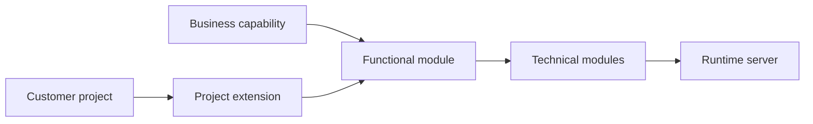

# Modular Architecture and Ownership

Modular Architecture and Ownership is the entry page for how Nodics separates
business capabilities, runtime servers, project extensions, and technical
implementation details. It helps a business reader understand why Nodics can
grow without becoming one large application, and helps a developer decide where
a change belongs before writing code.

The detailed pages in this group explain runtime composition, service
precedence, and architecture decisions. This page is the dashboard for that
journey.

## Ownership model

| Layer | What it owns | Reader impact |
| --- | --- | --- |
| Functional module | Business capability boundary and public contract. | Business users see a stable capability name. |
| Technical module | Schemas, services, controllers, pipelines, events, and tests. | Developers know where implementation lives. |
| Runtime server | Which modules are active together in a process. | Operators know what must run in each topology. |
| Customer project | Extensions, overrides, configuration, and seed data. | Customers customize without editing reusable framework source. |

## What to read next

- Read **Runtime Server Composition** when deciding which backend server should
  host a capability.
- Read **Module Loading and Service Precedence** when a project overrides a
  schema, service, controller, pipeline, event, or configuration value.
- Read **Architecture Decision Guide** when choosing between module ownership,
  project customization, runtime configuration, import data, or Axis content.
- Read **Functional Module Registry** when you need the active capability map
  visible to Axis, tools, and operators.

## Business perspective

For business teams, modularity means controlled growth. A retailer can start
with content, catalog, cart, checkout, payment, shipping, and order operations,
then add search, engagement, integrations, automation, analytics, and industry
accelerators without redesigning the whole platform. Each capability has a
business-friendly name, a clear owner, and a publication or runtime contract.

The important decision is not the package name. The important decision is who
owns the business behavior, who can change it, how it is approved, and where an
operator can verify it.

## Technical perspective

For a developer, modular architecture protects extension boundaries. A project
can extend Platform, WCMS, Commerce, Process, or another capability through
project modules, configuration, data, and service precedence. The project does
not rename the core capability or copy framework implementation just to make a
customer-specific change.

Every topic in this area should identify the owning module, the project-layer
override path, configuration keys, APIs, events, pipelines, validation tests,
and operational evidence. If the change affects runtime behavior, the
documentation must also explain whether it is static, import-driven, or
governed runtime change.

## Common mistakes

- Naming documentation after exact package folders instead of business
  capability names.
- Putting project customization inside reusable framework modules.
- Treating Axis as the owner of backend data instead of the administrative
  client.
- Describing service overrides without explaining load order or verification.

## Verification

Verify modular decisions by checking the module metadata, generated service
contracts, active runtime composition, Axis capability registry, and tests for
the changed behavior. A beginner should be able to follow the capability name;
a developer should be able to find the implementation; an operator should be
able to see where the capability runs.
