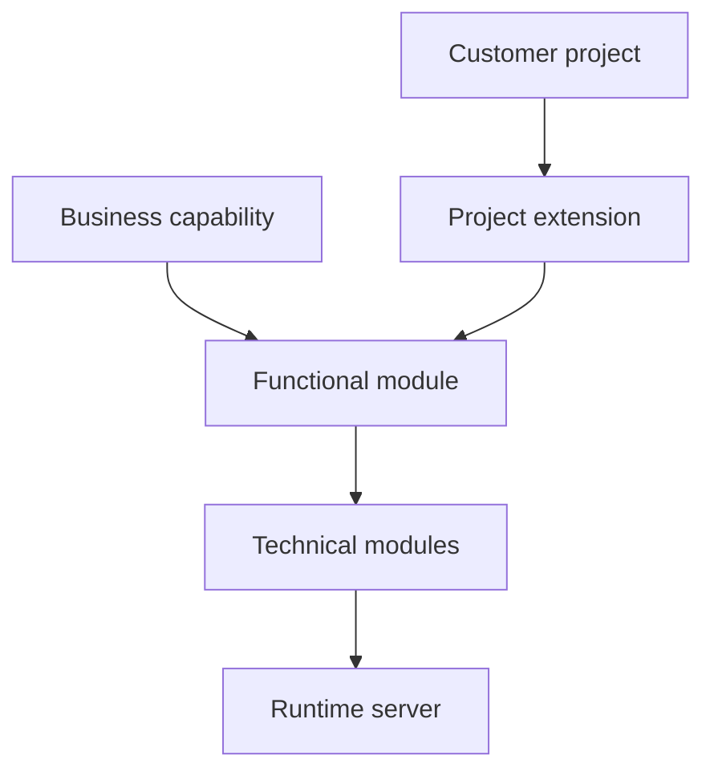
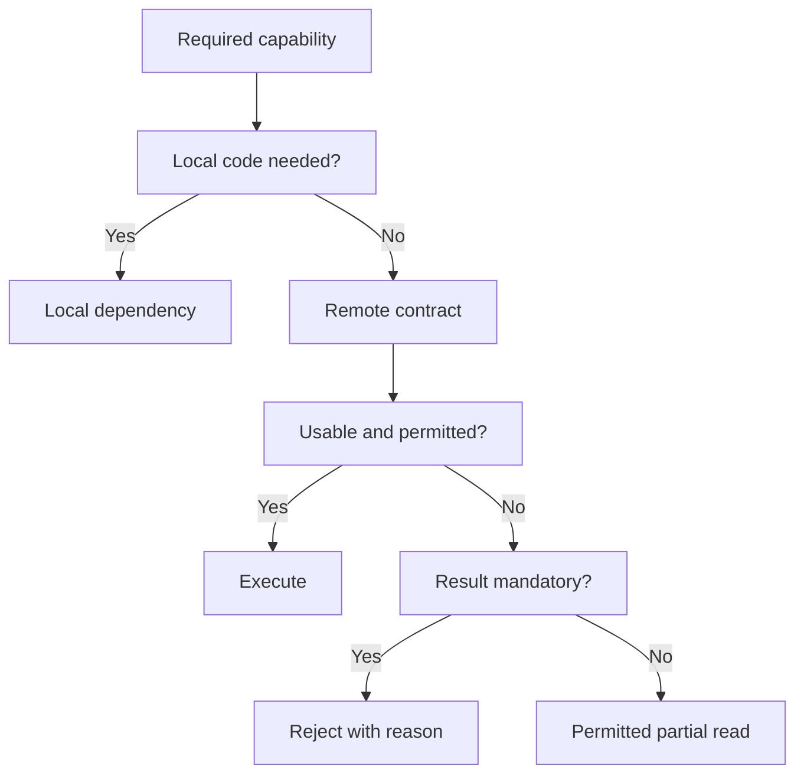

# Modular Architecture and Ownership

Modular Architecture and Ownership is the entry page for how Nodics separates
business capabilities, runtime servers, project extensions, and technical
implementation details. It helps a business reader understand why Nodics can
grow without becoming one large application, and helps a developer decide where
a change belongs before writing code.

The detailed pages in this group explain runtime composition, service
precedence, and architecture decisions. This page is the dashboard for that
journey.

## Ownership model



| Layer | What it owns | Reader impact |
| --- | --- | --- |
| Functional module | Business capability boundary and public contract. | Business users see a stable capability name. |
| Technical module | Schemas, services, controllers, pipelines, events, and tests. | Developers know where implementation lives. |
| Runtime server | Which modules are active together in a process. | Operators know what must run in each topology. |
| Customer project | Extensions, overrides, configuration, and seed data. | Customers customize without editing reusable framework source. |

## Plug-and-play availability

Optional modules can be selected independently. If an optional module is absent
or unavailable, only the operations that need it become unavailable. A running
module is not automatically permissioned or activated for Axis: registration,
activation, runtime readiness and employee permissions remain separate gates.

| Module family | Standard boundary |
| --- | --- |
| Foundation, Platform, WCMS | Protected functional roots; Foundation supplies the runtime substrate. |
| Process, Localization | Optional capabilities; required approvals and authoritative bundles still fail closed when unavailable. |
| Commerce, Communication, Engagement, Loyalty, Location, Waste, Discovery, Copilot | Optional functional groups; actual local implementation prerequisites remain explicit. |
| Accelerators | Optional umbrella; selected industry groups own their genuine Commerce or Waste inheritance. The umbrella does not force Commerce or Discovery. |
| Documentation | Backend-owned content, not proof that a documented runtime capability is installed or usable. |

Use `requiredModules` and `nodics.extends` only for actual local composition.
For example, selected WCMS Experience and Copilot Knowledge currently embed
Discovery implementation dependencies. Do not remove those dependencies while
their services still require them. Ordinary WCMS does not select Experience.
Remote reachability remains in existing module-service discovery and endpoint
configuration; it must not load a second schema owner into the calling server.

BackOffice uses existing workbench targets and lifecycle-action owners to
disable affected features. A healthy navigation publisher does not make an
absent target available. The backend returns the reason, and Axis renders it.
No new dependency registry, configuration layer or frontend list is required.

### Successful, rejected and recovery journeys

An administrator may register and activate Waste without activating Location.
Waste operations that do not use Location remain independent. Collection-centre
reads may return the partial data allowed by their enrichment contract; an
operation requiring a valid Location reference must not fabricate one. The same
rule applies to any optional integration, including reward issuance, search,
communication, approval and translation.

A missing permission still rejects access even when every module is healthy.
A required approval failure must not publish content. A failed mutation must
not be reported as successful enrichment. Recovery refreshes the existing
lease/capability projection and does not delete records or auto-enable an
administratively disabled module.

For local operations, a runtime exit after successful topology startup leaves
other processes running. Inspect `topology:status` and the affected runtime log.
Startup failures still fail the requested launch; explicit topology shutdown
still stops its owned processes. Consolidated processes naturally share a
process-failure boundary; use separate runtimes when failure isolation matters.

### Customization and verification overview

Partners contribute `workbenchTarget.moduleName`, action `ownerModule`, and
provider behavior through existing module-owned capability data and same-name
service overrides. Do not add a parallel dependency file or weaken target API
authorization. Existing protected-to-optional registrations retain their
registered/enabled state; deactivation is an explicit administrator action.

Maintainers should run the functional optionality, navigation availability,
lifecycle pagination, module invocation, and topology isolation contract tests.
The shared matrix covers missing/restored targets, independent actions,
multi-instance membership and more than 256 catalogue records. Production
qualification must additionally exercise the deployment's selected end-to-end
business operations; shared contract tests are not a claim that every provider
and deployment combination has been tested.

## Decide what kind of dependency you have

A package being present on disk is like equipment being delivered to a site:
it does not prove the equipment is connected, commissioned, or available to a
particular employee. Nodics separates those decisions so that an outage or a
permission change does not rewrite your application architecture.

| Question | Existing authority | What it does not mean |
| --- | --- | --- |
| Can the project resolve this package? | Project package resolution | Its schemas are loaded in every server. |
| Does this implementation run in this process? | Module/server `nodics.extends`, local `requiredModules`, effective `activeModules` | A remote integration must become a local schema owner. |
| Where can a remote owner be reached? | Existing `servers` configuration and module-service discovery | The module is registered and enabled for business users. |
| Has an administrator selected this business capability? | Functional registration and activation | Every target and provider is healthy. |
| Is an observed instance usable now? | Runtime leases and readiness | A caller has permission to perform a mutation. |
| Can this user perform this operation? | Owning API authorization, scope and validation | A visible menu is sufficient authorization. |



Read the diagram from the operation, not from the package list. A required
reference, approval or financial effect takes the rejection branch. A genuinely
optional display enrichment may take the partial-read branch. The service owns
that distinction; the registry does not infer it from arbitrary method calls.

## Worked module-selection examples

### Waste without Location

Starting state: the protected roots are available, Waste is installed and
running, and Location has not been activated. An authorized administrator
registers Waste and completes its own required activation data. Location is
not a whole-Waste prerequisite.

1. Check Module Registry for Waste registration and activation, then Module
   Health for the relevant technical owners. These answer different questions.
2. Use a Waste operation whose contract has no Location dependency, such as
   reading its material taxonomy. Do not use a collection-centre map as the
   proof of Location-independent behavior.
3. For a collection-centre journey, inspect the owning service's reference and
   enrichment requirements. Absence of Location does not convert `locationRef`
   into arbitrary text or remove a required reference from the schema.
4. A read may expose permitted partial centre data; a required Location-based
   operation must report the missing capability or invalid reference.
5. When Location becomes available and authorized, refresh the existing
   capability projection and retry an appropriate read. Do not recreate Waste
   records merely to refresh the UI.

This is a qualification procedure for a selected deployment, not a claim that
every Waste API can operate without Location. Profile references, permissions,
and the particular business operation remain part of that API's contract.

### Commerce with selected industry behavior

Starting state: a project wants Apparel behavior, but not every accelerator.
Select the actual Apparel group through the existing project/server composition.
Apparel keeps its real Commerce inheritance. The Accelerators umbrella itself
does not impose Discovery on unrelated selections. Choosing the umbrella is
not a substitute for reviewing which child groups the effective server loads.

Expected result: the selected industry's implementations are resolved with
their local prerequisites. Rejected customization: deleting Apparel's genuine
Commerce inheritance while its services still depend on Commerce. Recovery:
restore the project composition and rerun the selected industry's contracts.

### Optional Process does not mean optional approval

Starting state: Process is not used by a project's ordinary data reads. Those
reads should not acquire an artificial dependency on Process. An approval-
required publication is different: it must not succeed without the workflow
authority required by its publishing policy. Keep the operation pending or
rejected according to its existing lifecycle; do not manufacture an approval.

When Process recovers, inspect the existing request before retrying a mutation.
Recovery of a runtime does not establish whether a previous request committed.
Use the owning lifecycle's status and idempotency rules.

## Customize and extend safely

### Project files and responsibilities

Use an already scaffolded, loader-visible project module. The paths below are
project-relative patterns, not instructions to create another configuration
system or to copy a framework folder.

| Project-owned path | Supported change | Invariant |
| --- | --- | --- |
| `modules/<projectModule>/package.json` | Declare genuine inheritance and the module's actual ownership metadata. | Standard functional identity does not change. |
| `modules/<projectModule>/config/properties.js` | Override documented properties through normal configuration layering. | No second registry or hidden frontend module list. |
| `modules/<projectModule>/src/service/<existingService>.js` | Override a supported method after its framework provider is loaded. | Preserve authorization, scope, errors and public method contracts. |
| `envs/<environment>/<server>/package.json` | Select the server's actual local composition. | Remote endpoints do not become local persistence owners. |
| `envs/<environment>/nodics.environment.json` | Select process layout and startup order. | `dependsOn` is not an activation or permission policy. |
| `modules/<projectModule>/test/` | Prove the effective customized behavior and its failure paths. | Passing default tests alone does not qualify an overlay. |

### Smallest configuration customization

For an existing Platform-hosted project overlay, place this property in its
`config/properties.js`. This is a complete property fragment to merge with the
file's other exports, not a complete project scaffold:

```js
module.exports = {
  backofficeFunctionalModuleCatalogue: {
    eligibilityPageSize: 128
  }
};
```

The framework default is 256. The override changes records fetched per backend
page, not which modules are eligible, their permissions, or the final result
count. It must be a positive safe integer. Ensure the overlay is actually loaded
by the server hosting BackOffice; editing an unrelated Waste-only process will
not change Platform's effective properties. No browser restart can load an
unselected backend overlay.

To verify, use a disposable catalogue fixture with 257 records: expect all 257,
not only the first 128. Fail a later page and verify that no partial list is
treated as a complete reconciliation. Test an unauthorized caller separately.
For rollback, remove this property override and rebuild/restart the affected
runtime under the project's normal deployment procedure. Do not edit catalogue
records to simulate configuration rollback.

### Guarantees projects cannot override

Projects may narrow presentation and choose optional capabilities. They must
not make a missing required approval successful, disable API authorization,
replace tenant/enterprise scope with browser-supplied identity, or synthesize
references to unavailable records. Hiding a menu item does not revoke its API
permission. Such guarantees are deliberately not customization switches.

After an upgrade, verify the effective owner and method load order again.
An override can be syntactically valid but no longer participate in the selected
runtime. Keep a small overlay contract test in the customer repository and
link it to the framework contract tests listed below.

## Qualification matrix

| Scenario | Expected evidence | Unsafe conclusion to avoid |
| --- | --- | --- |
| Optional module absent | Unrelated permitted operation still works. | Every operation in the caller is independent. |
| Target loses readiness | Only dependent presentation/actions change; API remains authoritative. | Disabled UI alone prevents API calls. |
| Target returns | Current authorized projection recovers without altering stored enablement. | Recovery should auto-activate disabled modules. |
| Two replicas publish different technical members | Live membership represents both; expired members reconcile. | The last heartbeat is the whole module. |
| More than one catalogue page | Complete scoped listing and reconciliation. | A full first page proves all records were read. |
| Project override selected | Default and customized tests both pass. | Editing a file proves it is loaded. |

Run from the framework repository root:

```bash
node --test nodics.foundation/modules/nTooling/test/functionalModuleOptionalityContract.test.js
node --test nodics.platform/modules/backoffice/test/navigationModuleAvailability.test.js
node --test nodics.platform/modules/backoffice/test/functionalModuleLifecyclePagination.test.js
```

These are source and service contracts. Complete the chosen business journey in
an isolated deployment with authorized users before production acceptance.
No test command above registers modules, publishes content or resets business
data. See Module Registry Journey for the administrator flow and Tooling Runtime
Contracts for process recovery.

## What to read next

- Read **Runtime Server Composition** when deciding which backend server should
  host a capability.
- Read **Module Loading and Service Precedence** when a project overrides a
  schema, service, controller, pipeline, event, or configuration value.
- Read **Architecture Decision Guide** when choosing between module ownership,
  project customization, runtime configuration, import data, or Axis content.
- Read **Functional Module Registry** when you need the active capability map
  visible to Axis, tools, and operators.

## Business perspective

For business teams, modularity means controlled growth. A retailer can start
with content, catalog, cart, checkout, payment, shipping, and order operations,
then add search, engagement, integrations, automation, analytics, and industry
accelerators without redesigning the whole platform. Each capability has a
business-friendly name, a clear owner, and a publication or runtime contract.

The important decision is not the package name. The important decision is who
owns the business behavior, who can change it, how it is approved, and where an
operator can verify it.

## Technical perspective

For a developer, modular architecture protects extension boundaries. A project
can extend Platform, WCMS, Commerce, Process, or another capability through
project modules, configuration, data, and service precedence. The project does
not rename the core capability or copy framework implementation just to make a
customer-specific change.

Every topic in this area should identify the owning module, the project-layer
override path, configuration keys, APIs, events, pipelines, validation tests,
and operational evidence. If the change affects runtime behavior, the
documentation must also explain whether it is static, import-driven, or
governed runtime change.

## Common mistakes

- Naming documentation after exact package folders instead of business
  capability names.
- Putting project customization inside reusable framework modules.
- Treating Axis as the owner of backend data instead of the administrative
  client.
- Describing service overrides without explaining load order or verification.

## Verification

Verify modular decisions by checking the module metadata, generated service
contracts, active runtime composition, Axis capability registry, and tests for
the changed behavior. A beginner should be able to follow the capability name;
a developer should be able to find the implementation; an operator should be
able to see where the capability runs.
