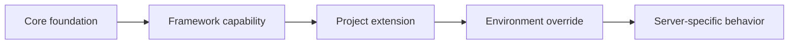

# Module Loading and Service Precedence

Module loading and service precedence explain which implementation wins when
framework and project modules provide related behavior. This topic is separate
from the business module hierarchy. A capability such as Platform, WCMS,
Commerce, or Process may be visible to business users as one capability, while
developers still need to know the exact technical module and service order
used at runtime.

The beginner rule is: the later, more specific layer may extend or override
the earlier framework layer when the module is composed into the same runtime.
That is how customer projects customize behavior without renaming the
framework capability or modifying shared framework source.

Service precedence answers which local implementation wins. It does not decide
whether a call should stay local or cross to another runtime. Use
`Module-to-Module Communication` for that local-versus-remote decision and
`API Request Lifecycle and Handler Pipeline` for incoming HTTP request
processing before a controller calls services.

## Loading order

Runtime loading starts with foundational modules, then loads functional
capabilities, then project, environment, and server-specific modules. The exact
composition is declared by the project. Service precedence follows that load
order, so a project service can replace or extend a framework service when the
contract allows it.

For the full startup timeline, including raw module discovery, active module
resolution, dotted numeric index sorting, pre-scripts, module `nodics.js`
hooks, post-scripts, initial data import, and listener startup, use
`Framework Startup Lifecycle`.



## Business and developer impact

| Reader | Why precedence matters |
| --- | --- |
| Business user | A customer can receive tailored behavior while still using the standard capability. |
| Developer | The correct customization point is the later project module, not a direct framework edit. |
| Operator | Runtime logs and loaded-module evidence explain why a specific implementation handled a request. |
| QA owner | Tests must prove both default framework behavior and project override behavior. |

## Customization and extension

Use precedence deliberately. Add a project service when the customer needs a
different decision, validation, provider, or business rule. Add configuration
when behavior already has a supported switch. Add a pipeline step when the
capability is intentionally orchestrated through business logic stages. Avoid
copying an entire framework module because one method needs customer-specific
behavior.

```js
module.exports = {
  service: 'customerPriceDecisionService',
  extends: 'defaultPriceDecisionService',
  owner: 'customer.project.pricing'
};
```

## Operator view

When production behavior differs from the default framework, operators should
be able to see which module supplied the active service. Logs, runtime module
lists, configuration source, and generated context should all point to the
same owner. That evidence matters during incidents, upgrades, and rollback.

## Reader and implementation contract

A beginner should finish this topic understanding that a customization does
not become active only because a file exists. The module must be part of the
runtime graph, and the runtime graph must load it after the framework behavior
it extends. A business user should understand that the customer can keep a
standard capability name while receiving tailored behavior. A developer should
know where the override lives, which service contract it replaces or extends,
and which generated artifacts or tests need to be updated. An operator should
know how to prove the active implementation from logs, module loading output,
configuration source, and runtime health evidence.

Document every precedence-sensitive change with the same shape: business
reason, owning capability, base implementation, project implementation,
activation configuration, server graph, rollback path, and verification
command. Without that evidence, a future maintainer cannot tell whether a
different result is expected customization or accidental drift.

## Common mistakes

- Confusing functional module hierarchy with service precedence.
- Renaming a capability because a project overrides one implementation detail.
- Adding duplicate services without knowing which one wins.
- Testing only the default service and forgetting the project override path.
- Documenting an override without explaining runtime and rollback impact.

## Verification

Verify precedence by checking the composed module order, confirming the active
service implementation, running the framework default tests, running the
project override tests, and proving the browser or API behavior uses the
expected service. The documentation must identify the owning capability, the
override path, and the rollback path.
