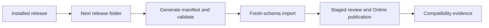

# Release and Upgrade Compatibility

Release and upgrade compatibility explains how module data folders evolve
without breaking customer projects. Before the first production baseline,
teams can keep improving `v001` release folders. After that baseline is used
by customers, every released folder becomes immutable and the next change
starts a new release folder. For beginners, a release folder is a promise: it
records the data shape that can be installed and tested again.

## Source map

| Area | Source location |
| --- | --- |
| Setup tooling module | `../nodics.foundation/modules/nSetup/package.json` |
| Documentation generated manifest | `data/manifest.json` |
| Data import release service | `../nodics.foundation/modules/nData/nImport/import/src/service/release/defaultDataReleaseService.js` |
| Import release ordering tests | `../nodics.foundation/modules/nData/nImport/import/test/importUtilityReleaseOrder.test.js` |
| Data authoring guide | `docs/pages/nodics.foundation/data-import-export-migration.md` |
| Documentation publishing runbook | `docs/pages/nodics.docs/documentation-publishing-runbook.md` |

## Folder contract

```text
data/
  init-v001/
    headers/
    records/
  core-v001/
    headers/
    records/
  sample-v001/
    commerce/
      headers/
      records/
    content/
      headers/
      records/
      assets/
  manifest.json
```

The business problem is upgrade confidence. Business users need stable setup
and sample data. Developers need a predictable place to add defaults and
customer extensions. Operators need checksum and import evidence. Production
support needs to know whether a customer installed `core-v001` or `core-v002`
before diagnosing a problem.

## Compatibility rules

| Rule | Meaning |
| --- | --- |
| Pre-production folders can change | Until customer release, teams may refine `v001`. |
| Released folders are immutable | After production release, create the next folder. |
| Manifest is generated | Developers edit headers, records, and assets, then regenerate. |
| Headers own routing | Module, schema, operation, and query stay in header files. |
| Records are declarative | No business logic, runtime paths, secrets, or service calls. |
| Assets stay with data | Media source files live under the release-owned assets folder. |

## Configuration behavior

Release configuration should describe active modules, target runtimes, import
lanes, and provider settings, but it should not replace the release folder.
The folder owns versioned data, the generated manifest owns checksums, and
runtime configuration selects where that data is installed and published.

## Upgrade flow



## Customization and extension guidance

Developers can extend a released module by creating a customer project data
folder with a later release code or by adding a project-owned module that
depends on the framework module. Do not patch old released framework data in a
customer project unless the repair is documented and repeatable. AI tools
should read the manifest, existing headers, and target schemas before adding
records.

## Implementation handoff

Every release handoff should name the changed folders, generated manifest,
target runtimes, import order, publication dependency, rollback option, and
browser evidence. Business users get a clear upgrade journey, developers get
source traceability, operators get production recovery instructions, and QA
owners get clean-install plus upgrade scenarios. This prevents a data release
from becoming tribal knowledge.

## Common mistakes

- Editing an already released data folder and losing reproducibility.
- Creating `release.js` files for values that can be derived from folder names.
- Hand maintaining generated manifest checksums.
- Putting provider-specific paths inside shared data records.
- Forgetting fresh-schema import tests before upgrade rollout.

## Verification

Regenerate manifests, run import ordering tests, import every changed release
into a fresh schema, publish where needed, and verify Axis, Nexus, or Agora in
the browser. Production acceptance requires business release notes, developer
source evidence, operator rollback instructions, and QA proof for both clean
install and upgrade paths.
