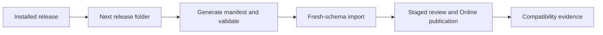

# Release and Upgrade Compatibility

Release and upgrade compatibility explains how module data folders evolve
without breaking customer projects. Before the first production baseline,
teams can keep improving `v001` release folders. After that baseline is used
by customers, every released folder becomes immutable and the next change
starts a new release folder. For beginners, a release folder is a promise: it
records the data shape that can be installed and tested again.

## Source map

| Area | Source location |
| --- | --- |
| Setup tooling module | `../nodics.foundation/modules/nSetup/package.json` |
| Documentation generated manifest | `data/manifest.json` |
| Data import release service | `../nodics.foundation/modules/nData/nImport/import/src/service/release/defaultDataReleaseService.js` |
| Import release ordering tests | `../nodics.foundation/modules/nData/nImport/import/test/importUtilityReleaseOrder.test.js` |
| Data authoring guide | `docs/pages/nodics.foundation/data-import-export-migration.md` |
| Documentation publishing runbook | `docs/pages/nodics.docs/documentation-publishing-runbook.md` |

## Folder contract

```text
data/
  init-v001/
    headers/
    records/
  core-v001/
    headers/
    records/
  sample-v001/
    commerce/
      headers/
      records/
    content/
      headers/
      records/
      assets/
  manifest.json
```

The business problem is upgrade confidence. Business users need stable setup
and sample data. Developers need a predictable place to add defaults and
customer extensions. Operators need checksum and import evidence. Production
support needs to know whether a customer installed `core-v001` or `core-v002`
before diagnosing a problem.

## Compatibility rules

| Rule | Meaning |
| --- | --- |
| Pre-production folders can change | Until customer release, teams may refine `v001`. |
| Released folders are immutable | After production release, create the next folder. |
| Manifest is generated | Developers edit headers, records, and assets, then regenerate. |
| Headers own routing | Module, schema, operation, and query stay in header files. |
| Records are declarative | No business logic, runtime paths, secrets, or service calls. |
| Assets stay with data | Media source files live under the release-owned assets folder. |

## Configuration behavior

Release configuration should describe active modules, target runtimes, import
lanes, and provider settings, but it should not replace the release folder.
The folder owns versioned data, the generated manifest owns checksums, and
runtime configuration selects where that data is installed and published.

## Upgrade flow



## Customization and extension guidance

Developers can extend a released module by creating a customer project data
folder with a later release code or by adding a project-owned module that
depends on the framework module. Do not patch old released framework data in a
customer project unless the repair is documented and repeatable. AI tools
should read the manifest, existing headers, and target schemas before adding
records.

## Implementation handoff

Every release handoff should name the changed folders, generated manifest,
target runtimes, import order, publication dependency, rollback option, and
browser evidence. Business users get a clear upgrade journey, developers get
source traceability, operators get production recovery instructions, and QA
owners get clean-install plus upgrade scenarios. This prevents a data release
from becoming tribal knowledge.

## Common mistakes

- Editing an already released data folder and losing reproducibility.
- Creating `release.js` files for values that can be derived from folder names.
- Hand maintaining generated manifest checksums.
- Putting provider-specific paths inside shared data records.
- Forgetting fresh-schema import tests before upgrade rollout.

## Verification

Regenerate manifests, run import ordering tests, import every changed release
into a fresh schema, publish where needed, and verify Axis, Nexus, or Agora in
the browser. Production acceptance requires business release notes, developer
source evidence, operator rollback instructions, and QA proof for both clean
install and upgrade paths.

## Code and contract compatibility

Compatibility also covers partner code and running clients. Before changing an
extension point, identify its consumers and write an old/new example. Validate
the framework default and the actual partner override after regeneration and
restart. A later file replaces matching methods; it does not replace every
method of the service or acquire ownership of the capability.

| Contract surface | Required compatibility evidence |
| --- | --- |
| Exported methods | Parameters, results, awaited completion, errors and side effects remain usable by inherited and overriding methods. |
| Configuration | Owner, default, scope, merge behavior, disabled values, binding resolution and restart/refresh semantics are explicit. |
| Schemas and APIs | Stable identity, validation, permissions, tenant isolation, response envelopes and supported operations match every migrated client. |
| Events | Existing consumers understand payloads, delivery/retry behavior, deduplication and ordering limits. |
| Cache/database providers | Isolation, serialization, expiry, atomic mutation, failure and cleanup match the owner contract. |
| Persisted records | A governed migration covers existing values, replay, partial failure, audit and irreversible effects. |

Do not infer compatibility from an unchanged method name or a new package
version. A new optional field can still break a strict consumer. A changed
permission can still remove an employee workflow. Removing a route requires
migrating all known clients and rejecting the obsolete path explicitly.

The current unreleased MongoDB `schemaProperties` conversion requires replacing
arrays with keyed booleans. Arrays reject instead of silently dropping validation.
For example, migrate `['enum', 'minimum']` to
`{ enum: true, minimum: true }`; a later `{ minimum: false }` disables only that
key. This does not change ordinary `properties.js` arrays, which merge by index,
or the separately governed data-record array replacement contract.

Source data keys remain stable within their owning dataset. A partner can
change a field under an existing exported record key without restating its code.
Changing the business code is a data migration decision, not a rename instruction
inferred from source merging. Released manifests/checksums remain immutable;
execute any upgrade through the existing import receipts and replay rules.

## Security boundaries under customization

A custom implementation must preserve authorization, tenant and enterprise
isolation, domain validation, API contracts, required confirmation, idempotency
and audit. Project JavaScript is trusted deployment code: Nodics extension seams
do not make malicious overrides impossible. Qualification must exercise the
effective override with forbidden identities, wrong tenant/module/instance,
invalid data, duplicate requests, interrupted work and unavailable providers.

For a cache change, retain atomic version allocation and fail-closed authentication
state. For a Workflow change, refuse new work after deactivation while following
the owning recovery contract for admitted work. For an Axis form change, retain
backend permissions and validation even when the browser hides a control.

## Explaining an effective runtime

Use the selected server's existing governance report and its runtime coordinates.
The report now reads `xNodics.overrideTrace` from the actual loaded artifacts.
Generated baseline contributions precede authored layers; `memberOrigins` shows
which contributor supplied each inherited or replaced method. The first source
path is not necessarily the capability owner; retain the schema/module metadata
as ownership authority. Nested property origins are not inferred from a
whole-file winner.

For configuration, follow indexed property contributions, external files and
tenant overlays and inspect only the affected effective key in a trusted context.
Never publish a raw configuration dump. A source/configuration edit follows its
own build/restart path. A governed runtime schema/router/class change uses
nDynamo preview, approval/activation, revision checks and audit. Provider selection
and remote routing remain with the existing cache/database/router owners.

A useful incident record names the runtime, capability owner, effective method
or key, contributing layers, selected provider/remote authority, change mechanism
and stable failure code. It contains no token, API key, password or function body.
