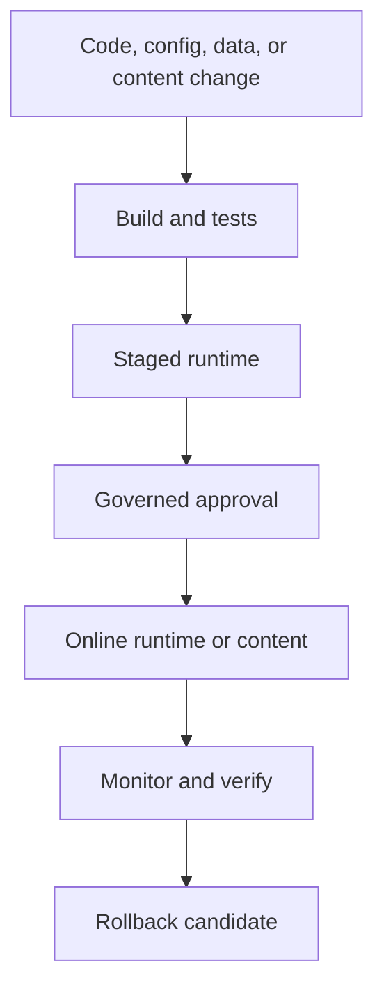

# Runtime Release and Rollback

Runtime Release and Rollback explains how Nodics changes should move through
local, staged, online, and future production environments without surprising
business users. It covers configuration, generated data, publication state, and
rollback evidence.

## Release flow

| Release item | Rollback question |
| --- | --- |
| Code | Which commit, package, or module version restores behavior? |
| Configuration | Which previous value is valid and who can activate it? |
| Content | Which Online version remains active if approval is rejected? |
| Data import | Which run, checksum, and target environment can be audited? |

## Business perspective

Business users should know whether a release changes customer-visible content,
checkout behavior, operational queues, automation, or internal Axis pages. A
release is not complete until there is browser evidence for the affected
journey and a clear rollback story if the change damages revenue or operations.

## Developer perspective

Developers should connect implementation change to generated contracts,
module metadata, tests, and deployment artifacts. If a change introduces a new
schema, service, route, event, pipeline, or content pack, it must document how
it is validated and what happens to existing data during rollback.

## Operator perspective

Operators need release identity, health status, logs, import runs, publication
receipts, task approvals, and monitoring signals. If a rollback is not yet
automated, the documentation must still describe the manual decision and the
evidence required before executing it.

## Operational evidence

Release documentation should capture the evidence that proves a change can be trusted. Include commit or package version, generated contract result, schema migration status, data import status, approval task, Online activation, affected routes, browser result, monitoring result, and rollback candidate. For content releases, include the previous Online version that remains active until approval. For runtime releases, include the configuration or deployment value that restores the previous behavior.

## Reader and implementation contract

A beginner should understand that release and rollback apply to content, data, configuration, generated contracts, and code. A business user should know what customer or operator journey changes and when the change becomes visible. A developer should document version, checksum, migration, import run, schema impact, and validation evidence. An operator should know how to confirm the active version and what action restores the previous state.

This page must be updated when a new release mechanism or rollback boundary is introduced. If the rollback is manual, the documentation should say so honestly and list the exact evidence needed before an administrator acts.

## Documentation maintenance rule

Keep this topic current whenever implementation, configuration, Axis workflow, publication behavior, or customer-facing rendering changes. The page should remain small enough to scan, but it must still carry enough business context, technical ownership, customization guidance, visual structure, operational evidence, and verification detail for a reader to act without guessing. When the detail becomes too large, create a sibling topic and link it from this page instead of turning the overview back into a long mixed article.

This extension guidance must stay linked to the owning project or capability page whenever a customer customizes the behavior.

## Common mistakes

- Publishing content without a rollback candidate.
- Changing runtime configuration without audit and approval.
- Treating generated schema differences as harmless.
- Missing browser verification for the journey that business users care about.

## Verification

Verify release and rollback by recording build result, generated contract
status, import or migration evidence, approval outcome, browser result, health
signals, and rollback instructions. A beginner should know what changed; an
operator should know how to recover.
