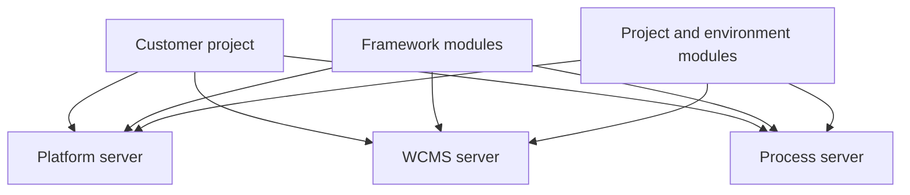

# Runtime Server Composition

Runtime server composition explains how Nodics turns framework modules and
project modules into running services. A beginner often looks at repository
folders and assumes that every available module is active. That is not the
Nodics model. Repository code only makes a capability available. Runtime
composition decides which capabilities load into a specific server, in which
order, and with which project or environment customizations.

For business users, this matters because the same framework can support a
small local evaluation and a larger enterprise deployment without changing the
capability ownership model. For developers and operators, it explains where a
change belongs and which server must load it before the behavior exists.

## Runtime model

Platform, WCMS, Process, and other servers are composition targets. Platform
usually handles employee identity, profile, BackOffice metadata, module
registry, and API discovery. WCMS handles sites, catalogs, pages, components,
routes, media, and documentation delivery. Process handles workflow, human
tasks, scheduled automation, and cron-related runtime behavior. A customer
project decides which modules extend each server for a given environment.

## Composition decisions

| Decision | Business impact | Technical impact |
| --- | --- | --- |
| Load Platform | Axis login, registry, profile, and administration are available. | Platform modules and project platform extensions must load. |
| Load WCMS | Public content, documentation, media, and site routes can be delivered. | WCMS schemas, services, routes, and content packs must load. |
| Load Process | Approval tasks, workflows, and scheduled automation can run. | Process and cron modules must load with task persistence and worker settings. |
| Add project extension | Customer behavior appears without forking framework source. | Later-loaded modules override or extend framework services. |

## Customization and extension

A project should customize composition through project-owned configuration and
modules. If a capability is not needed, it should not be forced into the
runtime only because its code exists in the framework. If a capability is
needed by a public application, it must be registered and loaded before related
content data is imported. Agora commerce data, for example, should not be
treated as complete unless the commerce capabilities it depends on are active.

## Operator view

Operators should verify composition by checking server status, loaded module
lists, logs, generated routes, module registry state, and health endpoints.
When a server fails, the question is not only "which process stopped?" It is
"which composed capability was responsible for the failed route, import, job,
or publication state?"

## Common mistakes

- Assuming every module in the framework checkout is active in every server.
- Importing data for a capability before the capability is registered and
  loaded.
- Treating local topology as the only production topology.
- Hiding customer-specific runtime decisions in unsourced environment files.
- Editing a framework module when a project extension should own the change.

## Verification

Verify composition from a fresh schema by starting the topology, checking the
loaded modules for each server, opening Axis Module Registry, importing only
data packs whose capabilities are active, and confirming that public apps show
Online content only after the relevant WCMS publication path succeeds.
