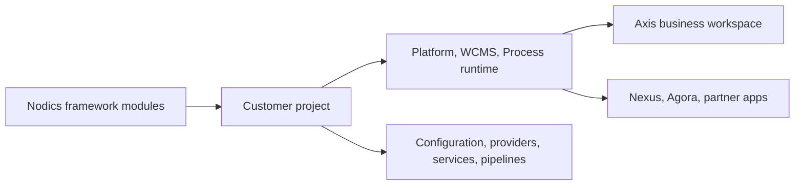

# What is Nodics?

Nodics is a modular enterprise application framework for building governed
business platforms without forcing every project to reinvent authentication,
content management, APIs, configuration, data import, publishing, workflow,
scheduled jobs, media, documentation, and operational contracts. It is not a
single finished storefront or one fixed business product. It is the framework
foundation that customer projects, internal tools, public sites, accelerators,
and solution use cases can build on.

For a beginner, the easiest mental model is this: Nodics gives the reusable
enterprise machinery, while the customer project supplies the business-specific
rules, content, branding, integrations, and runtime decisions. Axis is the
authenticated business workspace. Nexus and Agora are public-facing
applications that consume approved Online content and APIs. Backend modules
remain the authority for data, permissions, workflows, routes, and publication.

## Business definition

Nodics helps teams move faster without giving up enterprise governance. A
business can start with a reference project, initialize the required data,
publish public content, then customize behavior through Axis, configuration,
provider adapters, services, pipelines, and project modules. The value is not
only speed. The value is speed with a path to operate, secure, explain,
extend, test, and upgrade the platform.

| Business question | Nodics answer |
| --- | --- |
| What is being adopted? | A modular framework for enterprise application delivery. |
| Who uses it? | Business users, administrators, developers, operators, QA owners, partners, and AI-assisted delivery tools. |
| What does it reduce? | Repeated architecture work, customer forks, hidden configuration, unclear ownership, and fragile runtime changes. |
| What does it enable? | Faster setup, governed customization, publishable content, reusable capability modules, and clearer production support. |

## Technical definition

Technically, Nodics is a layered runtime. Framework modules live in
`nodics.ai`. Customer projects such as Kickoff declare which framework modules
and project modules load into Platform, WCMS, Process, and other runtime
servers. Axis renders authorized capabilities from backend contracts. CMS
content, documentation, storefront pages, media, routes, and publication state
come from backend-owned content packs and catalogs.

## What teams can build

Teams can build employee BackOffice applications, public corporate sites,
CMS-driven storefronts, commerce accelerators, process automation, scheduled
jobs, integrations, documentation portals, data engineering solutions, and
customer-specific project layers. The framework gives common contracts; the
project decides which business journey is needed.

Nodics is also meant to work well with AI-assisted development. AI can help
move quickly, but the framework keeps ownership explicit so generated changes
do not scatter behavior across the wrong modules.

## Where to continue

Use the sibling pages in this group as the first reader path. Read **Why Nodics
Exists** for the business problem and industry context. Read **How Nodics
Works** for runtime, module, Axis, Nexus, Agora, and backend ownership. Read
**Adoption and First Journey** for the first setup and verification path.

## Common mistakes

- Treating Nodics as one application instead of a framework used by many
  applications and solution use cases.
- Assuming Axis owns backend records because administrators use Axis screens.
- Expecting Nexus or Agora to show Staged content before Online publication.
- Customizing framework source before checking project-layer extension paths.
- Reading only technical modules before understanding the business journey.

## Verification

This introduction is correct when a new business user can explain what Nodics
is, a developer can identify framework versus project ownership, and an
operator can explain why public apps only render approved Online content. The
local proof is to start the reference workspace, initialize Axis, register
required capabilities, import content packs, approve publication where needed,
and verify Axis, Nexus, and Agora from the browser.
