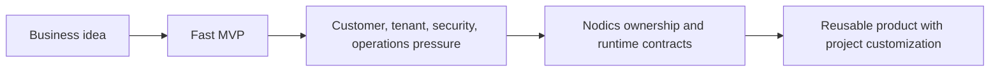

# Why Nodics Exists

Nodics exists because most enterprise software teams are asked to move fast and
stay governed at the same time. That sounds simple in planning meetings, but it
becomes difficult when a product starts serving more than one customer, tenant,
brand, region, channel, or operational team. A beginner usually sees the first
working screen. A business sponsor sees the market opportunity. A developer
sees the code that must survive the second and third wave of requirements. An
operator sees the production system that must be explainable when something
changes at runtime.

The framework was created to keep those viewpoints connected. It gives a
project named capability owners, runtime composition, configuration layering,
content publication, import/export discipline, extension points, and
documentation contracts so teams can build quickly without losing the path to
scale.

## Business problem

Many teams can now create a first product experience very quickly, especially
with AI-assisted development. The difficult part is what happens after the
first demo. Customers ask for custom rules. Security asks for permission
boundaries. Operations asks how to rebuild an environment. QA asks what must be
tested. Business users ask where they can update content, configuration, or
workflow without waiting for a full engineering release.

Nodics treats those questions as product requirements, not afterthoughts. A
business can use the framework to reduce the gap between first delivery and
enterprise readiness.

| Enterprise pressure | Common failure | Nodics response |
| --- | --- | --- |
| Faster go to market | One application grows without clear ownership. | Functional capabilities own APIs, schemas, data, documentation, and runtime behavior. |
| Customer customization | Teams fork framework code for every customer. | Project modules extend or override behavior after framework modules load. |
| Runtime change | Operators edit node-local settings manually. | Governed configuration and events propagate changes across running nodes. |
| Public content | Draft and Online content become mixed. | Staged, approval, Online, access policy, and audit remain explicit. |
| Supportability | New developers cannot tell where behavior lives. | Documentation and source maps explain business names and technical owners. |

## From fast MVP to durable platform

A fast MVP is useful because it proves demand. It becomes expensive when the
implementation has no stable model for ownership, extension, permissions,
data, media, imports, workflow, and runtime operation. The team then pays again
to restructure the product while customers are already using it.

Nodics tries to avoid that rewrite. The same business idea can start quickly,
but it is placed inside a framework that already expects multiple servers,
publishable content, reusable modules, generated contracts, and project-layer
customization. This lets developers and AI tools build inside guardrails
instead of creating hidden behavior wherever the first screen happened to work.

## Why a business should care

For a business reader, the value is not only that Nodics can produce APIs or
screens. The value is that the product can continue changing after the first
release. Teams can add a new site, publish new content, register another
capability, switch a provider, add a project-layer service, or prepare a new
accelerator without making the original framework unrecognizable.

That matters for revenue because delivery speed is only useful when the
platform can keep accepting change. A company can start a customer project,
show the working journey, publish content, and then add business-specific
rules without turning every customer into a private fork. It also matters for
cost because support, upgrade, security, and onboarding become easier when the
system can explain its own owners and lifecycle.

## What this means for developers

A developer should treat every change as an ownership question. If the change
is a reusable framework capability, it belongs in the owning framework module.
If it is customer-specific, it belongs in the customer project or a later
extension module. If it changes content, navigation, or public visibility, it
belongs in the content catalog and publication workflow. If it changes runtime
behavior, it needs configuration, validation, event propagation, tests, and
operator guidance.

This is why Nodics documentation must stay detailed. The page should tell a
developer which capability owns the behavior, how the project can extend it,
which configuration keys or data records are involved, and how to verify the
change from a fresh schema.

## Operator and governance impact

Operators need to know whether a change requires restart, publication,
approval, cache invalidation, event propagation, or rollback. Nodics exists to
make those decisions visible. Runtime servers load declared modules, generated
contracts expose API boundaries, data packs carry versioned checksums, and
publication state separates Staged work from Online delivery.

For production and support teams, this is the difference between "the screen
changed somehow" and "this approved content pack version became Online for
this site, catalog, route, and access policy."

## Common mistakes

- Treating Nodics as only a folder structure instead of an ownership and
  runtime model.
- Building a customer-specific behavior directly inside reusable framework
  source before checking project-layer extension points.
- Letting Axis or a storefront become the authority for backend state because
  users see the screen there.
- Shipping a fast MVP without documenting the business problem, extension path,
  configuration behavior, and production verification.
- Assuming beginners only need technical files; business and operator context
  must be visible from the first documentation pages.

## Verification

This page is useful when a new business reader can explain why Nodics exists
without knowing the source tree, and when a developer can connect that story to
module ownership, project-layer customization, content publication, and runtime
operation. The minimum verification is to run the reference workspace, open
Axis, inspect Module Registry, import or publish governed data, and confirm
that Nexus or Agora only render Online content after approval.
