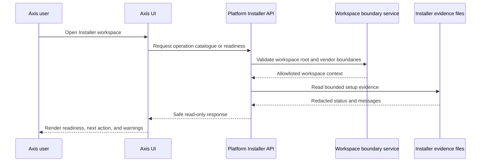

# Installed Runtime Installer and Application Builder APIs

The installed-runtime Installer capability explains how a generated Nodics workspace can expose safe, read-only setup and Application Builder information to Axis. This is separate from the standalone `nodics.installer` package, which remains the first-machine bootstrap path before a user has the framework locally. Beginners should use this page to understand the difference between creating a workspace and inspecting a workspace that already exists.

## Business perspective

Enterprise teams need a guided way to understand whether a local or customer workspace is ready before they ask developers or operators to repair it. The installed-runtime capability gives Axis and administrators a backend-owned view of installer information, operation catalogue, workspace status, workspace inventory, preflight readiness, setup-plan preview, and redacted evidence. That reduces confusion because the business user can see readiness and next action guidance without receiving raw machine paths, secrets, stack traces, or unsupported commands.

| Question | Business answer | Technical owner |
| --- | --- | --- |
| How do we create the first workspace? | Use the standalone installer bootstrap package | `nodics.installer` repository |
| How do we inspect an installed workspace from Axis? | Use secured read-only runtime APIs | Platform Installer module |
| Can Axis start or repair the machine? | Not through this read-only capability | Mutating operations require a separate governed contract |
| Where does setup evidence come from? | From allowlisted workspace evidence and marker files | Platform Installer services |

The result is a safer operator experience. A support engineer can ask for a workspace status check, an implementation partner can preview the generated project names and selected accelerator, and an administrator can confirm whether the backend sees expected repositories and runtime markers. None of those actions should change files or execute mutating shell commands.

## Runtime flow

## Technical perspective

The installed-runtime backend capability lives under the Platform Installer module. It owns API contracts, operation-state validation, permissions, workspace allowlist behavior, redaction, controller/facade/service boundaries, and BackOffice capability metadata for Axis discovery. The standalone installer owns npm or GitHub bootstrap behavior, local command execution before the framework exists, release tags, setup evidence writing, backups, rollback, and support-bundle creation.

Current read-only API routes include installer info, operation catalogue, workspace status, workspace inventory, workspace preflight, setup-plan preview, and evidence read. POST is used for workspace-sensitive read-only checks because the request body can carry bounded workspace identity without placing local paths into query strings. Every route requires explicit permission and returns a structured response envelope with status, operation code, correlation/request identity where available, sanitized messages, and no raw secret values.

## Configuration and customization

Project teams may configure allowed workspace roots and selected installer visibility through backend configuration. They must not make `nodics.project.json` the Application Builder authority, create a new `nodics.solution.json` descriptor, or place customer customizations inside vendor-owned framework/frontend repositories. A project-layer extension may add a new workspace check, but it must preserve the same principles: explicit permission, no secret exposure, allowlisted path access, deterministic response shape, and no mutation from a read-only operation.

| Extension need | Correct approach | Required validation |
| --- | --- | --- |
| Add a readiness signal | Add a backend service method and response contract | Permission, no-mutation, redaction, bounded payload |
| Add an Axis card | Register BackOffice capability metadata and renderer contract | Axis discovery, role filtering, empty/error states |
| Add mutating maintenance | Define a governed mutating-operation contract first | Idempotency, audit, dry-run, rollback, evidence |
| Change bootstrap package identity | Treat as release-impacting installer work | Explicit approval, docs update, npm/GitHub checks |

## Access and publication

Documentation for this capability belongs under Nodics Installer and Workspace Setup, with related links to Application Builder and Workspace Generation, Axis and BackOffice Operations, Operations Monitoring and Recovery, and Security Governance and Compliance. Public pages can describe the model. Operator-only details should be authenticated or permission gated through Axis. When published, the documentation records must include page metadata, navigation nodes, dashboard summaries, search metadata, access policies, and publication state.

## Common mistakes

- Mixing the standalone bootstrap package with installed-runtime APIs. They solve different parts of the journey.
- Letting Axis read local files directly. Axis must call backend APIs and render bounded responses only.
- Exposing command strings, raw stack traces, home paths, bearer tokens, passwords, API keys, or local credential values in evidence.
- Treating read-only readiness checks as permission-free because they do not mutate. Workspace identity and evidence still need authorization.
- Adding a mutating operation without idempotency, audit, dry-run preview, workspace allowlist, and rollback rules.

## Verification

Verify the implementation by running the Installer module contract tests, Platform tests, module metadata validation, and structure audit for the installer module. Verify the documentation by running `npm run docs:check` and `npm run validate` in `nodics.docs`, then confirm the generated data includes both legacy CMS page/component/route records and first-class documentation product, navigation, node, dashboard, page metadata, access policy, publication state, and search metadata records.
