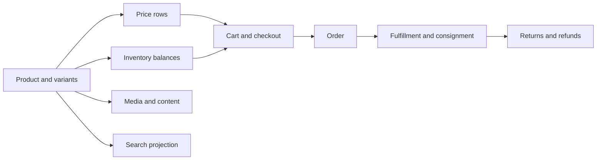

# Commerce Data Authoring and Fulfillment

Commerce data authoring covers the records that make a product visible,
sellable, priced, searchable, ordered, shipped, returned, and refunded. A
business user may create the same information through Axis workbenches, while
a developer or AI tool may create it through module or project release data.
Both paths must land in the owning Commerce schemas and services. Agora
Apparel is the clearest current project example because it combines product,
price, inventory, content, media, and storefront validation.

## Source map

| Capability | Source location |
| --- | --- |
| Product model | `../nodics.commerce/modules/baseCommerce/modules/product/` |
| Pricing and promotions | `../nodics.commerce/modules/baseCommerce/modules/pricing/`, `../nodics.commerce/modules/baseCommerce/modules/promotion/` |
| Inventory and warehouses | `../nodics.commerce/modules/baseCommerce/modules/inventory/` |
| Cart and checkout | `../nodics.commerce/modules/checkout/` |
| Order management | `../nodics.commerce/modules/baseCommerce/modules/order/` |
| Fulfillment | `../nodics.commerce/modules/fulfillment/` |
| Commerce search | `../nodics.commerce/modules/baseCommerce/modules/commerceSearch/` |
| Agora Apparel release data | `../../nodics.kickoff/modules/agora.apparel/data/sample-v001/commerce/` |
| Agora product how-to | `docs/pages/accelerators/agora-apparel-product-data-authoring.md` |

## Data bundle



Beginners should not think of a product as one row. A useful commerce product
usually needs category membership, localization, variants, price, tax context,
inventory availability, media, and search projection. Business value appears
only when those records work together. Developers should author stable codes
and relation keys. Operators should verify import counts, publication state,
search freshness, checkout availability, fulfillment execution, and exception
handling before production use.

## Authoring sequence

1. Create product and category records.
2. Add localized product names, descriptions, slugs, and SEO values.
3. Add variants or sellable SKUs with stable codes.
4. Add price rows and currency context.
5. Add inventory balances for the warehouse or stock location.
6. Add media references and content components when the storefront needs
   product imagery or landing content.
7. Add search rules or projection data when discovery behavior must be
   controlled.
8. Import the release into a fresh schema.
9. Publish required content and commerce projections.
10. Validate Agora, checkout, order placement, fulfillment, and return flows.

## Header and record contract

```js
module.exports = {
  product: {
    products: {
      options: {
        enabled: true,
        schemaName: 'product',
        operation: 'saveAll',
        dataFilePrefix: 'agoraApparelProductData'
      },
      query: { code: '$code', tenant: '$tenant' }
    }
  }
};
```

Headers define target module, schema, operation, and idempotent query. Records
define business data. They should not calculate availability, call pricing
services, assign fulfillment status from code, or write publication results.
The runtime services own validation and lifecycle transitions.

## Fulfillment flow

Fulfillment begins after order placement. The order identifies entries,
quantities, delivery mode, payment state, and warehouse assignment. Fulfillment
creates consignments or equivalent execution records, tracks picking and
shipment state, raises exceptions when stock or carrier information is missing,
and records evidence for operators. Returns and refunds depend on the original
order, delivered quantity, receipt state, and payment reconciliation.

| Step | Business view | Developer contract | Operator evidence |
| --- | --- | --- | --- |
| Product imported | Product exists. | Product and variant schemas validate. | Import run counts and no relation failures. |
| Price active | Customer can see a price. | Price row matches product, market, currency. | Pricing lookup result. |
| Stock active | Customer can buy. | Inventory balance maps to SKU and warehouse. | Available quantity calculation. |
| Order placed | Customer has an order. | Checkout creates order records. | Order id, payment state, totals. |
| Fulfillment started | Order is being prepared. | Fulfillment service creates execution records. | Consignment, carrier, exception state. |

## Customization and extension guidance

Developers can add product attributes, price strategies, inventory providers,
search ranking rules, fulfillment adapters, return policies, and refund
integration points. Keep the extension in the owning module and add tests
around schema validation, service behavior, and storefront result. Business
users should see these extensions as controlled fields, actions, dashboards,
and recovery messages in Axis, not as data-file business logic.

## Common mistakes

- Creating products without price or inventory and expecting checkout to work.
- Treating storefront display content as Commerce authority.
- Adding fulfillment records before the order lifecycle creates execution
  evidence.
- Forgetting search projection after product import.
- Using generated database ids instead of stable business codes in release
  data.

## Verification

Run Commerce product, pricing, inventory, checkout, order, fulfillment, and
return tests for the touched areas. Import Agora Apparel data into a fresh
schema, publish content and commerce projections, open the storefront in the
browser, search for the product, add it to cart, place a controlled order, and
confirm fulfillment evidence. Production readiness requires business-visible
status, developer traceability, operator recovery steps, and QA browser proof.
