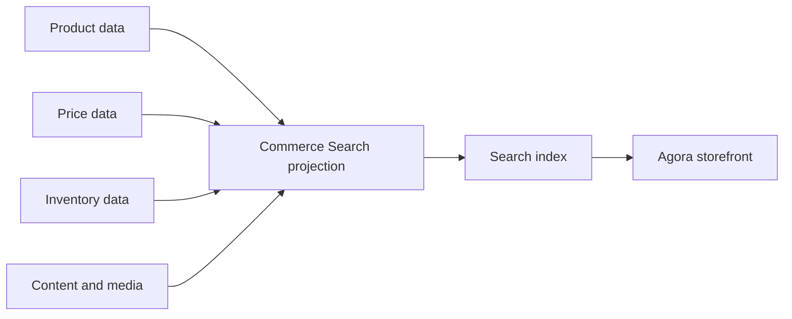

# Commerce Search Guide

Commerce Search turns product, category, price, inventory, and merchandising
signals into searchable storefront projections. The search index is not the
source of truth. Product, price, inventory, CMS, and Media modules own their
records; Commerce Search owns projection rules, ranking behavior, and query
readiness. For beginners, search is the fast customer-facing view that must be
rebuilt whenever the authoritative data changes.

## Source map

| Area | Source location |
| --- | --- |
| Commerce Search group | `../nodics.commerce/modules/baseCommerce/modules/commerceSearch/package.json` |
| Commerce Search core | `../nodics.commerce/modules/baseCommerce/modules/commerceSearch/modules/commerceSearchCore/package.json` |
| Product catalogue | `../nodics.commerce/modules/baseCommerce/modules/product/package.json` |
| Discovery docs | `docs/pages/nodics.discovery/search-indexing-discovery.md` |
| Agora search data | `../../nodics.kickoff/modules/agora.apparel/data/sample-v001/commerce/headers/commerceSearch/` |

## Projection flow



The business problem is findability. A product that exists but cannot be
found is not commercially ready. Business users need ranking, filtering, and
availability to match merchandising intent. Developers need deterministic
projection rules. Operators need freshness, index health, and rebuild evidence
before production acceptance.

## Ranking and rules

Search rules can express boosts, pins, exclusions, locale behavior, market
scope, and merchandising priority. These rules should be data-driven and
tested, but they should not replace product authority. If a product is
inactive, unpublished, out of market, or not approved, search should not make
it appear available.

```js
module.exports = {
  apparelBoosts: {
    code: 'apparelBoosts',
    storeCode: 'agoraApparel',
    locale: 'en',
    scopeType: 'category',
    priority: 100,
    boost: 2
  }
};
```

## Customization and extension guidance

Developers can customize analyzers, projection services, ranking rules,
facets, index providers, and rebuild jobs. Business users should manage
merchandising rules through Axis when available. Operators should have rebuild
actions, last projection time, failed item counts, and safe retry behavior.
AI tools must inspect product, price, inventory, and search data together
before adding records.

## Implementation handoff

Each search change should name the source schemas, projection service, index
provider, ranking rules, rebuild trigger, and browser search scenario. This
gives business users a merchandising journey, developers a controlled
extension point, operators production freshness evidence, and QA owners a
repeatable way to prove that imported products become discoverable only when
their authoritative records allow it.

## Evidence checklist

The release package should show which products entered the projection, which
ones were skipped, and why. The index run should record tenant, catalog
version, locale, market, source checksum, item count, failure count, and last
successful completion. In production, operators should be able to compare the
search document with the product record, price row, inventory balance, and
published media reference before deciding whether to rebuild or repair data.

## Common mistakes

- Treating search documents as product authority.
- Forgetting to rebuild projections after import or publication.
- Showing inactive products because index filters are incomplete.
- Adding ranking rules without locale or market scope.
- Hiding indexing failures from operators.

## Verification

Import product, price, inventory, media, and commerce search data into a fresh
schema. Run projection jobs, inspect indexed fields, open Agora in the browser,
search for the product, and verify filters, ranking, price, image, and
availability. Production readiness requires business-approved merchandising,
developer test coverage, operator rebuild evidence, and QA storefront proof.
