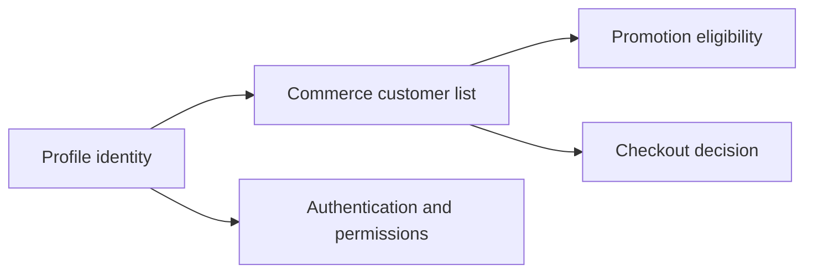

# Customer List and Profile Commerce Boundary

Customer List is a Commerce capability for grouping customers in commercial
contexts such as eligibility, promotions, account buying, or targeted
operations. Profile remains the authority for person, address, authentication,
permission, and organization identity. For beginners, Profile answers "who is
this customer?" and Customer List answers "which commercial group is this
customer part of for this commerce operation?"

## Source map

| Area | Source location |
| --- | --- |
| Customer List module | `../nodics.commerce/modules/checkout/modules/customerList/package.json` |
| Checkout module | `../nodics.commerce/modules/checkout/package.json` |
| Profile module | `../nodics.platform/modules/profile/package.json` |
| Security docs | `docs/pages/nodics.platform/security-identity-access.md` |
| Commerce operations | `docs/pages/nodics.commerce/cart-order.md` |

## Ownership model



The business problem is targeted commerce without identity duplication.
Business users need groups like VIP customers, wholesale buyers, or launch
audiences. Developers need a boundary that prevents Commerce from becoming a
parallel identity system. Operators need to trace eligibility decisions in
production without exposing personal data unnecessarily.

## Contract

Customer List records should reference stable profile or organization codes,
list codes, lifecycle state, source reason, and validity dates where needed.
They should not copy passwords, credentials, full identity payloads, or
permission ownership.

```js
module.exports = {
  vipCustomerMembership: {
    code: 'vipCustomerMembership',
    listCode: 'vipCustomers',
    customerCode: 'customer001',
    active: true
  }
};
```

## Customization and extension guidance

Developers can add eligibility services, import mappers, segmentation rules,
promotion integrations, and audit views. Business users should manage lists
through Axis when available. AI tools should inspect Profile and Commerce
schemas before adding references. Operators should verify that commercial
grouping works without broad identity export.

## Implementation handoff

Each customer-list customization should name the Profile reference key,
Commerce list schema, eligibility service, promotion or checkout consumer,
permission rule, retention rule, and audit evidence. Business users then
understand the journey, developers preserve the identity boundary, operators
can investigate production eligibility, and QA owners can prove that removing
a customer from a list changes commerce behavior without corrupting Profile.

## Evidence checklist

Membership evidence should include list code, referenced customer or
organization code, source reason, actor, validity window, lifecycle state, and
last eligibility decision. Do not expose more Profile detail than the business
journey requires. Operators should be able to prove why a customer received or
did not receive a commercial treatment, while developers keep identity,
authentication, address, and permission fields under Profile authority.

This evidence also protects production support from over-collecting identity
data. The support answer should be about eligibility and commerce treatment,
not a full customer profile export.

Production support should also prove expiry and removal. When a customer loses
membership, the next checkout or promotion decision must respect that change
without deleting the underlying Profile record.

## Common mistakes

- Copying Profile authority into Commerce records.
- Using email address as the only customer list key.
- Applying promotions without list lifecycle checks.
- Exposing list membership without permission checks.
- Forgetting removal, expiry, and audit behavior.

## Verification

Import profile and customer list data into a fresh schema. Validate list
membership, checkout eligibility, promotion behavior, removal behavior, and
permission-filtered Axis visibility. Production readiness requires business
approval, developer boundary tests, operator audit evidence, and QA proof that
Profile remains the identity authority.
