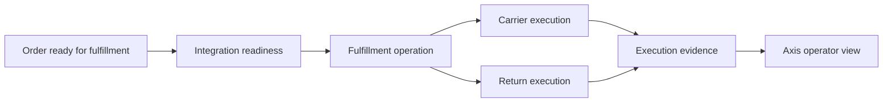

# Fulfillment Core Source Map

Fulfillment Core owns shipping, carrier execution, return execution,
integration readiness, and customer-safe fulfillment actions. The broader
Fulfillment page explains the business journey; this source map shows
developers, operators, QA owners, and AI tools where the implementation lives.
For beginners, this is the place where an order becomes work that can be
picked, shipped, returned, or blocked with clear evidence.

## Business problem

The business problem is trustworthy order execution. After checkout, the
business must prove which carrier was selected, whether integration was ready,
whether a shipment failed, and whether a return can be accepted. Fulfillment
Core keeps execution state near the services that own fulfillment behavior,
while product, payment, and identity authority stay in their own modules.

## Source map

| Area | Source location |
| --- | --- |
| Fulfillment Core module | `../nodics.commerce/modules/fulfillment/modules/fulfillmentCore/` |
| Schemas and routes | `../nodics.commerce/modules/fulfillment/modules/fulfillmentCore/src/schemas/schemas.js`, `../nodics.commerce/modules/fulfillment/modules/fulfillmentCore/src/router/routers.js` |
| Customer controller | `../nodics.commerce/modules/fulfillment/modules/fulfillmentCore/src/controller/defaultFulfillmentCustomerController.js` |
| Lifecycle and operations | `../nodics.commerce/modules/fulfillment/modules/fulfillmentCore/src/service/defaultFulfillmentLifecycleService.js`, `../nodics.commerce/modules/fulfillment/modules/fulfillmentCore/src/service/defaultFulfillmentOperationService.js` |
| Carrier execution | `../nodics.commerce/modules/fulfillment/modules/fulfillmentCore/src/service/defaultCarrierExecutionService.js` |
| Return execution | `../nodics.commerce/modules/fulfillment/modules/fulfillmentCore/src/service/defaultFulfillmentReturnExecutionService.js` |
| Readiness checks | `../nodics.commerce/modules/fulfillment/modules/fulfillmentCore/src/service/defaultFulfillmentIntegrationReadinessService.js` |
| Contract tests | `../nodics.commerce/modules/fulfillment/modules/fulfillmentCore/test/` |

## Execution flow



## Contract

Fulfillment Core records should identify order reference, consignment or
execution reference, carrier, state, retryability, failure reason, and customer
safe status. They should not duplicate product catalogue, payment provider, or
Profile identity authority. The service decides whether the requested action is
allowed, and the response should separate business status from technical
evidence.

```js
const execution = {
  orderCode: 'order1001',
  fulfillmentState: 'READY_FOR_CARRIER',
  carrierCode: 'sandboxCarrier',
  retryable: true
};
```

## Customization and extension guidance

Developers can add carrier adapters, warehouse allocation rules, return
inspection policies, integration readiness checks, customer-facing actions, or
operator recovery commands. Business users should see fulfillment progress,
blocked setup, and safe retry actions through Axis. Operators need production
evidence for integration status, retry count, carrier reference, and return
receipt. QA should test successful execution, blocked readiness, carrier
failure, retry, return approval, and customer policy boundaries.

## Operating rules

Every fulfillment extension should declare its stable code, owning module,
supported states, retry behavior, and operator evidence before it is enabled
for a tenant. Import data can seed carriers, rules, and policies, but services
must still validate whether an action is currently allowed. Axis can expose
commands such as retry or approve return only when the backend reports that
the command is available.

## Common mistakes

- Treating Fulfillment Core as product, payment, or identity authority.
- Calling a carrier before readiness checks pass.
- Showing raw carrier errors to customers.
- Creating return execution without original order and receipt evidence.
- Adding provider-specific logic without tests and operator recovery data.

## Verification

Run fulfillment customer policy, integration readiness, and return execution
contracts. In a fresh schema, place a controlled order, start fulfillment,
force a carrier failure, retry, and run a return path. Production readiness
requires safe status, source traceability, operator evidence, and QA proof
that failed execution does not corrupt order state.
