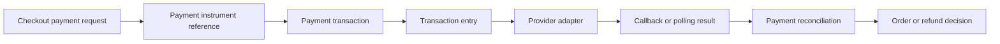

# Payment and fulfillment operations

## Business journey

Payment moves money; Fulfillment moves goods. Order connects their evidence but does not perform either operation. Payment separates methods, provider adapters, transactions, callbacks, and reconciliation. Fulfillment separates consignments, shipments, tracking, warehouse tasks, returns, receipts, inspections, and exceptions.

| Concern | Authority | Safe evidence |
| --- | --- | --- |
| Authorization, capture, void, refund | Payment | transaction entry and provider reference |
| Card or wallet eligibility | Payment Method | method capability without raw secret |
| External execution | Payment Provider | redacted request/outcome evidence |
| Shipment and tracking | Fulfillment | consignment, shipment, tracking event |
| Warehouse work | Fulfillment | assigned task and completion evidence |
| Returned stock disposition | Inventory | disposition and movement after inspection |

## Payment for beginners

The browser sends an opaque provider token, never raw card data. Payment validates tenant, currency, exact amount, operation, and idempotency key. The selected adapter executes AUTHORIZE, CAPTURE, VOID, or REFUND and Payment stores the outcome.

The included Stripe-shaped sandbox adapter is an offline conformance simulator. It accepts test tokens and returns deterministic references so tests can exercise success and replay. It is disabled by default, is not connected to Stripe, and is not live-qualified. PayPal, CyberSource, and Visa packages are declared but disabled until adapter conformance and external certification are complete.

Callbacks require a service boundary, HMAC or provider-approved signature verification, a freshness window, constant-time comparison, and replay storage. Callback data never bypasses reconciliation. A valid signature proves origin integrity; Payment still validates tenant mapping, transaction identity, amount, currency, event ordering, and allowed transition.

## Fulfillment for beginners

Fulfillment releases an Order into consignments. One order may produce partial shipments. Tracking events append evidence and cannot silently rewrite prior carrier history. Cancellation becomes an intent because a warehouse or carrier may already have acted.

A return begins with eligible Order evidence, then Fulfillment manages RMA logistics, pickup or drop-off, receipt, and inspection. Inventory decides whether inspected goods are restocked, quarantined, repaired, or written off. Payment refunds only after the approved lifecycle evidence reaches the configured checkpoint.

## Developer guidance

Provider adapters implement one narrow contract. Do not leak SDK objects into Payment schemas. Normalize provider statuses into owned statuses while retaining the original provider code and redacted reference. Derive deterministic idempotency keys and keep provider secrets in deployment secret management.

Carrier adapters follow the same boundary: normalized request, bounded timeout, redacted outcome, callback verification, retry, and reconciliation. New providers remain disabled until contract tests, sandbox tests, security review, operational runbook, and qualification evidence exist.

## Operator and DevOps guidance

Operators inspect unknown payment outcomes, callback rejection, reconciliation drift, expiring authorizations, partial capture/refund totals, shipment exceptions, missing tracking, warehouse backlog, and return inspection queues. Axis renders evidence and owner actions; it never stores credentials or invents statuses.

Production teams configure timeouts, retries, circuit breakers, rate limits, concurrency, dead-letter handling, and provider-specific capacity. Monitor success, decline, unknown, latency, duplicate suppression, callback age, shipment delay, and reconciliation lag. Exercise provider outage and carrier outage independently.

## Customization and extension guidance

Projects can customize payment and fulfillment by adding payment providers, authorization rules, capture timing, fraud checks, shipping handoff, or settlement events. Document provider configuration, event flow, failure behavior, retry policy, business approval impact, and browser or API evidence for checkout. Customer-specific logic should live in project modules or adapters, not by changing the reusable commerce contract.

## Common mistakes

- Storing raw card, wallet, or bank credentials.
- Calling a provider from Order or Axis.
- Treating an HTTP timeout as a final payment state.
- Accepting a callback without replay protection.
- Marking the offline simulator as live-qualified.
- Letting Payment decide returned-stock disposition.
- Assuming every order ships in one consignment.

## Verification

Run method/provider conformance, sandbox authorize/capture/void/refund, idempotent replay, invalid-token, callback signature, expiry, replay, transition, partial shipment, return receipt, inspection, and exception tests. Verify secrets are absent from logs, schemas, docs, OpenAPI examples, and Axis. A live provider requires separate credentialed sandbox certification, webhook delivery, reconciliation, capacity, security, and owner sign-off; local tests do not substitute for that evidence.

## Payment Transaction And Reconciliation Coverage

Payment documentation must explicitly cover PaymentTransaction,
PaymentTransactionEntry, PaymentInstrumentReference, and
PaymentReconciliation. These records are the difference between a customer
journey that merely calls a provider and an enterprise journey that can
explain what money state is known, unknown, authorized, captured, voided,
refunded, or waiting for reconciliation.

| Record | Business meaning | Required operator evidence |
| --- | --- | --- |
| PaymentInstrumentReference | Tokenized reference to a payment method, never raw credentials. | Token source, owner, expiry, and redaction. |
| PaymentTransaction | Parent commercial payment intent and state. | Idempotency key, provider, amount, currency, tenant, and order reference. |
| PaymentTransactionEntry | Each authorize, capture, void, refund, or callback result. | Provider reference, request hash, response state, and retry status. |
| PaymentReconciliation | Comparison between Nodics and provider state. | Drift, corrective action, owner, timestamp, and final evidence. |

Developers customize provider behavior through payment provider adapters, not
through checkout or Axis. Business users should see unknown outcomes and
reconciliation work as operational tasks, because a timeout is not a decline
and retrying money movement with a new key is unsafe.
