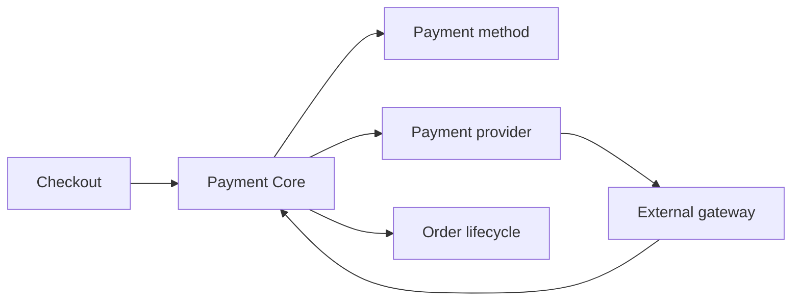

# Payment Core and Provider Boundaries

Payment in Nodics separates business payment decisions from provider-specific
execution. Payment Core owns method selection, authorization intent,
capture/refund lifecycle, reconciliation, and safe customer payloads. Provider
modules such as Stripe, PayPal, Visa, CyberSource, wallets, cards, bank
transfer, and cash on delivery implement integration details. For beginners,
Payment Core decides what should happen; providers perform it with an external
network or offline method.

## Source map

| Area | Source location |
| --- | --- |
| Payment group | `../nodics.commerce/modules/payment/package.json` |
| Payment Core | `../nodics.commerce/modules/payment/modules/paymentCore/package.json` |
| Payment methods | `../nodics.commerce/modules/payment/modules/paymentMethods/package.json` |
| Payment providers | `../nodics.commerce/modules/payment/modules/paymentProviders/package.json` |
| Stripe provider | `../nodics.commerce/modules/payment/modules/paymentProviders/modules/stripeProvider/package.json` |
| Payment operations docs | `docs/pages/nodics.commerce/payment-fulfillment.md` |

## Boundary model



The business problem is secure payment confidence. Business users need to know
which payment methods are available and whether money movement is complete.
Developers need provider contracts that avoid leaking gateway details into
checkout. Operators need reconciliation, retry, and failure evidence for
production.

## Safe payload contract

Payment responses shown to customers should contain status, amount, currency,
method label, recoverable action, and safe reference. They should not expose
provider secrets, raw gateway payloads, card data, credentials, or internal
stack traces.

```js
const paymentResult = {
  status: 'AUTHORIZED',
  amount: 12900,
  currency: 'USD',
  methodCode: 'card',
  providerReference: 'safe-reference'
};
```

## Customization and extension guidance

Developers can add methods, providers, adapters, reconciliation jobs, refund
handlers, and risk checks. Keep provider secrets in secure configuration and
never in data files or docs examples. Business users should configure
availability and policy through Axis where enabled. Operators should see
authorization, capture, refund, settlement, retry, and reconciliation evidence.

## Implementation handoff

Every payment provider handoff should identify supported operations, safe
payload fields, retryability, idempotency keys, reconciliation schedule,
configuration requirements, and unavailable-state messaging. That gives
business users confidence about payment availability, developers a provider
contract, operators production recovery evidence, and QA owners a way to test
success, decline, timeout, refund, and reconciliation cases.

## Evidence checklist

Payment evidence should include order reference, payment intent, method,
provider, amount, currency, lifecycle state, safe external reference,
correlation id, and reconciliation result. Sensitive values must remain
outside logs, release data, and browser payloads. Operators should be able to
decide whether to retry, cancel, refund, or escalate without reading raw
gateway responses in the main business UI.

Production readiness also needs negative-path evidence. A declined card,
provider timeout, duplicate callback, partial capture, and failed refund should
all return controlled states that the business can understand and developers
can trace.

## Common mistakes

- Letting provider-specific payloads leak into checkout responses.
- Treating a payment method as a gateway provider.
- Storing credentials in release data.
- Completing fulfillment before payment state allows it.
- Hiding failed reconciliation from operators.

## Verification

Run payment method and provider contract tests. In a fresh schema, place a
controlled order, authorize payment, capture or mark offline payment, issue a
test refund, and inspect reconciliation evidence. Production readiness
requires business-safe status, developer provider tests, operator audit
records, and QA proof that failures do not expose sensitive data.
