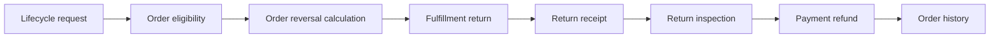

# Cancellation, return, and refund lifecycle

## Why one lifecycle is needed

Cancellation, return, and refund are related but different business intents. Cancellation tries to stop unfulfilled work. Return moves delivered goods back through Fulfillment and Inventory. Refund moves money through Payment. Order owns the customer intent, eligibility snapshot, approval trail, checkpoints, and final history projection.

| Intent | Typical prerequisite | Domain actions |
| --- | --- | --- |
| Cancellation | cancellable unfulfilled quantity | Fulfillment stop, Inventory release, Payment void or refund |
| Return | delivered eligible quantity | RMA, receipt, inspection, Inventory disposition, Payment refund |
| Refund | captured refundable amount | maker-checker approval, Payment refund, reconciliation |

Catalog and Product screens do not initiate these actions because a product alone has no customer, quantity, shipment, payment, or settlement evidence.

## Customer self-service journey

For beginners, requesting a reversal is not the same as completing it.

The customer opens an owned Order, selects eligible entries and quantities, chooses a reason, and requests a preview. The backend evaluates policy and returns exact refundable amounts, non-refundable charges, tax and discount allocation, expected logistics, approval requirements, and expiry. Submitting creates an immutable request version with an idempotency key.

The customer can read only their own requests. A retry returns the original result. The UI shows pending, awaiting approval, logistics, inspection, refund, reconciliation, completed, rejected, or failed states from backend evidence. It never promises money before Payment confirms the outcome.

## Administrator and operator journey

An operator sees queues grouped by Order lifecycle, not Catalog keywords. Approval is governed by tenant scope, workflow state, and explicit permissions, with requester identity retained as audit evidence. The approver sees policy version, quantities, exact allocation, source Order revision, fulfillment state, payment state, customer reason, and risk evidence.

After approval, the workflow calls Fulfillment, Inventory, and Payment through owner intents. Each step records a checkpoint. Failures remain retryable and reconcilable. Emergency stop may pause new execution but cannot erase already completed provider or warehouse evidence.

Axis keeps Cancellation, Return, and Refund as distinct workspaces and provides links only within the backend-published hierarchy. Payment reconciliation remains in Payment Operations. Return receipt and inspection remain in Fulfillment Operations. Catalog displays the explicit message that no catalog-only refund action exists.

## Developer guidance

Developers change eligibility through versioned policy pipelines. Exact reversal allocation must reference original price, discount, tax, payment, shipment, and prior reversal evidence. Never recalculate a historic order using today’s price or tax policy.

Workflow definitions are configured for cancellation, return, and refund with maker-checker steps. Order coordinates but delegates physical and monetary actions. Every service accepts tenant and correlation evidence. Customer extensions may add policy steps or approval thresholds through later layers while retaining owner contracts and history.

Compatibility aliases support migration for two minor releases or 180 days, whichever approved window applies. Aliases map old names to new contracts; they do not keep duplicate authorities alive.

## Operator and DevOps guidance

Monitor pending approvals, checkpoint age, retry counts, unknown payment outcomes, return-in-transit age, inspection backlog, disposition drift, and Order projection lag. Recovery resumes from the last durable checkpoint and reuses idempotency keys.

Backup/restore acceptance must prove requests, versions, approvals, checkpoints, owner evidence, and Order history remain consistent. Disaster recovery must not reissue refunds. Reconciliation compares restored state with Payment and Fulfillment providers before progressing unknown work.

## Security and privacy

Customer access requires ownership checks. Operator and approver permissions are separate. Service calls use service audiences. Reasons and evidence may contain protected data, so Axis receives only necessary projections and exports are bounded, audited, and retention-controlled.

## Common mistakes

- Starting refunds from Product or Catalog.
- Treating requester identity as the approval gate instead of checking tenant scope, workflow state, and explicit permissions.
- Repricing historic orders with current policy.
- Issuing a second refund after timeout.
- Updating the original Order instead of appending history.
- Restocking before receipt and inspection evidence.
- Treating UI visibility as backend authorization.

## Verification

Test customer ownership, tenant isolation, eligibility rejection, exact partial allocation, duplicate request, approval permission enforcement, cancellation before and after shipment, partial return, failed pickup, inspection disposition, void versus refund, provider timeout, checkpoint restart, reconciliation, and final Order history. Axis tests verify domain hierarchy, no Catalog refund action, accessibility, responsive rendering, and backend denial behavior. Production release requires approved policy, provider, legal, finance, operations, recovery, and residual-risk evidence.

## Return Receipt And Reversal Calculation Coverage

Cancellation, return, and refund documentation must show how the reverse
journey is assembled from order lifecycle, fulfillment return, receipt,
inspection, payment refund, and reversal calculation evidence. The key
business rule is that no domain acts alone: order owns lifecycle eligibility,
fulfillment owns physical return evidence, payment owns money movement, and
history explains the final customer-visible state.

| Reverse-flow record | Purpose | Documentation requirement |
| --- | --- | --- |
| OrderReversalCalculation | Calculates eligible cancellation, return, or refund amount. | Explain exact amount, historic pricing, tax, discounts, shipping, and partial quantity. |
| FulfillmentReturn | Owns operational return process. | Explain pickup/drop-off, carrier, warehouse, and failed return behavior. |
| ReturnReceipt | Proves returned goods were received. | Explain receipt time, location, quantity, and condition evidence. |
| ReturnInspection | Decides restock, reject, repair, or dispose. | Explain policy, actor, reason, and inventory impact. |
| Payment refund entry | Moves money only after approved evidence. | Explain idempotency, provider outcome, reconciliation, and duplicate prevention. |

Axis should present this as a single guided business journey with links to the
owning records. Developers should extend eligibility policy, inspection
policy, or provider execution through owning services and tests.
