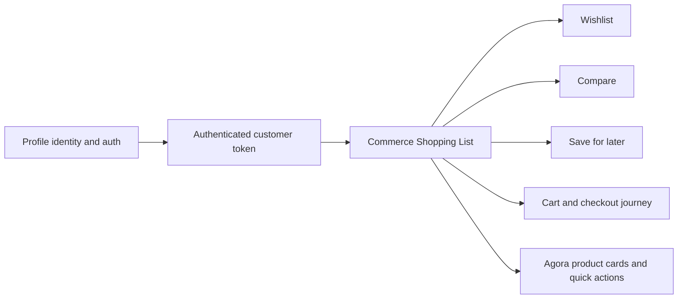

# Shopping List Commerce Boundary

Shopping List is a Commerce capability for customer shopping-intent lists such
as wishlist, compare, and save-for-later. It belongs under Base Commerce
because these lists are used across discovery, product cards, cart, checkout,
and later channel journeys. Profile remains the authority for person,
authentication, permissions, addresses, and organization identity.

For beginners, Profile answers "who is this actor?" Shopping List answers
"which products has this authenticated shopper intentionally saved for a
commerce journey?"

## Source map

| Area | Source location |
| --- | --- |
| Shopping List module | `../nodics.commerce/modules/baseCommerce/modules/shoppingList/package.json` |
| Shopping List schemas | `../nodics.commerce/modules/baseCommerce/modules/shoppingList/src/schemas/schemas.js` |
| Shopping List routes | `../nodics.commerce/modules/baseCommerce/modules/shoppingList/src/router/routers.js` |
| Shopping List service | `../nodics.commerce/modules/baseCommerce/modules/shoppingList/src/service/defaultShoppingListOperationService.js` |
| Commerce composition | `../nodics.commerce/modules/baseCommerce/package.json` |
| Profile security groups | `../nodics.platform/modules/profile/data/init-v001/records/groups/defaultBootstrapUserGroupsData.js` |
| Agora storefront client | `../../nodics.exp/nodics.agora.apparel/src/api/commerceClient.ts` |

## Ownership model



The business purpose is simple: a shopper can express purchase intent before
checkout without turning Profile into a commerce data store. Wishlist, compare,
and save-for-later are not profile preferences; they are commerce actions over
products, variants, stores, prices, availability, and storefront context.

## Contract

Shopping List records must be owned by Commerce and scoped to the authenticated
customer. They may reference customer identity by stable owner code from the
auth context, but they must not copy credentials, addresses, permission state,
or full Profile payloads.

Supported list types are:

- `WISHLIST`
- `COMPARE`
- `SAVE_FOR_LATER`

The customer API route family is:

```text
GET    /nodics/shoppingList/v0/lists/:listType
POST   /nodics/shoppingList/v0/lists/:listType/entries
DELETE /nodics/shoppingList/v0/lists/:listType/entries/:entryCode
```

All customer operations require `commerce.shoppingList.own` and must derive the
owner from the authenticated customer token, not from browser-supplied owner
fields.

```js
module.exports = {
  savedTopForLater: {
    code: 'shoppingList_customer001_SAVE_FOR_LATER_agoraRibbedTankTop',
    ownerId: 'customer001',
    listType: 'SAVE_FOR_LATER',
    productCode: 'agoraRibbedTankTop',
    variantCode: 'agoraRibbedTankTopIvoryS',
    storeCode: 'agoraMainStore',
    locale: 'en',
    active: true
  }
};
```

## Business configuration guidance

Business users should think of Shopping List as reusable commerce behavior that
storefront components can expose in different ways:

- Product cards can offer wishlist and compare quick actions.
- Quick-view or quick-add panels can add wishlist, compare, and save-for-later.
- Cart can offer save-for-later instead of removing an item permanently.
- Account pages can show saved products without owning the commerce schema.

Configuration should control limits and supported list types at the commerce
module level. Project modules may customize text, placement, and UI behavior,
but they should not redefine the underlying owner or route contract.

## Developer extension guidance

Developers may extend Shopping List with recommendation signals, expiration
rules, merchandising analytics, stock alerts, or business-specific list types
only when the list remains a product-intent list. If a feature groups people for
eligibility, segmentation, loyalty, or account buying, it should not be added to
Shopping List without a separate commerce capability decision.

Safe extension points include:

- list type policy,
- maximum item limits,
- duplicate/idempotency rules,
- product and variant validation,
- customer-safe projection fields,
- Axis visibility for business support,
- storefront component integration.

## Extending product-keeping journeys

The easiest and safest way to extend Shopping List is to add a new commerce
list type when the business need is "keep these products for a later product
journey." The module already owns the common mechanics: authenticated owner,
product reference, variant reference, store context, locale, idempotent add,
bounded list size, read, and remove.

Good examples are:

| Use case | Suggested list type | Why it fits Shopping List |
| --- | --- | --- |
| Save an item from cart for later | `SAVE_FOR_LATER` | The shopper is keeping a product instead of buying now. |
| Build a comparison set | `COMPARE` | The shopper is keeping a short product set for decision support. |
| Wishlist future purchases | `WISHLIST` | The shopper is keeping products for later discovery or purchase. |
| Keep outfit ideas | `OUTFIT_IDEA` | The shopper is grouping product references for a shopping intent. |
| Keep replenishment candidates | `REPLENISHMENT` | The shopper is remembering products they may buy again. |
| Keep gift ideas | `GIFT_IDEA` | The shopper is saving product references for a future occasion. |

To add a new product-keeping journey:

1. Add the list type to the Shopping List policy, for example
   `OUTFIT_IDEA`.
2. Define a clear item limit for that type. Small decision lists such as compare
   should stay low; open-ended saved lists can be higher.
3. Reuse the existing customer API route family by passing the new `listType`.
4. Store only `productCode`, optional `variantCode`, `storeCode`, `locale`, and
   lightweight intent metadata such as note, source component, or occasion.
5. Render the journey in the project storefront or Axis using business-managed
   component text, placement, labels, and icons.
6. Add contract tests for ownership, idempotency, limit enforcement, and
   unsupported type rejection.

```js
// Example project-level policy extension
shoppingList: {
  supportedListTypes: [
    'WISHLIST',
    'COMPARE',
    'SAVE_FOR_LATER',
    'OUTFIT_IDEA',
    'GIFT_IDEA'
  ],
  maximumWishlistItems: 100,
  maximumCompareItems: 4,
  maximumSaveForLaterItems: 100,
  maximumOutfitIdeaItems: 40,
  maximumGiftIdeaItems: 60
}
```

Do not create a separate module for every saved-product journey unless the
journey has a different owner or materially different lifecycle. If it is still
an authenticated shopper keeping product references, extend Shopping List.

Unsafe extensions include:

- copying Profile credentials or address payloads,
- accepting owner identity from browser payloads,
- placing Shopping List under Checkout only,
- keeping old `customerList` route or permission aliases,
- using wishlist as a generic customer segmentation feature.

## Common mistakes

- Treating wishlist, compare, or save-for-later as Profile data.
- Keeping compatibility aliases for `/nodics/customerList/v0`.
- Checking list ownership from request payload instead of authenticated token.
- Placing Shopping List under Checkout even though product cards and PDP need it
  before cart or checkout starts.
- Forgetting to migrate persisted customer groups to `commerce.shoppingList.own`.
- Adding new list types without clear commerce ownership, limits, and
  idempotency behavior.

## Migration principle

There is no compatibility alias for the old `customerList` boundary. The correct
runtime name is `shoppingList`, the correct permission is
`commerce.shoppingList.own`, and the correct module owner is Base Commerce.

Existing runtime identity records should be reconciled by the Profile identity
governance migration APIs so persisted customer groups receive
`commerce.shoppingList.own` through an audited change set.

## Verification

Production readiness requires these checks:

- Base Commerce loads `shoppingList` before Checkout and order journeys.
- The old `checkout/modules/customerList` module is absent.
- Customer tokens include `commerce.shoppingList.own`.
- Wishlist, compare, and save-for-later add/read/remove calls are owner-scoped.
- Agora product cards and quick panels call `/nodics/shoppingList/v0`.
- Non-owned list entries cannot be read or mutated.
- `npm run test:commerce`, `npm run validate:root`, Agora frontend verify, and
  live Agora commerce acceptance pass.
