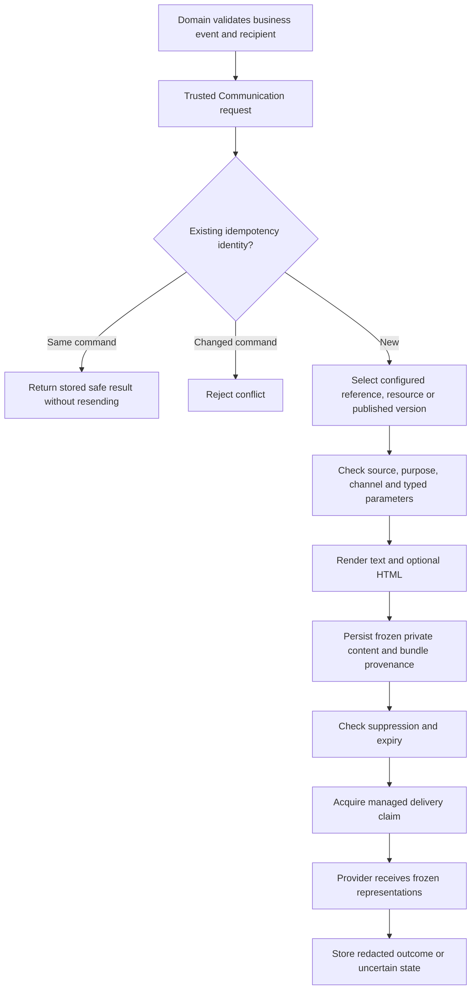

# Email and SMS Templates

## Signed Integration Source Authority

The internal intent request API requires a verified service principal, matching
authenticated/request tenant, explicit communication.request permission and signed
module scopes containing both commsApi and the selected trusted source module.
The configured trusted-source list alone is not a grant. A runtime authorized for
Profile cannot impersonate Order by changing sourceModule in a payload.

Retry and uncertainty resolution authorize exactly one stored intent's source,
not a source supplied by the caller. They validate the signed context before
reading private intent evidence; unreadable, missing or ambiguous records refuse
the action. No recipient, template variables or message body is disclosed.
Deployments use existing nAuth/nRouter runtime grants. This source boundary remains
subject to installed token/transport acceptance; no delivery is activated by it.

## Employee Lifecycle Intent Integration

Profile's exported `DefaultEnterpriseNotificationService` owns invitation and
account-ready decisions. Framework defaults live in
`enterpriseManagement.notifications`: enabled/qualified are false, with declarations
for INVITATION and ACCOUNT_READY. This policy selects resources, not inline HTML.
Existing framework resource bundles provide subject, HTML and plain text. Later
module, custom-project and runtime layers override those resource paths using the
existing loader. Keep declared parameter contracts compatible with frozen inputs.

On an admitted event Profile first stores private assignment lifecycleNotifications:
the recipient, templateCode/purpose/locale, bounded variables and stable idempotency
key. It then delegates to Communication's trusted internal communications API.
Communication owns rendered snapshots, queueing, delivery and provider retries;
Profile does not create another queue or call SMTP directly. An uncertain request
retains the same frozen inputs/key, so an explicit retry reconciles the same intent.
Once intentCode is saved, Profile returns that evidence rather than re-enqueuing.
Its saved status is intent-request progress, not refreshed mailbox delivery proof.

Invitation creation requests INVITATION only for an active unused unexpired
invitation. Completed registration or membership acceptance requests ACCOUNT_READY
only after stored completion. Delivery failure never rolls back account readiness
and receiving mail never grants access. Frozen recipient changes, withdrawals or
incomplete readiness fail closed. Generic CRUD cannot manufacture this evidence.

For customization, set approved connection/purpose/locale/nextStep in a later
Profile property layer and override the matching template resources. nextStep is
plain text, not HTML or a URL; action links need declared safe https-url parameters
and an owner-approved destination. Never pass credentials, OTP proof, access tokens,
role grants or caller-selected recipients. A new lifecycle kind requires a domain
readiness contract and reviewed owner implementation, not an arbitrary template
code accepted from HTTP. Reuse Communication for any new channel.

POST `/enterprise-team/retry-notification` takes only assignmentCode, current
revision and INVITATION/ACCOUNT_READY under fresh administrator authority. It
does not replace recipients/content or resend a known intent. Qualify trusted
Profile source admission, approved sender/recipients, deployed resource layering
and delivery/provider recovery before enabling policy. No delivery acceptance or
mail send has been performed for this source increment.

For beginners, start with the example below, then read the inventory and the
smallest-change customization table before attempting a new notification.

An email or SMS notification is a business message delivered through Communication.
Think of the template as stationery, the domain service as the person deciding what
to say, and the provider as the delivery service. Changing the stationery must not
change who is allowed to send, what a verification code proves, or whether an
enterprise application has been approved.

For example, Profile decides that an employee may receive an email-verification
challenge. It supplies the code and expiry to Communication. Communication resolves
the effective template, safely inserts those values, stores the private rendered
message and invokes the selected email provider. A customer can replace the subject
or HTML without copying Profile, the renderer or SMTP into the customer project.

## Scope, audience and maturity

Functional owner: `nodics.communication`. Technical owner: `commsCore`.
Business presentation also has a domain owner, such as Profile or customerFeedback.
This guide addresses business evaluators, notification authors, administrators,
partner developers, framework maintainers, operators, QA engineers and AI tools.

Layered files, typed rendering, durable intents, source gating and provider adapters
are implemented. SMTP supports guarded controlled-test delivery. SMS remains a
disabled-by-default injected sandbox boundary, not a supplied production carrier
integration. A template editor, arbitrary email scripting, automatic localization,
SMS segmentation and automatic uncertain-send retry are not promised capabilities.
Authored configuration examples are not authorization to enable or send messages.

Business users review wording, destination journeys and approved notifications.
Developers author deployed resources. Operators select qualified transports and
inspect redacted evidence. This guide does not assert that Axis provides a visual
editor for these resource files. See [provider operations](provider-runbooks.md)
for sender credentials, transport policy and delivery-result interpretation.

## Ownership and source map

| Concern | Canonical owner | What must not move here |
| --- | --- | --- |
| Business eligibility, purpose, recipient and values | Requesting domain service | Provider credentials and retries |
| Default wording and HTML for a domain | Domain module `src/templates` | Project-specific branding in framework defaults |
| Generic runtime notice presentation | commsCore `src/templates` | Another domain's business copy |
| Discovery, manifests, parameters and rendering | DefaultCommunicationTemplateService | A project-specific loader or renderer |
| Intents, source policy, claims, suppression and recovery | DefaultCommunicationRuntimeService | Domain approval or identity transitions |
| Schema source | commsSchema | Another message ledger in a project |
| SMTP/MIME transport | smtpCommsProvider | Template lookup and business decisions |
| SMS sandbox transport boundary | smsCommsProvider | HTML rendering or assumed carrier qualification |
| Reusable verification challenge lifecycle | commsVerification | Email-file ownership of proof or identity |
| Customer branding/deployment selection | Existing concrete customer and runtime layers | Copied framework services |

The main sources, relative to the framework repository, are:

- `nodics.communication/modules/commsCore/src/service/defaultCommunicationTemplateService.js`
- `nodics.communication/modules/commsCore/src/service/defaultCommunicationRuntimeService.js`
- `nodics.communication/modules/commsCore/config/properties.js`
- `nodics.communication/modules/commsCore/llm/contracts/template-resources.md`
- `nodics.communication/modules/commsSchema/src/schemas/schemas.js`
- `nodics.communication/modules/smtpCommsProvider/config/properties.js`
- `nodics.communication/modules/smsCommsProvider/config/properties.js`

## How a notification travels



The diagram is a reading aid, not an independent workflow engine. In the actual
request path, trusted-source policy is checked before replay lookup. The command
identity includes domain/source, template, recipient, purpose, channel, locale and
variables. The same key with changed command data rejects. New content is rendered
before intent persistence; send-time suppression, expiry and claim checks still
apply. Invalid rendering creates no new intent.

Transport failure does not undo the business event. A failed notification must not
repeat enterprise approval, password reset, registration or feedback creation.
The domain should retain the Communication reference and expose truthful progress.
The dispatcher owns attempts; providers neither re-render nor perform hidden retries.

## Standard folder layout

```text
<owning-module>/
  src/
    templates/
      email/
        employee-email-verification/
          template.json
          en/
            subject.txt
            email.html
            email.txt
      sms/
        runtime-notice/
          template.json
          en/
            message.txt
```

Directories are lowercase `email` and `sms`; manifest channel values are uppercase
`EMAIL` and `SMS`. OTP is a purpose, not a channel folder. An OTP sent by email
uses the email layout; an OTP sent by SMS uses the SMS layout. Adding an SMS file
does not make a caller that requests EMAIL switch channels.

Email requires all three locale representations. The subject is plain text and
must not contain CR/LF/NUL after rendering; trailing file newlines are trimmed.
`email.txt` is the plain-text alternative, not source generated by stripping HTML.
`email.html` is trusted static markup with escaped parameter insertion. SMS uses
only `message.txt`; a provider refuses HTML in an SMS envelope.

Resources are deployed source artifacts. They are not arbitrary uploaded paths,
template URLs or editable database body blobs. A project/application root is not
a concrete template owner: use a customer module or a selected runtime module.

## Existing template inventory

All current bundles below use manifest version 2 and default locale `en`.
The resource folder is distinct from the stable code supplied by the caller.

| Owner | Channel and folder | Stable template code | Purpose | Required variables |
| --- | --- | --- | --- | --- |
| profile | email/employee-email-verification | profile.employee.emailVerification | EMPLOYEE_EMAIL_VERIFICATION | verificationCode, expiresAt |
| profile | email/employee-otp-verification | profileEmployeeRecoveryCode | EMPLOYEE_PASSWORD_RECOVERY | verificationCode, expiresAt |
| profile | email/employee-application-outcome | profile.employee.applicationOutcome | EMPLOYEE_APPLICATION_OUTCOME | enterpriseName, decision, decidedAt, nextStep |
| profile | email/employee-invitation | profile.employee.invitation | EMPLOYEE_INVITATION | enterpriseName, responsibility, nextStep |
| profile | email/employee-account-ready | profile.employee.accountReady | EMPLOYEE_ACCOUNT_READY | enterpriseName, nextStep |
| profile | email/employee-password-reset | profileEmployeePasswordReset | EMPLOYEE_PASSWORD_RESET_CONFIRMATION | completedAt |
| commsCore | email/runtime-notice | COMMUNICATION_RUNTIME_NOTICE | TRANSACTIONAL | reference, message |
| commsCore | sms/runtime-notice | COMMUNICATION_RUNTIME_NOTICE | TRANSACTIONAL | reference, message |
| contactSubmission | email/contact-acknowledgement | CONTACT_ACKNOWLEDGEMENT | TRANSACTIONAL | reference |
| customerFeedback | email/feedback-acknowledgement | FEEDBACK_ACKNOWLEDGEMENT | TRANSACTIONAL | reference |
| customerReview | email/review-acknowledgement | REVIEW_ACKNOWLEDGEMENT | TRANSACTIONAL | reference |
| testimonial | email/testimonial-consent-request | TESTIMONIAL_CONSENT_REQUEST | CONSENT | reference |

Profile resources are under `nodics.platform/modules/profile`; Engagement resources
are under `nodics.engagement/modules/<owner>`; commsCore is under
`nodics.communication/modules/commsCore`. Source allowlists name those technical
owners, not the functional group or customer brand.

Profile bundles additionally accept optional `brandName`, maximum length 120,
defaulting to `Account services`. Verification code/expiry, decision, timestamps
and completion timestamp are bounded at 128 characters; enterpriseName at 256
and nextStep at 2000. Runtime notice reference is bounded at 256 and message at
10000; each Engagement reference at 256. These are parameter bounds, not provider
delivery limits. In particular SMS still enforces its smaller final byte limit.

The notice and four Engagement resources require explicit selection. Profile
resources do not use that optional-resource selection gate, but Profile's business
feature policy, trusted sources, recipient checks and provider gates still apply.
Invitation/account-ready resources are presentation defaults only. Their durable
lifecycle triggers are not wired or enabled by adding files; sender, recipients
and delivery/recovery acceptance remain gated. Do not send readiness mail from
application approval or treat an invitation message as an access grant. Customize
these files through the same project/runtime overrides without copying services.
Dynamic nextStep is plain text; introduce action links only through declared
`https-url` parameters and an owner-approved destination, never bearer secrets.

The application-outcome template does not itself make an approved applicant ready
to sign in. The recovery OTP folder is not the registration verification template.
New business scenarios may require additional resources and caller integration.

## Manifest reference

This is the implemented Profile email-verification declaration:

```json
{
  "formatVersion": 1,
  "code": "profile.employee.emailVerification",
  "ownerModule": "profile",
  "version": 2,
  "status": "ACTIVE",
  "purpose": "EMPLOYEE_EMAIL_VERIFICATION",
  "sourceModules": ["profile"],
  "channel": "EMAIL",
  "defaultLocale": "en",
  "parameters": {
    "verificationCode": {
      "type": "string", "required": true, "maximumLength": 128
    },
    "expiresAt": {
      "type": "string", "required": true, "maximumLength": 128
    },
    "brandName": {
      "type": "string", "required": false, "maximumLength": 120,
      "default": "Account services"
    }
  }
}
```

| Field | Meaning and constraint |
| --- | --- |
| formatVersion | Supported resource format is 1 |
| code | Stable identity, not a filename; simple bounded identifier |
| ownerModule | First manifest must come from this discovered module |
| version | Positive integer, distinct from a data-release semantic version |
| status | ACTIVE is required for resolution |
| purpose | Exact business purpose matched against the request |
| sourceModules | Explicit non-empty source-module allowlist |
| channel | EMAIL or SMS, matching the requested channel |
| defaultLocale | Locale folder used when a requested-locale file is absent |
| requiresSelection | Optional boolean; true requires explicit resource selection/adoption |
| parameters | Declared simple parameter names and string contracts |
| type | Resource parameters support string, not arbitrary objects or numbers |
| required | Required strings must be supplied and nonblank; cannot have defaults |
| maximumLength | Positive string-length limit; not a UTF-8 byte or SMS segment count |
| default | Optional presentation default, never a secret or a required proof value |
| format | Optional https-url for safe dynamic href/src insertion |

A later complete manifest may change version, default locale and optional
presentation defaults. It cannot change owner, code, purpose, channel, source
allowlist, requiresSelection behavior or parameter names/types/requiredness/limits/
format. Use a new owner-defined identity for an incompatible contract, not a
branding override. Duplicate identities under different resource folder names reject.

## Configuration and activation

Four separate decisions are involved:

1. The sending runtime discovers the files' owner module.
2. The relevant template is selected and valid.
3. The requesting business operation and trusted source are allowed.
4. A selected, enabled and qualified provider can deliver to the recipient.

Neither installing a package nor adding a template passes the other gates.
Configuration must be effective in the sending runtime, not only in a web or
Profile runtime that makes the original request.

| Configuration | Default | Purpose |
| --- | --- | --- |
| communication.templateResources.enabled | true | Enable file-resource resolution |
| communication.templateResources.modules | empty object | Explicit discovered inactive owners whose files may be used |
| communication.templateResources.selections | empty object | Optional resource codes explicitly selected with true |
| communication.templateResources.maximumFileBytes | 65536 | Bound each source file |
| communication.templateResources.maximumTemplatesPerModule | 100 | Bound resource catalogue scanning |
| communication.templateResources.maximumLayers | 512 | Bound effective resource layers |
| communication.rendering.maximumVariables | 50 | Bound declared/accepted render data |
| communication.rendering.maximumRenderedBytes | 65536 | Bound serialized rendered output, including private identity |
| communication.trustedSourceModules | empty array | Permit requesting technical module names |
| communication.templates | empty object | Existing explicit configured selection/compatibility map |
| communication.providers.EMAIL | absent | Select email provider type and deployment differences |
| communication.providers.SMS | absent | Select SMS provider type and deployment differences |

Resource rendering rejects unknown variables regardless of a legacy permissive
policy expectation. Defaults are inherited; customer properties should contain only
the intended differences, not a copy of this table.

For example, an existing customer module may select a framework acknowledgement:

```js
module.exports = {
  communication: {
    trustedSourceModules: ["contactSubmission"],
    templateResources: {
      selections: { CONTACT_ACKNOWLEDGEMENT: true }
    }
  }
};
```

This is a fragment for a runtime whose intended trusted-source set includes that
module. Preserve other required sources according to the existing configuration
merge contract; do not blindly replace a live allowlist. It does not select a
provider, enable contact intake or create a notification request.

For a split sending runtime that discovers but does not activate Profile:

```js
module.exports = {
  communication: {
    templateResources: { modules: { profile: true } }
  }
};
```

This only makes Profile's deployed files eligible. The existing runtime discovery
roots must already include the owner package. Unknown selected owners fail closed.
Do not activate all Profile services just to obtain email files.

## Selection precedence and published references

For a new intent, selection is:

1. Explicit `communication.templates[templateCode]`.
2. A matching available/selected module resource.
3. An active parent and active locale/channel version in the existing published store.

A configured inline legacy entry therefore shadows a same-code resource. Remove
that old selection through a reviewed migration when adopting files. Do not
diagnose its unchanged wording as a file-override failure.

An explicit configured resource reference can pin version selection without bodies:

```js
module.exports = {
  communication: {
    templates: {
      CONTACT_ACKNOWLEDGEMENT: {
        code: "CONTACT_ACKNOWLEDGEMENT",
        resourceCode: "CONTACT_ACKNOWLEDGEMENT",
        version: 2,
        status: "ACTIVE",
        purpose: "TRANSACTIONAL",
        channels: ["EMAIL"],
        sourceModules: ["contactSubmission"]
      }
    }
  }
};
```

Use one deliberate selection approach, not every example simultaneously.
A reference's resourceCode must equal the requested code. The effective resource
version, purpose and source must match. A reference cannot also have subjectTemplate
or bodyTemplate. Resource availability still follows existing discovery.

Published parents store explicit sourceModules, declared variables, channels,
purpose and currentVersion. Active version rows select resourceCode, version,
channel and locale; they do not own HTML/text presentation. Missing source ownership
is not a wildcard. The published lookup requires its requested locale/version row;
resource-file locale fallback does not invent a missing published selection row.

Current commsCore releases use core-v002 and optional sample-v002 source roots at
release version 0.0.1, with message resource version 2. The old v001 files remain
unchanged historical inputs, not active manifest inputs. The IN_APP notice remains
legacy text because this migration concerns EMAIL/SMS. Import schema changes and
adoption records only through the governed owner path in an authorized runtime.
Do not edit old releases or bulk-rewrite queued messages.

## Customize and extend safely

### Choose the smallest change

| Desired change | Correct extension |
| --- | --- |
| Change one email subject | Override only locale subject.txt |
| Change HTML branding/layout | Override email.html; review email.txt for equivalent information |
| Change wording for SMS | Override message.txt |
| Change a declared optional brand default | Supply a complete compatible template.json |
| Add a language | Add corresponding locale files, select that request locale |
| Different server-specific wording | Same resource path under the selected server/node module |
| New purpose or parameter contract | New domain-owned code and manifest |
| Different provider | Existing provider selection/extension, not template changes |
| Different business trigger or recipient rule | Owning domain extension, not presentation or transport |

### Override a subject without copying the framework

In an already discovered and active concrete customer module:

```text
<customer-module>/src/templates/email/employee-email-verification/en/subject.txt
```

```text
Your Example Company verification code
```

That is the entire presentation override. The framework manifest, HTML and plain
text remain inherited. The folder name must remain employee-email-verification,
even though the caller uses profile.employee.emailVerification. Do not add a
template registration service or duplicate renderer.

### Override HTML and plain text together

Create the same two locale files in the customer module:

```html
<!doctype html>
<html lang="en">
  <body style="margin:0;padding:24px;font-family:Arial,sans-serif;color:#202724;">
    <h1 style="font-size:24px;">Verify your Example Company email</h1>
    <p>Your verification code is <strong>{{verificationCode}}</strong>.</p>
    <p>It expires at {{expiresAt}}.</p>
    <p>If you did not request this code, ignore this message.</p>
  </body>
</html>
```

```text
Verify your Example Company email.
Your verification code is {{verificationCode}}.
It expires at {{expiresAt}}.
If you did not request this code, ignore this message.
```

Use email-compatible static markup and inline CSS. Preserve essential information
in the text version. Static images, when used, need trusted HTTPS URLs and useful
alt text; remote image loading depends on the recipient client. The renderer does
not fetch assets. Never place secrets in asset URLs.

### Customize optional branding defaults

Copy the complete owner manifest into the matching customer resource folder,
preserve its identity and parameter contract, and change only the optional
brandName default. There is no partial JSON merge for manifests. A file containing
only parameters.brandName.default is invalid. Caller-supplied brandName takes
precedence over that default.

Existing resources without a brandName parameter cannot acquire one through a
branding override. Use static wording in the HTML or introduce an owner-reviewed
new template identity when a new dynamic parameter is genuinely required.

### Layer precedence

Resource resolution follows the existing module graph, low to high:

1. Explicitly selected discovered inactive owners, before indexed active modules.
2. Indexed active concrete modules in their existing order.
3. Selected environment, server-root, server and node modules, deduplicated in that order.

Runtime scopes are evaluated last even if normal module indexes differ. Project/
application roots are excluded. A customer package merely installed on disk is not
automatically an active overriding layer. Inspect the sending runtime's indexed/raw
module metadata rather than guessing precedence from directory names.

To make an environment override, put the same relative resource path under that
selected environment module, for example:

```text
<environment-module>/src/templates/email/employee-email-verification/en/subject.txt
<server-module>/src/templates/email/employee-email-verification/en/email.html
<node-module>/src/templates/sms/runtime-notice/en/message.txt
```

These are placeholders for existing discovered module roots, not new loader
directories. The highest eligible existing file wins. Missing files inherit;
an existing invalid, oversized or unreadable file rejects instead of silently
falling back. No automatic tenant-name directory lookup exists. Tenant-specific
branding requires an explicitly governed existing deployment/customization route;
do not infer a new per-tenant filesystem loader.

### Locale fallback

Add translated files under a locale such as fr. For each required file, requested
locale is preferred across all layers; only then does defaultLocale fallback apply.
A framework fr file therefore beats a customer en file for a fr request.

| Available files for a fr request | Effective file |
| --- | --- |
| Owner en, customer en, no fr anywhere | Highest eligible en file |
| Owner fr, customer en | Owner fr |
| Owner fr, customer fr | Customer fr |
| Customer fr subject only | Customer fr subject; other files fall back independently |
| No requested/default file for a required representation | Reject incomplete bundle |

Partial translations can produce mixed-language representations. Supply the full
locale bundle when consistency is required. The renderer does not translate dates,
choose a customer's language or format numbers. The trusted caller supplies
localized strings and the desired locale.

## Build a new email notification

This worked example is an illustrative customer-domain notification, not a newly
shipped framework capability. Assume an existing discovered module acmeOrders owns
the approved order-ready event. Do not create a module solely to hold framework
mechanics or change a framework module from a partner project.

### 1. Define the business contract

The domain has already determined that the order is ready and selected the eligible
recipient from authoritative data. It supplies only orderNumber and a safe HTTPS
orderUrl. Purpose is TRANSACTIONAL. The message neither marks an order ready nor
grants access to the order. Use a stable event identity and authorize the linked
page independently.

### 2. Add the manifest

`<acmeOrders-module>/src/templates/email/order-ready/template.json`:

```json
{
  "formatVersion": 1,
  "code": "acme.orderReady",
  "ownerModule": "acmeOrders",
  "version": 1,
  "status": "ACTIVE",
  "purpose": "TRANSACTIONAL",
  "sourceModules": ["acmeOrders"],
  "channel": "EMAIL",
  "defaultLocale": "en",
  "requiresSelection": true,
  "parameters": {
    "orderNumber": {
      "type": "string", "required": true, "maximumLength": 64
    },
    "orderUrl": {
      "type": "string", "required": true, "maximumLength": 512,
      "format": "https-url"
    }
  }
}
```

### 3. Add all three representations

`en/subject.txt`:

```text
Order {{orderNumber}} is ready
```

`en/email.txt`:

```text
Your order {{orderNumber}} is ready.
View the order: {{orderUrl}}
```

`en/email.html`:

```html
<!doctype html>
<html lang="en">
  <body style="margin:0;padding:24px;font-family:Arial,sans-serif;color:#202724;">
    <h1 style="font-size:24px;">Order ready</h1>
    <p>Your order <strong>{{orderNumber}}</strong> is ready.</p>
    <p><a href="{{orderUrl}}">View your order</a></p>
  </body>
</html>
```

The full href is one quoted https-url parameter. Do not construct it with
`href="https://example.test/{{orderNumber}}"`: mixed dynamic attributes are not
supported. Construct and validate the complete URL in the domain service. HTTPS
validation alone does not authorize an arbitrary destination; apply the domain's
approved host/path policy before passing it.

### 4. Select the notification

Add only the necessary differences in the existing customer configuration:

```js
module.exports = {
  communication: {
    trustedSourceModules: ["acmeOrders"],
    templateResources: { selections: { "acme.orderReady": true } }
  }
};
```

Compose the customer owner and Communication into the appropriate runtime or use
the existing secured Communication service route for a split topology. Do not
assume a service global from another process exists locally. Provider selection
is separate; see the runbook. New resources do not require a new schema, router or
data-release pack when direct configured selection meets the requirement.

### 5. Request through the existing owner

Within an authorized server-side domain service, the in-process call shape is:

```js
return SERVICE.DefaultCommunicationRuntimeService.request(request, {
  sourceModule: "acmeOrders",
  sourceType: "ORDER",
  sourceCode: order.code,
  templateCode: "acme.orderReady",
  purpose: "TRANSACTIONAL",
  channel: "EMAIL",
  locale: "en",
  recipientId: recipient.code,
  recipientAddressReference: recipient.approvedEmail,
  variables: {
    orderNumber: order.number,
    orderUrl: approvedOrderUrl
  },
  idempotencyKey: notificationEventKey,
  correlationId: request.correlationId
});
```

The shown identifiers represent values already validated by the domain, not browser
body fields. The request must carry trusted tenant/authentication context. The
service route additionally requires its existing service permission. Keep real
recipient addresses and values out of logs. For SMTP, the recipient reference is
a validated single mailbox; another provider may resolve a reference differently.

notificationEventKey must be deterministic for that domain event, channel and
recipient. Replaying the same event reuses it; changing variables under it conflicts.
Do not append a timestamp on every retry. A later distinct authorized event gets
a distinct key. Supply expiresAt when business delivery validity is bounded.
For OTP, align delivery validity with the existing verification authority.

## Build a new SMS notification

Use the same domain event and renderer, with a separate channel resource:

```text
<acmeOrders-module>/src/templates/sms/order-ready/template.json
<acmeOrders-module>/src/templates/sms/order-ready/en/message.txt
```

Use the complete email manifest above with channel changed to SMS; retain the same
code, owner, purpose and parameter declarations for this illustrative dual-channel
message. The channel separates resource lookup. The message file is:

```text
Order {{orderNumber}} is ready. View: {{orderUrl}}
```

Request channel SMS, supply the recipient reference understood by the selected
SMS transport, and use a distinct channel-specific event key. An email idempotency
key cannot be reused with a changed channel. The existing optional selection is
code-scoped: selecting acme.orderReady makes either matching channel resource
eligible; it does not authorize both channels for every domain event.

SMS is text, not a miniature HTML email. No subject or email.html is required.
The sandbox provider enforces a default maximum of 1600 UTF-8 bytes. Multi-byte
characters consume more bytes; this bound is not a promise of a particular number
of GSM/UCS-2 segments or a carrier price. Segmentation, opt-out handling, recipient
resolution and real carrier delivery need an explicitly qualified transport.
Do not invent an SMS OTP proof store or a live carrier adapter in a template file.

## Parameter safety and supported interaction

Only simple `{{name}}` expressions are supported. HTML output escapes dynamic
values; text output preserves literal characters. Required values must be nonblank
strings. Unknown values reject, optional absent values become blank unless a default
exists, and object/array/number values are not resource parameters.

Rejected syntax includes raw triple braces, helpers, blocks, loops, partials,
dynamic lookup and prototype/property traversal. Reserved helper/prototype names
are invalid declarations. Compose alternative messages in the domain by selecting
the correct template or supplying an already-approved string, not by executing
business logic inside HTML.

HTML parsing rejects script/style blocks, embedded documents, forms, event handlers,
unsafe URLs and active CSS. Use static inline styling. Dynamic attributes are only
quoted href/src whose entire value is a declared https-url parameter. This is
trusted deployment-resource validation, not a general public HTML sanitizer.

Supported interaction means safe links to authorized application journeys.
JavaScript, form submission, embedded payment actions and executable email widgets
are not supported. Never make the presence of a link or a rendered decision string
the authority for a privileged action.

## Durability, privacy and upgrades

Each new intent records templateVersion and private renderedContent, including
text, optional HTML and templateIdentity. That identity contains a checksum,
owner and per-file module/locale/resource provenance, not absolute filesystem
paths or variable values. The checksum covers the effective manifest and files,
so branding changes are distinguishable even if a compatible version is retained.

Provider payloads contain only required representations; private provenance stays
local. Public results, events and logs remain content-free. The private intent can
contain sensitive message content, including an OTP; it needs existing storage
access and retention controls. Do not incorrectly claim that only a hash is stored.
Proof hashing in commsVerification is a separate security contract.

Existing intents are not re-rendered after a template change. Identical replay
returns stored evidence even if the files have been removed; retry uses frozen
content. New requests use the then-effective resources. An operator must not
resend to apply a new brand layout or change an idempotency key to evade uncertainty.

Published release checksums identify framework bundles; the actual customized
bundle hash is pinned in a new intent. A reference-pinned version must continue to
match its selected resource. Plan manifest version/adoption changes together.
Legacy persisted/configured text stays on the shared restricted compatibility
renderer and cannot silently become HTML.

## Troubleshooting matrix

| Symptom | Likely cause | Safe next action |
| --- | --- | --- |
| Communication source is not configured | Source missing from sending runtime policy | Review effective trustedSourceModules, not browser fields |
| Resource owner is unavailable | Owner not discovered or wrong selected name | Inspect raw metadata and existing discovery roots |
| Template unavailable for source | Purpose/channel/source mismatch or optional unselected resource | Compare manifest, caller and selection/adoption |
| Resource reference unavailable | Pinned version does not match effective resource | Coordinate version and governed adoption |
| Old wording after file override | Configured legacy entry shadows files, or wrong runtime/locale | Inspect selection precedence and provenance |
| Incomplete bundle | Required file missing in requested and default locales | Supply/inherit all required representations |
| Parameter missing or invalid | Wrong type, blank required value, too long or unsafe URL | Fix trusted caller data; never weaken security for bad input |
| Unknown variable | Caller supplied undeclared input | Minimize data or create an owner-reviewed new contract |
| Manifest override rejected | Changed source/purpose/parameter contract or partial manifest | Keep compatible full manifest or create a new identity |
| Rendered content too large | Output plus identity exceeds configured byte bound | Reduce copy/markup and check all representation sizes |
| SMS rejected despite valid rendering | Final text exceeds provider bytes or contains HTML | Shorten SMS and retain provider safety bounds |
| UNCONFIGURED | Provider disabled, missing references/ports or invalid auth | Follow provider runbook; do not change template copy |
| UNCERTAIN | Transport may have accepted before reply was lost | Reconcile exact managed revision; no blind retry |
| New layout absent on retry | Intent correctly retained frozen content | Use a genuinely new authorized event to observe new files |

Errors must remain content-free. Investigate with template/intent/correlation codes
and protected metadata; do not paste production bodies, addresses, credentials or
verification values into support records.

## Common mistakes

- Copying the renderer into a customer project instead of overriding files.
- Using a resource folder name as the request code or confusing OTP with a channel.
- Treating optional selection as permission to send or as production qualification.
- Adding undeclared parameters through a partial manifest or using raw HTML values.
- Expecting a customer default-locale file to replace an existing exact-locale file.
- Retrying with a new idempotency key because the first send outcome is uncertain.
- Claiming that private intents contain no message content.

## Verification workflow

For joint testing, prepare a fake-value preview before enabling any transport:

- Resolve each default and each intended customer/environment/server/node override.
- Check subject, HTML, text and SMS independently; include long strings and small screens.
- Exercise requested-locale precedence and incomplete/malformed resource rejection.
- Reject unknown/missing/oversized values, raw markup, helper syntax and unsafe URLs.
- Confirm optional resources stay unavailable until explicitly selected/adopted.
- Confirm wrong source, purpose, channel and published version reject before persistence.
- Prove replay and retry retain content, and changed data under the same key conflicts.
- Check disabled providers, tenant/lease/expiry, suppression and uncertain recovery.
- Confirm private identity never reaches provider content, public DTOs or logs.
- Qualify actual database schema installation, live mailbox/client rendering and
  approved SMS carrier behavior separately from source and sandbox tests.

Existing focused suites are Communication template resources, channel migration,
durable runtime, SMTP runtime adapter, SMS runtime adapter and Profile employee
template resources under their owning module test directories. They are a map for
testing, not evidence that a particular customer deployment has passed.

## Related topics

- [Communication overview](overview.md)
- [Provider configuration and operations](provider-runbooks.md)
- [Resource implementation contract](../../../../nodics.communication/modules/commsCore/llm/contracts/template-resources.md)
- [Framework presentation principle](../../../../nodics.foundation/modules/nSetup/llm/contracts/nodics-principles.md#module-owned-email-and-sms-presentation)
