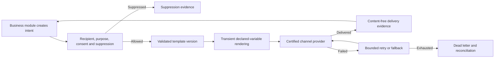

# Communication, delivery, and verification

Nodics Communication turns a business-owned request to inform or verify someone into a governed message and delivery outcome. This beginner-friendly guide explains templates, recipients, consent and suppression, provider delivery, retry, callbacks, inbox records, and the boundary between Communication and consuming modules such as Engagement, Order, Process, Profile/KYC, and Security.

Communication owns how a message is prepared and delivered. The consuming domain owns why it was requested and what business state changes afterward. For example, Contact Submission owns an enquiry and may request an acknowledgement. Communication renders and sends that acknowledgement, but a provider failure never deletes or rolls back the enquiry.

## Module structure

| Module | Responsibility |
| --- | --- |
| `commsSchema` | Source declarations for templates, intents, delivery attempts, suppression, inbox, and verification evidence. |
| `commsCore` | Rendering, idempotency, policy, delivery orchestration, retry, fallback, and content-free events. |
| `commsVerification` | Expiring, hashed, attempt-limited communication challenges without owning identity. |
| `localCommsProvider` | Deterministic development delivery with no external network transmission. |
| `commsApi` | Secured customer inbox, operator recovery, and service-authenticated callback routes. |

## End-to-end delivery journey

## Template and rendering journey

An administrator defines a template code, purpose, supported channels, and declared variables. Each locale/channel body is an immutable validated version with a checksum. Activation moves the template pointer; it does not rewrite earlier delivery evidence.

The renderer accepts only declared variables, rejects executable constructs, and enforces count and rendered-size limits. Rendering is transient. Intent and event records store a variables hash and template version, not a convenient copy of every customer field. Provider secrets never appear in templates or Axis.

Developers add a template by declaring the smallest variable set, providing safe locale/channel versions, testing missing and unknown variables, validating output size and escaping, and supplying a migration path before retiring an active version.

## Consent, purpose, and suppression

Every intent states a purpose such as transactional, service, consent, verification, or marketing. Marketing consent must never be inferred from permission to send a transaction or security challenge. A suppression is recipient-, purpose-, and channel-scoped with reason, source, and validity period.

Policy runs before rendering and provider delivery. A suppressed request produces evidence and returns safely to the caller. It is not retried through another provider to evade customer preference. Emergency or legally required messages need an explicit policy rather than a hidden bypass.

## Idempotency and delivery evidence

The consuming domain supplies an idempotency key and correlation ID. Repeating the same logical request returns the existing intent instead of sending a duplicate. Delivery attempts record provider, channel, attempt, bounded status, safe provider reference, response code, retry time, and timestamps. Events contain codes and statuses, not message bodies, addresses, or provider payloads.

Retry uses exponential delay and a maximum attempt count. Ambiguous timeouts require provider reconciliation before replay. Fallback between providers or channels must be allowed by purpose, consent, residency, and customer preference; it is not an automatic escape hatch.

## Verification journey

Verification creates a random transient secret and stores only salted hash evidence plus a destination hash. The challenge has purpose, subject reference, channel, expiry, attempt limit, status, and correlation. Successful comparison marks it verified once. Expiry or lockout prevents further use.

Communication proves possession of a channel; it does not decide that a user is authenticated, KYC-approved, authorized, or safe. Profile, KYC, Security, or the requesting domain consumes the verified outcome and applies its own current policy.

## Axis and customer journey

Customers use the secured Communication inbox route to list only their own in-app messages. They can never select another recipient identifier in the URL or query. Axis operators inspect delivery evidence and retry only failed, retry-pending, or dead-letter attempts with explicit permission. Raw content and addresses stay masked.

Provider callbacks use service authentication and bounded provider evidence. Production adapters additionally verify signature, timestamp/replay window, provider/account identity, and idempotency before reconciling an attempt. A callback does not trust domain identifiers supplied by an external payload.

## Engagement integration

`engagementComms` is a later-loaded bridge. It maps CONTACT, FEEDBACK, REVIEW, and TESTIMONIAL scenarios to Communication templates, declared variables, purpose, recipient/address reference, and a stable idempotency key. The dependency is one-way: Communication never imports Engagement or changes its status.

When Communication is unavailable, the bridge returns deferred evidence with `domainStateChanged: false`. Contact intake and other safe domain operations remain durable. A scheduled worker can retry or reconcile later.

## Provider activation and operations

The local provider is enabled for development and returns deterministic content-free evidence. SMTP and Twilio-style external providers remain disabled until a deployment supplies secured credentials, verified sender identity, region/residency approval, consent mapping, callbacks, retry/fallback, observability, rate and cost limits, incident response, and rollback.

Operators monitor accepted/suppressed intent volume, render failures, provider latency/error, delivered rate, retry age, dead letters, callback rejection/replay, inbox expiry, verification success/lockout, and consent/suppression decisions. Logs use intent, attempt, template, and correlation codes without content.

## Common mistakes

- Letting Engagement, Order, or Process own email templates or provider retry.
- Letting Communication change order, case, identity, or security status.
- Storing rendered bodies or recipient addresses in events and logs.
- Treating transactional permission as marketing consent.
- Sending again after retry without checking the idempotency key or ambiguous provider outcome.
- Storing a verification secret in plaintext or allowing unlimited guesses.
- Enabling an external provider because local delivery passed.
- Trusting callback fields without service authentication, signature, replay, tenant, and provider-reference validation.

## Verification

Prove template version/checksum, declared-variable rendering, executable and unknown-variable rejection, output limits, purpose/channel denial, suppression, consent separation, idempotent replay, content-free events, local delivery, provider failure, exponential retry, dead letter, safe fallback, callback authentication and replay policy, tenant isolation, customer inbox ownership, challenge hashing/expiry/lockout/single use, one-way domain integration, and domain durability during outage. Run Communication package tests, generated schema contracts, Communication route/security contracts, Engagement bridge tests, documentation generation/validation, and the effective Engagement server build to confirm Communication loads first.

## Customization and extension

Projects may add providers, templates, channel policies, callback adapters,
verification purposes, and inbox views through Communication-owned extension
points. The extension must preserve consent, suppression, content masking,
idempotency, replay protection, tenant isolation, and the rule that
Communication delivers messages but does not decide domain state.
