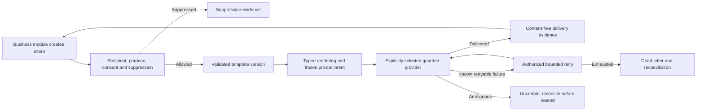

# Communication, delivery, and verification

Nodics Communication turns a business-owned request to inform or verify someone into a governed message and delivery outcome. This beginner-friendly guide explains templates, recipients, consent and suppression, provider delivery, retry, callbacks, inbox records, and the boundary between Communication and consuming modules such as Engagement, Order, Process, Profile/KYC, and Security.

Communication owns how a message is prepared and delivered. The consuming domain owns why it was requested and what business state changes afterward. For example, Contact Submission owns an enquiry and may request an acknowledgement. Communication renders and sends that acknowledgement, but a provider failure never deletes or rolls back the enquiry.

## Module structure

| Module | Responsibility |
| --- | --- |
| `commsSchema` | Source declarations for templates, intents, delivery attempts, suppression, inbox, and verification evidence. |
| `commsCore` | Rendering, idempotency, policy, delivery orchestration, retry, fallback, and content-free events. |
| `commsVerification` | Expiring, hashed, attempt-limited communication challenges without owning identity. |
| `localCommsProvider` | Deterministic development delivery with no external network transmission. |
| `commsApi` | Secured customer inbox, operator recovery, and service-authenticated callback routes. |

## End-to-end delivery journey

```mermaid
flowchart LR
  Domain["Business module creates intent"] --> Policy["Recipient, purpose, consent and suppression"]
  Policy -->|Suppressed| Evidence["Suppression evidence"]
  Policy -->|Allowed| Template["Validated template version"]
  Template --> Render["Typed rendering and frozen private intent"]
  Render --> Provider["Explicitly selected guarded provider"]
  Provider -->|Delivered| Outcome["Content-free delivery evidence"]
  Provider -->|Known retryable failure| Retry["Authorized bounded retry"]
  Provider -->|Ambiguous| Uncertain["Uncertain: reconcile before resend"]
  Retry --> Provider
  Retry -->|Exhausted| Dead["Dead letter and reconciliation"]
  Outcome --> Domain
```

## Template and rendering journey

Domain modules supply neutral presentation under `src/templates/email/<name>`
or `src/templates/sms/<name>`. An inert manifest declares code, owner, purpose,
channel, source allowlist and typed parameters. Email has locale subject, HTML and
plain-text files; SMS has a locale message.txt. Customer/runtime layers override
individual files. Configuration and published adoption records select resources;
new EMAIL/SMS presentation does not belong in configuration or database body blobs.

The shared renderer accepts declared typed values, escapes HTML and enforces bounds.
New intents privately store frozen rendered content and effective template identity
for deterministic retry, as well as a variables hash/version. Public results,
events and logs omit content. Providers consume frozen representations and do not
load templates. Provider credentials never belong in presentation. The private
message content needs storage access and retention controls.

Developers add a template by declaring the smallest variable set, providing safe locale/channel versions, testing missing and unknown variables, validating output size and escaping, and supplying a migration path before retiring an active version.

Use [Email and SMS Templates](email-sms-templates.md) for the complete inventory,
selection precedence, customer/server overrides, localization and worked examples.

## Consent, purpose, and suppression

Every intent states a purpose such as transactional, service, consent, verification, or marketing. Marketing consent must never be inferred from permission to send a transaction or security challenge. A suppression is recipient-, purpose-, and channel-scoped with reason, source, and validity period.

Trusted-source and template policy run before new rendering; durable suppression
and expiry checks prevent sending. A suppressed request produces evidence. It must
not switch providers to evade customer preference. The diagram above summarizes
policy responsibility rather than promising that every suppression read precedes
rendering. Emergency exceptions require an explicit owner-defined policy.

## Idempotency and delivery evidence

The consuming domain supplies an idempotency key and correlation ID. Repeating the same logical request returns the existing intent instead of sending a duplicate. Delivery attempts record provider, channel, attempt, bounded status, safe provider reference, response code, retry time, and timestamps. Events contain codes and statuses, not message bodies, addresses, or provider payloads.

Retry uses exponential delay and a maximum attempt count. Ambiguous timeouts require provider reconciliation before replay. Fallback between providers or channels must be allowed by purpose, consent, residency, and customer preference; it is not an automatic escape hatch.

## Verification journey

Verification creates a random transient secret and stores only salted hash evidence plus a destination hash. The challenge has purpose, subject reference, channel, expiry, attempt limit, status, and correlation. Successful comparison marks it verified once. Expiry or lockout prevents further use.

Communication proves possession of a channel; it does not decide that a user is authenticated, KYC-approved, authorized, or safe. Profile, KYC, Security, or the requesting domain consumes the verified outcome and applies its own current policy.

## Axis and customer journey

Customers use the secured Communication inbox route to list only their own in-app messages. They can never select another recipient identifier in the URL or query. Axis operators inspect delivery evidence and retry only failed, retry-pending, or dead-letter attempts with explicit permission. Raw content and addresses stay masked.

Provider callbacks use service authentication and bounded provider evidence. Production adapters additionally verify signature, timestamp/replay window, provider/account identity, and idempotency before reconciling an attempt. A callback does not trust domain identifiers supplied by an external payload.

## Engagement integration

`engagementComms` is a later-loaded bridge. It maps CONTACT, FEEDBACK, REVIEW, and TESTIMONIAL scenarios to Communication templates, declared variables, purpose, recipient/address reference, and a stable idempotency key. The dependency is one-way: Communication never imports Engagement or changes its status.

When Communication is unavailable, the bridge returns deferred evidence with `domainStateChanged: false`. Contact intake and other safe domain operations remain durable. A scheduled worker can retry or reconcile later.

## Provider activation and operations

The local provider returns deterministic development evidence. SMTP supports a
disabled-by-default guarded test mode with approved recipients and TLS. SMS is an
injected sandbox adapter, not a supplied live carrier client. Neither is qualified
for unrestricted production simply by configuring credentials. See
[provider runbooks](provider-runbooks.md) for exact settings, outcome semantics
and the remaining delivery/operational qualification gates.

Operators monitor accepted/suppressed intent volume, render failures, provider latency/error, delivered rate, retry age, dead letters, callback rejection/replay, inbox expiry, verification success/lockout, and consent/suppression decisions. Logs use intent, attempt, template, and correlation codes without content.

## Common mistakes

- Putting domain presentation in generic configuration, or domain-owned provider retry.
- Letting Communication change order, case, identity, or security status.
- Storing rendered bodies or recipient addresses in events and logs.
- Treating transactional permission as marketing consent.
- Sending again after retry without checking the idempotency key or ambiguous provider outcome.
- Logging verification secrets, storing plaintext as authoritative challenge evidence,
  or allowing unlimited guesses. Private delivery content is a separate protected boundary.
- Enabling an external provider because local delivery passed.
- Trusting callback fields without service authentication, signature, replay, tenant, and provider-reference validation.

## Verification

Prove template version/checksum, declared-variable rendering, executable and unknown-variable rejection, output limits, purpose/channel denial, suppression, consent separation, idempotent replay, content-free events, local delivery, provider failure, exponential retry, dead letter, safe fallback, callback authentication and replay policy, tenant isolation, customer inbox ownership, challenge hashing/expiry/lockout/single use, one-way domain integration, and domain durability during outage. Run Communication package tests, generated schema contracts, Communication route/security contracts, Engagement bridge tests, documentation generation/validation, and the effective Engagement server build to confirm Communication loads first.

## Customize and extend safely

Projects may add providers, templates, channel policies, callback adapters,
verification purposes, and inbox views through Communication-owned extension
points. The extension must preserve consent, suppression, content masking,
idempotency, replay protection, tenant isolation, and the rule that
Communication delivers messages but does not decide domain state.

For example, replace only
`<customer-module>/src/templates/email/employee-email-verification/en/subject.txt`
to brand a subject while inheriting the owner's manifest and bodies. The module
must be discovered in the effective sending hierarchy. Wrong source, incompatible
manifest and invalid parameters reject; queued intents keep their old content.
Verify the effective override and rejection/replay behavior using the
[worked guide](email-sms-templates.md#customize-and-extend-safely).
